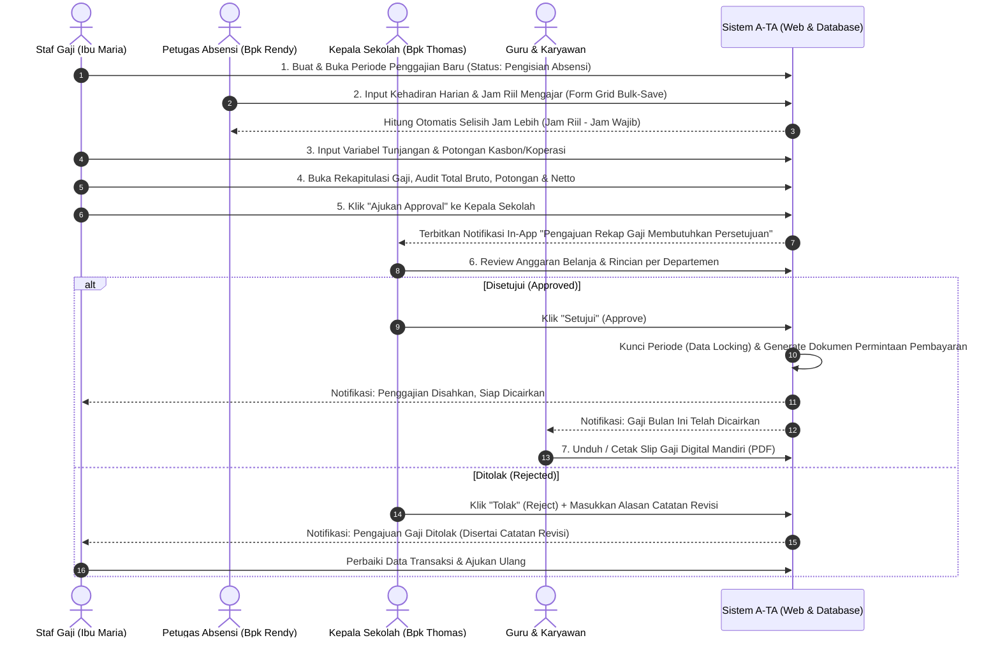

# 📘 BUKU PANDUAN PENGGUNA (USER MANUAL & SOP)
## SISTEM INFORMASI PENGGAJIAN SMK PSKD 3 JAKARTA (APLIKASI A-TA)
*Dokumen Resmi Petunjuk Operasional Sistem Berbasis Peran (Role-Based Operational Guidebook)*
*Versi: 2.0.0 (Sinkronisasi 13 Tabel PostgreSQL & Multi-Role Permission) | Terbit: September 2026*

---

## 📑 DAFTAR ISI
1. [Pendahuluan & Gambaran Umum Sistem](#1-pendahuluan--gambaran-umum-sistem)
2. [Matriks Peran (Role) & Hak Akses Aplikasi](#2-matriks-peran-role--hak-akses-aplikasi)
3. [Akun Pengujian & Akses Sistem](#3-akun-pengujian--akses-sistem)
4. [Siklus Bulanan Penggajian (End-to-End Workflow)](#4-siklus-bulanan-penggajian-end-to-end-workflow)
5. [Panduan Operasional: Petugas Absensi (Bapak Rendy)](#5-panduan-operasional-petugas-absensi-bapak-rendy)
6. [Panduan Operasional: Staf Penggajian / Admin Keuangan (Ibu Maria)](#6-panduan-operasional-staf-penggajian--admin-keuangan-ibu-maria)
7. [Panduan Operasional: Approver / Kepala Sekolah (Bapak Thomas)](#7-panduan-operasional-approver--kepala-sekolah-bapak-thomas)
8. [Panduan Operasional: Administrator Sistem (Superadmin)](#8-panduan-operasional-administrator-sistem-superadmin)
9. [Panduan Pengguna Akhir: Guru & Karyawan (Penerima Gaji)](#9-panduan-pengguna-akhir-guru--karyawan-penerima-gaji)
10. [Aturan Bisnis & Logika Perhitungan Finansial](#10-aturan-bisnis--logika-perhitungan-finansial)
11. [Integritas Keamanan & Protokol Data Locking](#11-integritas-keamanan--protokol-data-locking)
12. [Tanya Jawab & Penanganan Masalah (Troubleshooting / FAQ)](#12-tanya-jawab--penanganan-masalah-troubleshooting--faq)

---

## 1. PENDAHULUAN & GAMBARAN UMUM SISTEM

### 1.1 Latar Belakang
Sistem Informasi Penggajian **A-TA** dirancang khusus untuk memodernisasi tata kelola administrasi keuangan dan penggajian di **SMK PSKD 3 Jakarta**. Sebelum aplikasi ini diimplementasikan, seluruh proses penggajian dikelola secara konvensional menggunakan lima lembar kerja (*sheet*) Microsoft Excel terpisah, yaitu:
1. **Sheet `jam`**: Rekapitulasi jam wajib dan jam riil mengajar guru.
2. **Sheet `Tunjangan`**: Catatan tunjangan struktural, wali kelas, dan tunjangan keluarga.
3. **Sheet `GJ.POKOK`**: Acuan matriks gaji pokok mengacu Peraturan Pemerintah No. 85 Tahun 1997.
4. **Sheet `RECAP`**: Penggabungan total bruto, potongan pinjaman/koperasi, dan penghitungan netto.
5. **Sheet `DAFTAR PERMINTAAN PEMBAYARAN`**: Berkas pengajuan dana resmi kepada bendahara yayasan/sekolah.

Fragmentasi tersebut memicu rentannya kesalahan manusia (*human error*), risiko rumus Excel yang rusak/tertimpa, keterlambatan koordinasi manual via pesan singkat, serta ketiadaan transparansi rincian gaji bagi guru dan staf.

### 1.2 Tujuan Aplikasi A-TA
Aplikasi A-TA mengintegrasikan seluruh proses di atas ke dalam satu sistem berbasis web terpadu dengan keunggulan:
- **Pangkalan Data Terpusat (PostgreSQL)**: Menghilangkan redundansi dan desinkronisasi data antar-dokumen.
- **Form Grid Absensi Kilat (*Bulk-Save*)**: Memudahkan petugas absensi menginput puluhan data kehadiran sekaligus.
- **Kalkulasi Otomatis Presisi 100%**: Menghitung jam lebih, tunjangan keluarga, potongan kasbon, simpanan koperasi, hingga *Take Home Pay* (THP) secara otomatis.
- **Persetujuan Berjenjang (*Multi-Tier Approval*)**: Mekanisme verifikasi resmi oleh Kepala Sekolah sebelum dana dicairkan.
- **Notifikasi Terintegrasi (*In-App Notification*)**: Notifikasi otomatis saat pengajuan gaji butuh persetujuan dan saat gaji telah disahkan.
- **Slip Gaji Digital Mandiri**: Guru dan karyawan dapat mengakses dan mengunduh slip gaji resmi berformat PDF kapan saja.

---

## 2. MATRIKS PERAN (ROLE) & HAK AKSES APLIKASI

Sistem A-TA menerapkan *Role-Based Access Control* (RBAC) yang membagi hak istimewa pengguna ke dalam 4 peran utama:

| No | Peran Pengguna (*Role*) | Aktor Lapangan | Tanggung Jawab Utama |
|---|---|---|---|
| 1 | **Administrator (`Admin`)** | Tim IT / Superadmin | Mengelola data master (pegawai, jabatan, golongan PP 85/97, komponen tarif), manajemen akun pengguna, serta audit sistem menyeluruh. |
| 2 | **Petugas Absensi (`Petugas Absensi`)** | Bapak Rendy | Mengelola rekapitulasi kehadiran harian (WFO, WFH, Izin, Sakit, Alpha) dan memasukkan jam mengajar riil guru dari log mesin absensi. |
| 3 | **Staf Penggajian (`Staf Gaji`)** | Ibu Maria | Membuka periode penggajian baru, menyesuaikan tunjangan dan potongan dinamis, meninjau rekapitulasi gaji bulanan, mengajukan *approval*, dan mencetak laporan resmi. |
| 4 | **Approver (`Approver`)** | Bapak Thomas (Kepala Sekolah) | Meninjau ringkasan anggaran gaji sekolah, memverifikasi rincian per departemen, serta memberikan keputusan Persetujuan (*Approve*) atau Penolakan (*Reject*). |
| 5 | **Pegawai / Guru (`User`)** | Seluruh Guru & Staf | Memantau status penggajian, menerima notifikasi pencairan, dan mengunduh slip gaji digital mandiri. |

### Matriks Akses Rute Halaman Web:

| Rute URL | Nama Menu | Admin | Petugas Absensi | Staf Gaji | Approver |
|---|---|:---:|:---:|:---:|:---:|
| `/dashboard` | Dashboard Utama | ✅ | ✅ | ✅ | ✅ |
| `/master/pegawai` | Master Pegawai | ✅ | ❌ | ❌ | ❌ |
| `/master/jabatan` | Master Jabatan | ✅ | ❌ | ❌ | ❌ |
| `/master/golongan` | Master Golongan (PP 85/97) | ✅ | ❌ | ❌ | ❌ |
| `/master/komponen` | Master Komponen & Tarif | ✅ | ❌ | ❌ | ❌ |
| `/periode` | Pengelolaan Periode Gaji | ✅ | ❌ | ✅ | ❌ |
| `/transaksi/absensi` | Form Grid Absensi & Jam | ✅ | ✅ | ✅ | ❌ |
| `/transaksi/tunjangan` | Transaksi Tunjangan & Lembur | ✅ | ❌ | ✅ | ❌ |
| `/transaksi/potongan` | Transaksi Potongan & Kasbon | ✅ | ❌ | ✅ | ❌ |
| `/audit/koreksi-jam` | Log Audit Koreksi Jam | ✅ | ❌ | ✅ | ❌ |
| `/rekap-gaji` | Rekapitulasi Gaji & Pengajuan | ✅ | ❌ | ✅ | ❌ |
| `/rekap-gaji/slip/[id]` | Cetak Dokumen Slip Gaji | ✅ | ❌ | ✅ | ❌ |
| `/approval` | Persetujuan Gaji Kepala Sekolah | ✅ | ❌ | ❌ | ✅ |

---

## 3. AKUN PENGUJIAN & AKSES SISTEM

Untuk keperluan pelatihan (*training*), demonstrasi, dan pengujian operasional, sistem menyediakan 4 akun pengguna bawaan (*default demo accounts*):

```
┌────────────────────────────────────────────────────────────────────────┐
│                        DAFTAR AKUN BAWAAN A-TA                         │
├────────────────────┬───────────────┬──────────────┬────────────────────┤
│ PERAN (ROLE)       │ USERNAME      │ PASSWORD     │ NAMA TAMPILAN      │
├────────────────────┼───────────────┼──────────────┼────────────────────┤
│ Administrator      │ admin         │ admin123     │ Administrator      │
│ Petugas Absensi    │ absensi       │ absensi123   │ Petugas Absensi    │
│ Approver (Kasek)   │ approver      │ approver123  │ Approver (Kasek)   │
│ Staf Penggajian    │ gaji          │ gaji123      │ Staf Gaji (Maria)  │
└────────────────────┴───────────────┴──────────────┴────────────────────┘
```

> [!IMPORTANT]
> - URL Aplikasi Web Frontend: `http://localhost:3000` (atau IP server lokal sekolah).
> - URL Layanan Backend REST API: `http://localhost:3040/api/v1`.
> - Pada lingkungan produksi, kata sandi di atas wajib segera diperbarui melalui menu manajemen pengguna demi menjaga keamanan data kepegawaian.

---

## 4. SIKLUS BULANAN PENGGAJIAN (END-TO-END WORKFLOW)

Siklus penggajian di SMK PSKD 3 Jakarta berjalan melalui 7 tahapan sekuensial yang saling terikat:



---

## 5. PANDUAN OPERASIONAL: PETUGAS ABSENSI (BAPAK RENDY)

Petugas Absensi bertanggung jawab penuh atas keabsahan data kehadiran fisik serta total jam mengajar riil seluruh tenaga pendidik dan kependidikan.

### 5.1 Alur Kerja Petugas Absensi
```mermaid
flowchart TD
    A([Mulai]) --> B[Login dengan Akun 'absensi']
    B --> C[Masuk ke Menu 'Transaksi' > 'Absensi']
    C --> D[Pilih Periode Penggajian yang Sedang Aktif]
    D --> E[Isi Kolom: Hadir WFO, WFH, Izin, Sakit, Alpha]
    E --> F{Total Hari <= Batas Hari Periode?}
    F -- Tidak --> G[Tampilkan Peringatan Error & Perbaiki Angka]
    G --> E
    F -- Ya --> H[Klik Tombol 'Simpan Data Absensi' (Bulk-Save)]
    H --> I[Sistem Otomatis Menghitung Jam Lebih Guru]
    I --> J([Selesai - Data Siap Ditarik Bagian Penggajian])
```

### 5.2 Langkah demi Langkah Penggunaan:
1. **Masuk ke Sistem**:
   - Buka peramban (*browser*) dan arahkan ke alamat `http://localhost:3000/login`.
   - Masukkan *Username*: `absensi` dan *Password*: `absensi123`.
   - Klik tombol **Masuk**.
2. **Membuka Form Absensi**:
   - Pada bilah navigasi kiri (*sidebar*), klik menu **Transaksi**, kemudian pilih submenu **Absensi** (`/transaksi/absensi`).
   - Pastikan pemilih periode di bagian atas menunjukkan periode bulan penggajian berjalan.
3. **Mengisi Data Kehadiran**:
   - Sistem akan menyajikan tabel daftar seluruh pegawai (*Grid View*).
   - Masukkan angka pada kolom:
     * **Hadir WFO**: Jumlah hari kehadiran fisik di sekolah (berkorelasi langsung dengan uang transport harian).
     * **Hadir WFH**: Jumlah hari kerja kedinasan dari rumah.
     * **Izin**: Jumlah hari izin resmi tertulis.
     * **Sakit**: Jumlah hari tidak hadir dengan surat keterangan dokter.
     * **Alpha**: Jumlah ketidakhadiran tanpa keterangan.
4. **Pemeriksaan Batas Hari Otomatis**:
   - Sistem memiliki validasi cerdas: $\text{Total Hari} = \text{WFO} + \text{WFH} + \text{Izin} + \text{Sakit} + \text{Alpha}$.
   - Jika jumlah total hari melampaui jumlah hari kalender periode berjalan (misal > 30 hari), kolom akan ditandai warna merah dan sistem memblokir penyimpanan hingga diperbaiki.
5. **Menyimpan Data (*Bulk-Save*)**:
   - Setelah seluruh baris terisi sesuai rekap *fingerprint*, klik tombol **Simpan Data Absensi** di sudut kanan atas.
   - Kotak dialog hijau (*Toast Notification*) akan muncul menandakan data sukses masuk ke tabel `tb_absensi`.
6. **Perhitungan Jam Mengajar Lebih**:
   - Sistem secara otomatis menghitung selisih jam lebih guru:
     $$\text{Jam Lebih} = \text{Jam Riil Mengajar} - \text{Jam Wajib Guru (18 Jam/Minggu)}$$
   - Hasil kalkulasi langsung disimpan ke dalam tabel `tb_jam_mengajar` dan siap digunakan pada kalkulasi tunjangan.

> [!TIP]
> **Petunjuk Cepat**: Petugas Absensi tidak perlu menyimpan per satu pegawai. Isikan seluruh baris pegawai sekaligus dari atas ke bawah, lalu tekan tombol **Simpan Data Absensi** satu kali saja (*one-click bulk save*).

---

## 6. PANDUAN OPERASIONAL: STAF PENGGAJIAN / ADMIN KEUANGAN (IBU MARIA)

Staf Penggajian memegang kendali atas penentuan nominal hak dan kewajiban finansial pegawai, penyusunan draf rekapitulasi, hingga pengajuan pengesahan ke pimpinan.

### 6.1 Alur Kerja Staf Penggajian
```mermaid
flowchart TD
    A([Mulai]) --> B[Buka Menu 'Periode' & Buat Periode Baru]
    B --> C[Pastikan Petugas Absensi Sudah Menyimpan Data Kehadiran]
    C --> D[Buka Menu 'Transaksi' > 'Tunjangan' (Cek Jam Lebih & Honor)]
    D --> E[Buka Menu 'Transaksi' > 'Potongan' (Input Kasbon & Koperasi)]
    E --> F[Buka Menu 'Rekap Gaji']
    F --> G[Sistem Mengkalkulasi Otomatis THP Seluruh Pegawai]
    G --> H{Apakah Angka Rekap Sudah Valid?}
    H -- Perlu Koreksi Jam --> I[Gunakan Fitur 'Audit Koreksi Jam']
    I --> F
    H -- Sudah Tepat --> J[Klik 'Ajukan Approval']
    J --> K[Menunggu Keputusan Kepala Sekolah]
    K --> L{Status Persetujuan?}
    L -- Ditolak --> M[Baca Catatan Revisi, Perbaiki Transaksi, Ajukan Ulang]
    M --> J
    L -- Disetujui --> N[Cetak Rekap Gaji & Daftar Permintaan Pembayaran]
    N --> O([Selesai - Berkas Diserahkan ke Bendahara])
```

### 6.2 Langkah demi Langkah Penggunaan:

#### A. Membuka Periode Gaji Baru (`/periode`)
1. Klik menu **Periode Gaji** pada sidebar.
2. Klik tombol **+ Tambah Periode**.
3. Masukkan nama periode (contoh: `September 2026`), pilih tanggal awal (contoh: `2026-09-01`) dan tanggal akhir (contoh: `2026-09-30`).
4. Klik **Simpan**. Periode baru akan berstatus `Pengisian Absensi`.

#### B. Mengatur Tunjangan Bulanan (`/transaksi/tunjangan`)
1. Masuk ke menu **Transaksi** > **Tunjangan**.
2. Sistem otomatis memuat komponen tunjangan tetap:
   * **Tunjangan Suami/Istri**: 10% dari Gaji Pokok PP 85/97.
   * **Tunjangan Anak**: 2% per anak (maksimal 2 anak).
   * **Tunjangan Kesra**: Sesuai kebijakan tetap sekolah.
   * **Tunjangan Jabatan**: Kepala Sekolah, Wakil Kepala Sekolah, Wali Kelas, atau Kepala Bengkel.
3. Masukkan variabel honorarium dinamis:
   * **Total Jam Lebih**: Diambil otomatis dari selisih jam riil mengajar (dapat disesuaikan jika ada instruksi khusus pimpinan).
   * **Honor Bulan**: Honor tambahan kegiatan kepanitiaan/ekstrakurikuler.
4. Klik **Simpan Tunjangan**.

#### C. Mengatur Potongan Pegawai (`/transaksi/potongan`)
1. Masuk ke menu **Transaksi** > **Potongan**.
2. Masukkan kewajiban potongan per pegawai:
   * **Simpanan Wajib Koperasi**: Potongan simpanan koperasi sekolah.
   * **Angsuran Pinjaman / Kasbon**: Nominal cicilan pinjaman kasbon bulan berjalan.
   * **BPJS Ketenagakerjaan / Kesehatan**: Iuran porsi karyawan.
3. Klik tombol **Simpan Data Potongan**.

#### D. Menangani Komplain Jam Mengajar via Audit Koreksi Jam (`/audit/koreksi-jam`)
Jika terdapat guru yang mengajukan koreksi jam mengajar (misal akibat mesin *fingerprint* mati saat jam mengajar pengganti):
1. Buka menu **Audit Koreksi Jam**.
2. Klik tombol **+ Tambah Koreksi Jam**.
3. Pilih nama guru, masukkan jumlah jam koreksi (penambahan/pengurangan), dan **wajib mencantumkan alasan tertulis** (contoh: *"Koreksi jam pengganti mata pelajaran Produktif TKJ tanggal 12 September"*).
4. Klik **Simpan**. Sistem otomatis merekam audit trail dan memperbarui kalkulasi honor jam lebih secara *real-time*.

#### E. Mengajukan Persetujuan Rekapitulasi Gaji (`/rekap-gaji`)
1. Buka menu **Rekap Gaji**.
2. Pilih periode aktif. Sistem akan menyajikan lembar rekapitulasi menyeluruh:
   * Kolom Gaji Pokok (PP 85/97).
   * Kolom Total Tunjangan (Keluarga + Jabatan + Kesra + Transport WFO).
   * Kolom Honor Jam Lebih & Tugas Tambahan.
   * Kolom Total Pendapatan Bruto.
   * Kolom Total Potongan.
   * Kolom Gaji Bersih (*Take Home Pay* / Netto).
3. Periksa baris ringkasan total di bagian paling bawah tabel.
4. Jika seluruh data telah valid, klik tombol **Ajukan Approval** di sudut kanan atas.
5. Konfirmasi pengajuan. Status periode akan berubah menjadi `Menunggu Approval`, dan notifikasi otomatis dikirimkan ke akun Kepala Sekolah.

#### F. Mencetak Laporan Resmi (Pasca Approval)
Setelah Kepala Sekolah menyetujui rekapitulasi:
1. Masuk kembali ke menu **Rekap Gaji**.
2. Klik tombol **Cetak Daftar Permintaan Pembayaran**: Sistem menghasilkan berkas formal (menggantikan Sheet 5 Excel) lengkap dengan kolom tanda tangan Kepala Sekolah dan Bendahara Sekolah.
3. Klik tombol **Cetak Rekap Gaji Bulanan**: Laporan rekap menyeluruh untuk arsip tata usaha.
4. Klik ikon **Slip Gaji** di baris pegawai tertentu untuk melihat dan mengunduh slip gaji individual.

---

## 7. PANDUAN OPERASIONAL: APPROVER / KEPALA SEKOLAH (BAPAK THOMAS)

Kepala Sekolah bertindak sebagai pemegang otoritas tertinggi yang mengesahkan penggunaan anggaran belanja gaji sekolah.

### 7.1 Alur Kerja Approver
```mermaid
flowchart TD
    A([Mulai]) --> B[Login dengan Akun 'approver']
    B --> C[Periksa Notifikasi Lonceng di Sudut Kanan Atas]
    C --> D[Buka Menu 'Approval Gaji']
    D --> E[Tinjau 4 Kartu Metrik Anggaran Sekolah]
    E --> F[Pemeriksaan Rincian Komponen per Pegawai]
    F --> G{Keputusan Pimpinan?}
    G -- Tolak --> H[Klik 'Tolak Pengajuan' & Masukkan Catatan Revisi]
    H --> I[Sistem Kirim Notifikasi Pengembalian ke Staf Gaji]
    I --> J([Selesai - Menunggu Pengajuan Ulang])
    G -- Setujui --> K[Klik 'Setujui Penggajian' (Approve)]
    K --> L[Sistem Mengunci Seluruh Data Periode (Locked)]
    L --> M[Sistem Mengirim Notifikasi Pencairan ke Seluruh Pegawai]
    M --> N[Sistem Menerbitkan Dokumen Permintaan Pembayaran Resmi]
    N --> O([Selesai - Dana Siap Dicairkan])
```

### 7.2 Langkah demi Langkah Penggunaan:
1. **Login & Cek Notifikasi**:
   - Masuk menggunakan *Username*: `approver` dan *Password*: `approver123`.
   - Perhatikan ikon **Lonceng Notifikasi** di bagian kanan atas antarmuka. Jika ada pengajuan baru, terdapat badge merah *"Pengajuan Rekap Gaji Periode September 2026 Menunggu Persetujuan"*.
2. **Membuka Halaman Approval (`/approval`)**:
   - Klik menu **Approval** pada navigasi kiri.
   - Layar akan menampilkan ringkasan eksekutif:
     * **Total Anggaran Penggajian**: Nominal akumulasi dana bersih yang harus dicairkan.
     * **Total Pegawai**: Jumlah penerima hak gaji.
     * **Alokasi Berdasarkan Status**: Rincian subtotal anggaran untuk GTY (Guru Tetap Yayasan), PTY (Pegawai Tetap Yayasan), GTT (Guru Tidak Tetap), dan PTT (Pegawai Tidak Tetap).
3. **Pemeriksaan Detail Pegawai**:
   - Gulir ke tabel daftar penerima.
   - Kepala Sekolah dapat mengeklik tombol **Lihat Detail** pada salah satu baris guru/staf untuk memunculkan jendela sembulan (*modal*) yang merinci seluruh jam wajib, jam lebih, tunjangan jabatan fungsional/struktural, dan potongan pinjaman yang bersangkutan.
4. **Memberikan Keputusan**:
   - **Jika Draf Disetujui**:
     1. Klik tombol hijau **Setujui Penggajian**.
     2. Muncul kotak dialog konfirmasi: *"Apakah Anda yakin ingin menyetujui dan mengesahkan pencairan gaji periode ini?"*.
     3. Klik **Ya, Setujui**.
     4. Sistem akan mengubah status menjadi `Disetujui`, menyiarkan notifikasi ke seluruh guru/karyawan, dan **mengunci data secara permanen** agar tidak bisa diubah-ubah lagi.
   - **Jika Terdapat Kekeliruan (Ditolak)**:
     1. Klik tombol merah **Tolak Pengajuan**.
     2. Kotak dialog penolakan akan terbuka.
     3. **Wajib mengisi kolom Alasan Penolakan** (contoh: *"Honor jam lebih atas nama Bpk. Hendra terlalu tinggi, mohon cross-check ulang dengan absensi piket tanggal 15"*).
     4. Klik **Kirim Penolakan**.
     5. Sistem segera mengembalikan draf ke Staf Gaji disertai catatan revisi tersebut.

---

## 8. PANDUAN OPERASIONAL: ADMINISTRATOR SISTEM (SUPERADMIN)

Administrator bertanggung jawab atas stabilitas infrastruktur data, master konfigurasi, dan keamanan hak akses.

### 8.1 Menu yang Dikelola Admin:
1. **Master Pegawai (`/master/pegawai`)**:
   - Menambah pegawai baru (Nama, NIP/NUPTK, Tanggal Lahir, Status Kawin, Jumlah Anak).
   - Menentukan status kepegawaian: `GTY`, `PTY`, `GTT`, atau `PTT`.
   - Mengaitkan pegawai dengan jabatan fungsional/struktural dan golongan ruang.
2. **Master Golongan (`/master/golongan`)**:
   - Mengelola tabel dasar gaji pokok berlandaskan **Peraturan Pemerintah No. 85 Tahun 1997**.
   - Menyesuaikan nominal gaji pokok per masa kerja golongan (MKG).
3. **Master Jabatan (`/master/jabatan`)**:
   - Mengatur besaran tunjangan jabatan:
     * Kepala Sekolah
     * Wakil Kepala Sekolah
     * Wali Kelas
     * Kepala Bengkel / Jurusan
     * Koordinator Kurikulum
4. **Master Komponen & Tarif (`/master/komponen`)**:
   - Mengatur parameter tarif kalkulasi global:
     * Tarif Honor Jam Lebih Guru: Rp 35.000 / jam.
     * Tarif Uang Kehadiran (Transport WFO): Rp 25.000 / hari.
     * Persentase Tunjangan Istri: 10%.
     * Persentase Tunjangan Anak: 2% per anak (maks 2).
5. **Manajemen Pengguna (*User Accounts*)**:
   - Mendaftarkan akun login baru bagi staf atau kepala sekolah baru.
   - Mereset kata sandi akun staf yang terlupa.

---

## 9. PANDUAN PENGGUNA AKHIR: GURU & KARYAWAN (PENERIMA GAJI)

Guru dan staf tata usaha memiliki hak akses mandiri untuk memperoleh bukti transfer hak kerja secara transparan tanpa perlu mengantre di ruang keuangan.

### 9.1 Prosedur Melihat & Mengunduh Slip Gaji:
1. **Login ke Sistem**:
   - Masuk menggunakan kredensial akun pegawai masing-masing.
2. **Menerima Pemberitahuan**:
   - Ikon lonceng akan menampilkan pesan: *"Gaji Anda untuk periode September 2026 telah disahkan oleh Kepala Sekolah dan siap diambil."*
3. **Membuka Halaman Slip Gaji**:
   - Klik notifikasi tersebut atau buka menu **Slip Gaji Saya**.
4. **Memeriksa Rincian Transparansi**:
   - Layar akan menampilkan lembar slip gaji resmi berlogo SMK PSKD 3 Jakarta:
     * **Identitas**: Nama Pegawai, NIP, Jabatan, Golongan, Status Kepegawaian.
     * **Rincian Penerimaan (Pendapatan)**: Gaji Pokok, Tunjangan Istri/Anak, Tunjangan Kesra, Tunjangan Jabatan, Honor Jam Lebih, dan Uang Transport Kehadiran.
     * **Rincian Potongan**: Angsuran Pinjaman, Simpanan Wajib Koperasi, Iuran BPJS Kesehatan & Ketenagakerjaan.
     * **Gaji Bersih (Take Home Pay)**: Angka riil yang masuk ke rekening bank pegawai (dilengkapi kalimat terbilang).
5. **Mengunduh Berkas PDF**:
   - Klik tombol **Unduh Slip Gaji (PDF)**.
   - Dokumen PDF resmi siap disimpan di ponsel/laptop atau dicetak untuk kebutuhan kelengkapan administrasi perbankan/kredit.

---

## 10. ATURAN BISNIS & LOGIKA PERHITUNGAN FINANSIAL

Seluruh formula perhitungan di dalam sistem A-TA dirumuskan secara baku sesuai regulasi yayasan dan peraturan ketenagakerjaan:

### 10.1 Rumus Perhitungan Penghasilan Bruto:
$$\text{Penghasilan Bruto} = \text{Gaji Pokok} + \text{Tunjangan Keluarga} + \text{Tunjangan Jabatan} + \text{Tunjangan Kesra} + \text{Honor Jam Lebih} + \text{Uang Kehadiran}$$

Di mana rincian per komponen adalah:
1. **Gaji Pokok**:
   - Mengacu pada Tabel Golongan Ruang PP No. 85 Tahun 1997 berdasarkan Masa Kerja Golongan (MKG).
2. **Tunjangan Suami/Istri**:
   $$\text{Tunjangan Istri} = 10\% \times \text{Gaji Pokok} \quad (\text{hanya jika status Kawin})$$
3. **Tunjangan Anak**:
   $$\text{Tunjangan Anak} = (\text{Jumlah Anak, Maks 2}) \times 2\% \times \text{Gaji Pokok}$$
4. **Honor Jam Mengajar Lebih (Guru)**:
   $$\text{Jam Lebih} = \max(0, \text{Total Jam Riil Mengajar} - \text{Jam Wajib Mengajar})$$
   $$\text{Honor Jam Lebih} = \text{Jam Lebih} \times \text{Tarif Honor per Jam (Rp 35.000)}$$
5. **Uang Kehadiran (Transport Operasional WFO)**:
   $$\text{Uang Kehadiran} = \text{Jumlah Hari Hadir WFO} \times \text{Tarif Transport (Rp 25.000)}$$

### 10.2 Rumus Perhitungan Potongan & Gaji Bersih (Netto):
$$\text{Total Potongan} = \text{Simpanan Koperasi} + \text{Angsuran Kasbon} + \text{Porsi BPJS TK/Kes}$$
$$\text{Gaji Bersih (Take Home Pay)} = \text{Penghasilan Bruto} - \text{Total Potongan}$$

---

## 11. INTEGRITAS KEAMANAN & PROTOKOL DATA LOCKING

Aplikasi A-TA dilengkapi dengan mekanisme perlindungan integritas data tingkat tinggi untuk mencegah kebocoran, manipulasi angka di tengah jalan, atau perbuatan curang:

### 11.1 Protokol Kunci Status Periode (*Periode Locking*)
Status periode penggajian bergerak dalam siklus status berikut:
```
[Pengisian Absensi] ──> [Menunggu Approval] ──> [Disetujui / Diproses Gaji] ──> [Selesai]
         │                                               │
         └──────────────<─── [Ditolak] ───<──────────────┘
```

> [!CAUTION]
> **Aturan Penguncian Otomatis (*Auto-Lock*)**:
> - Ketika periode berada pada status `Menunggu Approval`, `Disetujui`, `Diproses Gaji`, atau `Selesai`:
>   * Form Grid Absensi otomatis terkunci (*read-only*).
>   * Form Transaksi Tunjangan & Potongan dinonaktifkan.
>   * Tombol simpan dan tombol hapus diblokir oleh sistem melalui fungsi `isPeriodeLocked()`.
> - Data HANYA dapat diedit kembali jika Kepala Sekolah secara resmi memilih opsi **Tolak Pengajuan (Reject)** sehingga status kembali menjadi `Ditolak`.

### 11.2 Jejak Audit (*Audit Trail & Anti-Tampering*)
- Setiap perubahan pada jam lembur/mengajar melalui menu koreksi jam wajib menyertakan alasan tertulis dan mencatat ID pengguna yang melakukan perubahan beserta stempel waktu (*timestamp*) di tabel `tb_koreksi_jam`.
- Seluruh kata sandi pengguna dienkripsi searah menggunakan algoritma **Bcrypt** dengan salt 10 putaran, menjamin keamanan akun dari kebocoran pangkalan data.

---

## 12. TANYA JAWAB & PENANGANAN MASALAH (TROUBLESHOOTING / FAQ)

#### Q1: Mengapa formulir absensi dan tunjangan tidak bisa diketik atau tombol simpan berwarna abu-abu (dinonaktifkan)?
> **Penyebab**: Periode penggajian sedang dalam status `Menunggu Approval` atau sudah `Disetujui` oleh Kepala Sekolah.
> **Solusi**: Jika ada perbaikan yang mendesak, hubungi Kepala Sekolah agar melakukan penolakan pengajuan (*Reject*) dengan mencantumkan catatan revisi. Status akan terbuka kembali ke mode edit.

#### Q2: Muncul pesan kesalahan *"Total absensi untuk pegawai melebihi batas hari periode"*. Apa maksudnya?
> **Penyebab**: Jumlah hari yang diisikan (WFO + WFH + Izin + Sakit + Alpha) lebih besar daripada jumlah hari dalam bulan tersebut (misal total 32 hari pada bulan September yang hanya 30 hari).
> **Solusi**: Periksa kembali input angka pada baris pegawai terkait. Pastikan total akumulasinya tidak melebihi 30 hari.

#### Q3: Guru mengeluhkan jam mengajarnya di slip gaji kurang dari jam riil di kelas. Bagaimana cara memperbaikinya?
> **Langkah**:
> 1. Staf Gaji membuka menu **Audit Koreksi Jam** (`/audit/koreksi-jam`).
> 2. Klik **+ Tambah Koreksi Jam**, pilih nama guru terkait.
> 3. Masukkan selisih jam penambahan dan tuliskan kronologi alasannya.
> 4. Klik **Simpan**. Sistem akan langsung menyinkronkan data tunjangan dan rekapitulasi gaji seketika.

#### Q4: Di mana Kepala Sekolah dapat mencetak lembar pengajuan resmi untuk diserahkan ke Bendahara Yayasan?
> **Langkah**:
> Buka menu **Rekap Gaji** (`/rekap-gaji`), pilih periode yang telah disetujui, lalu klik tombol **Cetak Daftar Permintaan Pembayaran**. Dokumen resmi format lembar permintaan pencairan dana sekolah akan otomatis terbit siap cetak.

---

*Buku Panduan ini disusun sebagai pedoman operasional baku (SOP) dan lampiran resmi naskah Tugas Akhir (Skripsi) Program Studi Teknik Informatika Universitas Indraprasta PGRI (UNINDRA) Jakarta.*
