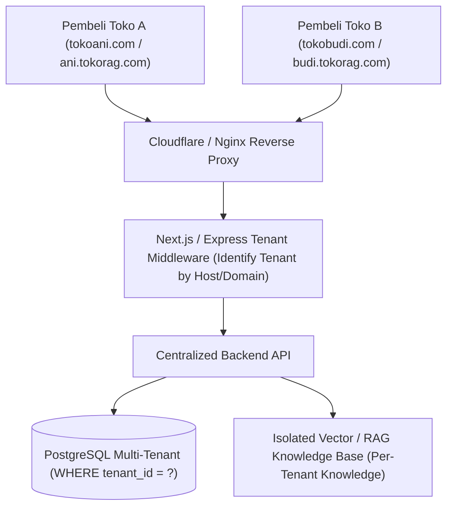

# 🚀 Cetak Biru (Blueprint): AI E-Commerce Storefront SaaS
**Platform Pembuat Toko Online Instan Berbasis Multi-Tenant dengan Asisten AI Penjualan (RAG AI Sales Copilot)**

---

## 📌 1. Ringkasan Eksekutif & Value Proposition

### 🎯 Visi Produk
Membangun platform **E-Commerce Storefront SaaS (White-label Store Builder)** yang memungkinkan pemilik brand / UMKM membuat website toko online mandiri dalam hitungan menit—lengkap dengan domain sendiri, hitung ongkir kurir otomatis, pembayaran QRIS/VA instan, dan **Asisten AI Penjual Aktif (RAG AI)** yang melayani pembeli 24/7.

### 💎 Nilai Pembeda Unik (*The AI Moat* vs Shopify / Berdu / OrderOnline)
| Platform Tradisional (Shopify / Berdu) | Platform AI Storefront SaaS (Milik Anda) |
| :--- | :--- |
| Katalog pasif (pembeli membaca teks sendiri). | **AI Sales Copilot Aktif:** Pembeli bisa konsultasi ukuran, bahan, rekomendasi produk, dan tanya stok secara cerdas. |
| Fitur AI hanya sebatas generator teks deskripsi produk. | **RAG AI Interaktif & Transaksional:** AI bisa langsung menambahkan item ke keranjang dan memandu checkout. |
| Biaya langganan mahal ($39/bln) & tanpa optimasi lokal Indo. | **Terintegrasi Lokal:** Hitung ongkir otomatis J&T/JNE/SiCepat & pembayaran QRIS/E-Wallet instan. |

---

## 🏗️ 2. Arsitektur Multi-Tenancy (Database & Routing)

Untuk melayani ratusan klien toko dalam 1 server terpusat secara aman, sistem dirombak dari arsitektur *Single-Tenant* menjadi *Shared Database, Multi-Tenant with Tenant Isolation*:



### 🗄️ Skema Basis Data Inti (Database Multi-Tenancy)

```sql
-- 1. TABEL UTAMA: TENANTS (Klien / Pemilik Toko SaaS)
CREATE TABLE tenants (
    id UUID PRIMARY KEY DEFAULT gen_random_uuid(),
    nama_toko VARCHAR(100) NOT NULL,
    subdomain VARCHAR(50) UNIQUE NOT NULL,      -- contoh: 'distroani' -> distroani.tokorag.com
    custom_domain VARCHAR(100) UNIQUE NULL,     -- contoh: 'distroani.com'
    logo_url TEXT,
    primary_color VARCHAR(20) DEFAULT '#000000',
    owner_email VARCHAR(150) UNIQUE NOT NULL,
    plan_type VARCHAR(20) DEFAULT 'STARTER',    -- STARTER, PRO, ENTERPRISE
    subscription_status VARCHAR(20) DEFAULT 'TRIAL', -- TRIAL, ACTIVE, EXPIRED, CANCELLED
    subscription_expires_at TIMESTAMP NOT NULL,
    -- Integrasi Merchant (Payment & Kurir)
    xendit_sub_account_id VARCHAR(100) NULL,
    biteship_api_key TEXT NULL,
    origin_postal_code VARCHAR(10) NULL,        -- Kode pos gudang toko untuk kalkulasi ongkir
    created_at TIMESTAMP DEFAULT CURRENT_TIMESTAMP
);

-- 2. TABEL: PRODUK (Dengan Tenant Isolation)
CREATE TABLE produk (
    id UUID PRIMARY KEY DEFAULT gen_random_uuid(),
    tenant_id UUID NOT NULL REFERENCES tenants(id) ON DELETE CASCADE,
    nama VARCHAR(255) NOT NULL,
    harga INTEGER NOT NULL,
    hpp INTEGER DEFAULT 0,
    stock INTEGER NOT NULL DEFAULT 0,
    weight_gram INTEGER NOT NULL DEFAULT 200,   -- Wajib untuk hitung ongkir
    image TEXT,
    kategori VARCHAR(100) DEFAULT 'Umum',
    deskripsi TEXT,
    ingredients_or_specs TEXT,
    is_active BOOLEAN DEFAULT TRUE,
    created_at TIMESTAMP DEFAULT CURRENT_TIMESTAMP
);
CREATE INDEX idx_produk_tenant ON produk(tenant_id);

-- 3. TABEL: KNOWLEDGE BASE AI (Terisolasi per-toko)
CREATE TABLE tenant_knowledge_base (
    id UUID PRIMARY KEY DEFAULT gen_random_uuid(),
    tenant_id UUID NOT NULL REFERENCES tenants(id) ON DELETE CASCADE,
    title VARCHAR(255) NOT NULL,
    content TEXT NOT NULL,
    tags TEXT[] DEFAULT '{}',
    is_active BOOLEAN DEFAULT TRUE,
    created_at TIMESTAMP DEFAULT CURRENT_TIMESTAMP
);
CREATE INDEX idx_kb_tenant ON tenant_knowledge_base(tenant_id);

-- 4. TABEL: ORDERS (Pesanan Pembeli)
CREATE TABLE orders (
    id UUID PRIMARY KEY DEFAULT gen_random_uuid(),
    tenant_id UUID NOT NULL REFERENCES tenants(id) ON DELETE CASCADE,
    customer_name VARCHAR(100) NOT NULL,
    customer_phone VARCHAR(30) NOT NULL,
    customer_email VARCHAR(100) NULL,
    shipping_address TEXT NOT NULL,
    shipping_postal_code VARCHAR(10) NOT NULL,
    courier_service VARCHAR(50) NOT NULL,       -- contoh: 'J&T Express - REG'
    shipping_cost INTEGER NOT NULL DEFAULT 0,   -- Ongkir otomatis
    total_amount INTEGER NOT NULL,
    status_pesanan VARCHAR(30) NOT NULL CHECK (
        status_pesanan IN ('MENUNGGU_PEMBAYARAN', 'DIBAYAR', 'DIPROSES', 'DIKIRIM', 'SELESAI', 'DIBATALKAN')
    ),
    status_pembayaran VARCHAR(30) DEFAULT 'UNPAID',
    tracking_number VARCHAR(100) NULL,          -- Nomor Resi
    created_at TIMESTAMP DEFAULT CURRENT_TIMESTAMP
);
CREATE INDEX idx_orders_tenant ON orders(tenant_id);
```

---

## 📦 3. Alur Logistik & Payment Gateway Indonesia

### A. Alur Hitung Ongkir Otomatis (Menggunakan Biteship / RajaOngkir API)
1. Pembeli mengisi nama, nomor telepon, kecamatan & kode pos tujuan pada formulir checkout.
2. Frontend mengirim `origin_postal_code` (gudang penjual), `destination_postal_code` (pembeli), dan total berat barang (`weight_gram`).
3. Sistem memanggil API Ekspedisi dan menampilkan daftar kurir (JNE, J&T, SiCepat, Anteraja) beserta tarif & estimasi hari sampai secara instan.
4. Ongkir otomatis ditambahkan ke total belanja.

### B. Alur Pembayaran (Xendit XenPlatform / Multi-Merchant)
* Pembeli membayar total pesanan (Harga Produk + Ongkir) menggunakan QRIS/Virtual Account.
* **Xendit Split Payment:** Uang langsung masuk ke saldo rekening pemilik toko, sementara *platform fee* SaaS (misal: 1% atau Rp 1.500 per transaksi) otomatis terpotong ke rekening Anda sebagai penyedia platform.

---

## 🤖 4. Modul AI Penjualan (RAG AI Sales Copilot)

Widget obrolan AI yang melayang di pojok kanan bawah toko pelanggan:
1. **Paham Konteks Toko:** AI hanya membaca produk dan SOP milik toko yang sedang dibuka (menggunakan filter `WHERE tenant_id = current_tenant`).
2. **Konsultasi Cerdas:** Mampu menjawab pertanyaan seperti:
   - *"Saya cari jaket parasut anti air warna hitam ukuran XL ada?"*
   - *"Apakah toko melayani pengiriman sameday ke Surabaya?"*
3. **Penyisipan Produk ke Keranjang (*Call to Action*):** AI memberikan balasan teks ramah sekaligus kartu produk dengan tombol *"Beli Sekarang"* atau *"Tambah ke Keranjang"*.

---

## 💰 5. Model Monetisasi & Strategi Harga (Pricing Strategy)

| Paket | Harga Langganan | Fitur Utama | Target Klien |
| :--- | :--- | :--- | :--- |
| **Starter** | Rp 99.000 / bulan | Subdomain gratis (`toko.namasaas.com`), maks. 50 produk, 100 chat AI/bulan, hitung ongkir kurir otomatis. | Toko pemula / dropshipper / UMKM mikro. |
| **Pro (Recommended)** | Rp 249.000 / bulan | **Custom Domain (`brandanda.com`)**, produk unlimited, 1.000 chat AI/bulan, integrasi WhatsApp Notifikasi, Laporan Keuangan HPP & Laba Bersih. | Brand lokal, olshop aktif di IG/TikTok. |
| **Enterprise** | Rp 599.000 / bulan | Semua fitur Pro + Integrasi WhatsApp AI Bot 24/7 langsung di nomor WA toko, prioritas server & support. | Bisnis dengan omset ratusan order per hari. |

---

## ⚠️ 6. Telaah Kritis, Risiko Teknis & Saran Penting

> [!IMPORTANT]
> **1. Jangan Koding Semua Fitur Sekaligus (Fokus ke MVP Dahulu)**
> Buat versi minimum yang berfungsi (MVP) dalam 2–3 minggu:
> - Cukup 1 tema template website toko online yang modern & responsif di HP (Next.js).
> - Checkout terhubung hitung ongkir otomatis (Biteship API) + QRIS Xendit.
> - Floating RAG AI chat widget.

> [!WARNING]
> **2. Manajemen Token API AI (Gemini/OpenAI Costs)**
> Biaya pemanggilan API Gemini/OpenAI harus dibatasi per paket (gunakan limit kuota chat AI bulanan per tenant) agar akun backend Anda tidak membengkak biaya tagihannya karena toko yang terlalu ramai.

> [!TIP]
> **3. Cara Mendapatkan 5 Klien Pertama Tanpa Iklan Berbayar:**
> - Cari penjual lokal di Instagram/TikTok yang saat ini masih jualan manual pakai link bio *Bitly/WhatsApp*.
> - Tawarkan promo khusus: *"Gratis coba 1 bulan website toko online instan dengan asisten AI + hitung ongkir otomatis, kami bantu uploadkan semua fotonya"*.
> - Umpan balik dari 5 toko nyata ini akan membuat software Anda 10x lipat lebih matang daripada sekadar menebak-nebak kebutuhan pasar.
