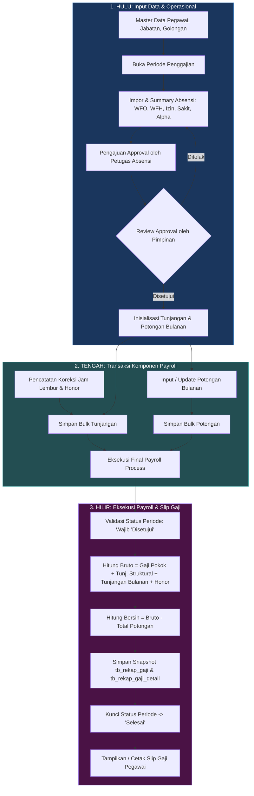

# Arsitektur Alur Sistem Penggajian Hulu-Hilir

Dokumen ini menjelaskan alur data menyeluruh (_end-to-end data lifecycle_) dari hulu (master data, absensi, approval) ke hilir (perhitungan tunjangan, potongan, eksekusi payroll, rekap gaji final, dan pencetakan slip gaji).

---

## 1. Diagram Alur Hulu-Hilir (Data Flow)

---

## 2. Siklus Hidup Status Periode (_State Machine_)

Periode penggajian menggunakan kontrol status ketat untuk menjaga integritas data keuangan:

| Status                  | Hak Akses Utama            | Aksi yang Diizinkan                                              | Keterangan                   |
| :---------------------- | :------------------------- | :--------------------------------------------------------------- | :--------------------------- |
| **`Pengisian Absensi`** | Petugas Absensi, Staf Gaji | Impor Absensi, Input Jam Lembur, Inisialisasi Tunjangan/Potongan | Periode baru dibuka          |
| **`Menunggu Approval`** | Approver                   | Review summary absensi, Beri catatan, Approve / Reject           | Menunggu verifikasi pimpinan |
| **`Disetujui`**         | Staf Gaji                  | Finalisasi Tunjangan, Potongan, & Eksekusi Payroll               | Siap dihitung gajinya        |
| **`Ditolak`**           | Petugas Absensi            | Perbaiki data absensi                                            | Dikembalikan ke petugas      |
| **`Diproses Gaji`**     | Sistem / Staf Gaji         | Perhitungan otomatis bruto, potongan, dan net                    | Transisi eksekusi            |
| **`Selesai`**           | Semua (Read-Only)          | Lihat Rekap, Cetak Slip Gaji                                     | Periode terkunci permanen    |

---

## 3. Rumus & Formula Perhitungan Komponen

### A. Tunjangan

1. **Uang Transport WFO (`TRN_WFO`)**
   $$\text{Transport} = \text{Total Kehadiran WFO} \times \text{Tarif Transport Master (Rp 30.000)}$$

2. **Tunjangan Istri (`TUNJ_ISTRI`)**
   $$\text{Tunj. Istri} = \begin{cases} 10\% \times \text{Gaji Pokok Dasar}, & \text{jika Status} = \text{'K'} \\ 0, & \text{jika Status} = \text{'TK'} \end{cases}$$

3. **Tunjangan Anak (`TUNJ_ANAK`)**
   $$\text{Tunj. Anak} = \min(\text{Jumlah Anak}, 2) \times 2\% \times \text{Gaji Pokok Dasar}$$

4. **Tunjangan Struktural (`TUNJ_STRUKTURAL`)**
   Diambil langsung dari `tb_jabatan.tunjangan_jabatan_struktural`.

5. **Honor Lembur / Jam Lebih (`HONOR_LEMBUR`)**
   $$\text{Honor Lembur} = \text{Total Jam Koreksi} \times \text{Tarif Lembur Master (Rp 25.000)}$$

### B. Potongan

- **Potongan Angsuran (`POT_ANGSURAN`)**: Dinamis per pegawai berdasarkan sisa angsuran pinjaman.
- **Potongan Dana Wajib (`POT_DANA_WAJIB`)**: Nominal tetap bulanan (Rp 50.000).
- **Potongan S_PSKD (`POT_S_PSKD`)**: Iuran paguyuban / sosial (Rp 20.000).
- **Potongan Pelkes (`POT_PELKES`)**: Iuran pelayanan kesehatan (Rp 30.000 - Rp 50.000).
- **Potongan Lainnya (`POT_LAINNYA`)**: Penyesuaian khusus.

### C. Total Penghasilan & Take Home Pay (Clean)

$$\text{Total Bruto} = \text{Gaji Pokok} + \text{Tunj. Struktural} + \sum \text{Tunjangan Detail} + \text{Honor Bulan}$$
$$\text{Total Potongan} = \sum \text{Potongan Detail}$$
$$\text{Penerimaan Bersih (Clean)} = \text{Total Bruto} - \text{Total Potongan}$$

---

## 4. Keunggulan Desain Snapshot (Immutability)

Sistem menggunakan tabel snapshot `tb_rekap_gaji` dan `tb_rekap_gaji_detail` pada bagian hilir. Keuntungannya:

1. **Historis Kebal Perubahan**: Jika di masa depan terjadi kenaikan gaji pokok master, perubahan nama jabatan, atau tarif potongan, data slip gaji masa lalu pada periode yang sudah berstatus `Selesai` **tidak akan pernah berubah**.
2. **Audit Trail Penuh**: Setiap rincian nominal memiliki `kode_kondisi_snapshot` dan nama komponen asli saat penggajian dieksekusi.
3. **Kinerja Tinggi**: Pengambilan data slip gaji dan laporan tidak memerlukan kalkulasi berulang atau join belasan tabel transaksi.
