# Kamus Data & Entity Relationship Diagram (ERD) Sistem Penggajian

Dokumen ini memuat spesifikasi lengkap struktur database PostgreSQL, relasi antar entitas, tipe data, constraint, serta aturan bisnis (*business rules*) untuk sistem penggajian hulu-hilir.

---

## 1. Diagram Entity-Relationship (ERD Mermaid)

```mermaid
erDiagram
    %% Master Tables
    tb_pengguna {
        SERIAL id_pengguna PK
        VARCHAR username UK
        VARCHAR password
        VARCHAR role
        TIMESTAMPTZ deleted_at
    }

    tb_formula_tunjangan {
        SERIAL id_formula_tunjangan PK
        VARCHAR kode_formula UK
        VARCHAR nama_formula
        TEXT keterangan
    }

    tb_tunjangan {
        SERIAL id_tunjangan PK
        VARCHAR nama_tunjangan
        NUMERIC nilai
        VARCHAR jenis_tunjangan
        VARCHAR sifat_tunjangan
        TEXT keterangan
        VARCHAR kode_kondisi UK
        VARCHAR formula_type FK
        TIMESTAMPTZ deleted_at
    }

    tb_formula_potongan {
        SERIAL id_formula_potongan PK
        VARCHAR kode_formula UK
        VARCHAR nama_formula
        TEXT keterangan
    }

    tb_master_potongan {
        SERIAL id_master_potongan PK
        VARCHAR nama_potongan
        NUMERIC nilai
        VARCHAR jenis_potongan
        VARCHAR sifat_potongan
        TEXT keterangan
        VARCHAR kode_potongan UK
        VARCHAR formula_type FK
        TIMESTAMPTZ deleted_at
    }

    tb_jabatan {
        SERIAL id_jabatan PK
        VARCHAR nama_jabatan UK
        NUMERIC tunjangan_jabatan_struktural
        TIMESTAMPTZ deleted_at
    }

    tb_golongan {
        SERIAL id_golongan PK
        VARCHAR nama_golongan UK
        NUMERIC gaji_pokok_standar
        TIMESTAMPTZ deleted_at
    }

    tb_periode {
        SERIAL id_periode PK
        VARCHAR bulan_gaji UK
        DATE tanggal_awal
        DATE tanggal_akhir
        VARCHAR status
        TIMESTAMPTZ deleted_at
    }

    tb_pegawai {
        SERIAL id_pegawai PK
        TEXT nama_dan_tanggal_lahir
        INTEGER id_jabatan FK
        INTEGER id_golongan FK
        VARCHAR status_perkawinan
        INTEGER jumlah_anak
        NUMERIC gaji_pokok_dasar
        TIMESTAMPTZ created_at
        TIMESTAMPTZ updated_at
        TIMESTAMPTZ deleted_at
    }

    %% Transaksi Hulu
    tb_absensi_summary {
        SERIAL id_absensi_summary PK
        INTEGER id_periode FK
        INTEGER id_pegawai FK
        INT total_hadir_ops_wfo
        INT total_hadir_ops_wfh
        INT total_izin
        INT total_sakit
        INT total_alpha
    }

    tb_approval {
        SERIAL id_approval PK
        INTEGER id_periode FK
        INTEGER approver_id FK
        VARCHAR status
        TEXT catatan
        TIMESTAMPTZ created_at
    }

    tb_koreksi_jam {
        SERIAL id_koreksi PK
        INTEGER id_periode FK
        INTEGER id_pegawai FK
        INTEGER id_staf_gaji FK
        NUMERIC jam_awal
        NUMERIC jam_koreksi
        NUMERIC jam_akhir
        VARCHAR jenis_koreksi
        TEXT keterangan
        VARCHAR bukti_dokumen
        TIMESTAMPTZ created_at
    }

    %% Intermediary Payroll
    tb_tunjangan_bulanan {
        SERIAL id_tunjangan_bulanan PK
        INTEGER id_periode FK
        INTEGER id_pegawai FK
        NUMERIC total_jam_lebih
        NUMERIC honor_bulan
        NUMERIC total_tunjangan_terhitung
    }

    tb_tunjangan_bulanan_detail {
        SERIAL id_tunjangan_detail PK
        INTEGER id_periode FK
        INTEGER id_pegawai FK
        INTEGER id_tunjangan FK
        NUMERIC nilai_terhitung
    }

    tb_potongan_bulanan {
        SERIAL id_potongan_bulanan PK
        INTEGER id_periode FK
        INTEGER id_pegawai FK
        NUMERIC total_potongan_terhitung
    }

    tb_potongan_bulanan_detail {
        SERIAL id_potongan_detail PK
        INTEGER id_periode FK
        INTEGER id_pegawai FK
        INTEGER id_master_potongan FK
        NUMERIC nilai_potongan
    }

    %% Hilir Snapshot
    tb_rekap_gaji {
        SERIAL id_rekap PK
        INTEGER id_periode FK
        INTEGER id_pegawai FK
        VARCHAR jabatan_snapshot
        VARCHAR pangkat_golongan_snapshot
        NUMERIC gaji_pokok_snapshot
        NUMERIC total_penghasilan_bruto
        NUMERIC total_potongan
        NUMERIC total_penerimaan_clean
        TIMESTAMPTZ created_at
    }

    tb_rekap_gaji_detail {
        SERIAL id_rekap_detail PK
        INTEGER id_rekap FK
        VARCHAR jenis_komponen
        VARCHAR nama_komponen_snapshot
        NUMERIC nilai_snapshot
        VARCHAR kode_kondisi_snapshot
    }

    %% Relasi
    tb_formula_tunjangan ||--o{ tb_tunjangan : "referensi formula"
    tb_formula_potongan ||--o{ tb_master_potongan : "referensi formula"
    tb_jabatan ||--o{ tb_pegawai : "ditetapkan ke"
    tb_golongan ||--o{ tb_pegawai : "ditetapkan ke"
    tb_pengguna ||--o{ tb_approval : "melakukan approval"
    tb_pengguna ||--o{ tb_koreksi_jam : "diinput oleh Staf Gaji"

    tb_periode ||--o{ tb_absensi_summary : "memiliki rekap absensi"
    tb_pegawai ||--o{ tb_absensi_summary : "direkap di"

    tb_periode ||--o{ tb_approval : "disetujui melalui"
    tb_periode ||--o{ tb_koreksi_jam : "memiliki koreksi"
    tb_pegawai ||--o{ tb_koreksi_jam : "dikenai koreksi"

    tb_periode ||--o{ tb_tunjangan_bulanan : "memiliki header tunjangan"
    tb_pegawai ||--o{ tb_tunjangan_bulanan : "memiliki header tunjangan"

    tb_periode ||--o{ tb_tunjangan_bulanan_detail : "memiliki detail tunjangan"
    tb_pegawai ||--o{ tb_tunjangan_bulanan_detail : "memiliki detail tunjangan"
    tb_tunjangan ||--o{ tb_tunjangan_bulanan_detail : "komponen tunjangan"

    tb_periode ||--o{ tb_potongan_bulanan : "memiliki header potongan"
    tb_pegawai ||--o{ tb_potongan_bulanan : "memiliki header potongan"

    tb_periode ||--o{ tb_potongan_bulanan_detail : "memiliki detail potongan"
    tb_pegawai ||--o{ tb_potongan_bulanan_detail : "memiliki detail potongan"
    tb_master_potongan ||--o{ tb_potongan_bulanan_detail : "komponen potongan"

    tb_periode ||--o{ tb_rekap_gaji : "menghasilkan slip gaji"
    tb_pegawai ||--o{ tb_rekap_gaji : "menerima slip gaji"

    tb_rekap_gaji ||--|{ tb_rekap_gaji_detail : "rincian komponen slip"
```



---

## 2. Kamus Data Tabel (Data Dictionary)

### 1. `tb_pengguna` (Master Pengguna / Akun)
Menyimpan kredensial dan hak akses pengguna sistem.

| Kolom | Tipe Data | Constraint | Keterangan |
| :--- | :--- | :--- | :--- |
| `id_pengguna` | SERIAL | PK, NOT NULL | ID unik pengguna |
| `username` | VARCHAR(50) | UNIQUE, NOT NULL | Username login |
| `password` | VARCHAR(255) | NOT NULL | Hash password (bcrypt) |
| `role` | VARCHAR(20) | NOT NULL, CHECK | Role: `'Admin'`, `'Petugas Absensi'`, `'Approver'`, `'Staf Gaji'` |
| `deleted_at` | TIMESTAMPTZ | NULL | Soft delete timestamp |

---

### 2. `tb_formula_tunjangan` (Master Formula Tunjangan)
Katalog jenis kalkulasi otomatis tunjangan.

| Kolom | Tipe Data | Constraint | Keterangan |
| :--- | :--- | :--- | :--- |
| `id_formula_tunjangan` | SERIAL | PK, NOT NULL | ID unik formula |
| `kode_formula` | VARCHAR(30) | UNIQUE, NOT NULL | Kode formula: `'HARIAN_HADIR_WFO'`, `'PERSEN_GAJI_JIKA_KAWIN'`, `'PERSEN_GAJI_PER_ANAK'`, `'PER_JAM_LEMBUR'` |
| `nama_formula` | VARCHAR(100) | NOT NULL | Nama deskriptif formula |
| `keterangan` | TEXT | NULL | Penjelasan teknis formula |

---

### 3. `tb_tunjangan` (Master Komponen Tunjangan)
Daftar master komponen tunjangan yang berlaku di instansi.

| Kolom | Tipe Data | Constraint | Keterangan |
| :--- | :--- | :--- | :--- |
| `id_tunjangan` | SERIAL | PK, NOT NULL | ID unik tunjangan |
| `nama_tunjangan` | VARCHAR(100) | NOT NULL | Nama tunjangan (cth: Uang Transport WFO) |
| `nilai` | NUMERIC(12,2) | NOT NULL, DEFAULT 0 | Nilai nominal flat atau persentase (cth: 0.10 untuk 10%) |
| `jenis_tunjangan` | VARCHAR(20) | NOT NULL, DEFAULT 'NOMINAL' | `'NOMINAL'` / `'PERSENTASE'` |
| `sifat_tunjangan` | VARCHAR(20) | NOT NULL, DEFAULT 'BULANAN' | `'BULANAN'`, `'HARIAN'`, `'PER_JAM'` |
| `keterangan` | TEXT | NULL | Catatan tambahan |
| `kode_kondisi` | VARCHAR(20) | UNIQUE, NOT NULL | Kode unik identifier (cth: `'TRN_WFO'`, `'TUNJ_ISTRI'`, `'TUNJ_ANAK'`, `'LEMBUR_PER_JAM'`) |
| `formula_type` | VARCHAR(30) | FK -> `tb_formula_tunjangan.kode_formula` | Tipe formula kalkulasi otomatis |
| `deleted_at` | TIMESTAMPTZ | NULL | Soft delete timestamp |

---

### 4. `tb_formula_potongan` (Master Formula Potongan)
Katalog jenis kalkulasi potongan.

| Kolom | Tipe Data | Constraint | Keterangan |
| :--- | :--- | :--- | :--- |
| `id_formula_potongan` | SERIAL | PK, NOT NULL | ID unik formula |
| `kode_formula` | VARCHAR(30) | UNIQUE, NOT NULL | Kode formula (cth: `'NOMINAL_FLAT'`) |
| `nama_formula` | VARCHAR(100) | NOT NULL | Nama deskriptif formula |
| `keterangan` | TEXT | NULL | Penjelasan teknis formula |

---

### 5. `tb_master_potongan` (Master Komponen Potongan)
Daftar master komponen potongan wajib maupun opsional.

| Kolom | Tipe Data | Constraint | Keterangan |
| :--- | :--- | :--- | :--- |
| `id_master_potongan` | SERIAL | PK, NOT NULL | ID unik master potongan |
| `nama_potongan` | VARCHAR(100) | NOT NULL | Nama potongan (cth: Potongan Dana Wajib, Pelkes) |
| `nilai` | NUMERIC(12,2) | NOT NULL, DEFAULT 0 | Nilai default pemotongan |
| `jenis_potongan` | VARCHAR(20) | NOT NULL, DEFAULT 'NOMINAL' | `'NOMINAL'` / `'PERSENTASE'` |
| `sifat_potongan` | VARCHAR(20) | NOT NULL, DEFAULT 'BULANAN' | Sifat potongan per bulan |
| `keterangan` | TEXT | NULL | Penjelasan potongan |
| `kode_potongan` | VARCHAR(20) | UNIQUE, NOT NULL | Kode unik (cth: `'POT_ANGSURAN'`, `'POT_DANA_WAJIB'`, `'POT_PELKES'`) |
| `formula_type` | VARCHAR(30) | FK -> `tb_formula_potongan.kode_formula` | Formula potongan terkait |
| `deleted_at` | TIMESTAMPTZ | NULL | Soft delete timestamp |

---

### 6. `tb_jabatan` (Master Jabatan)
Struktur jabatan struktural dan fungsional beserta tunjangan strukturalnya.

| Kolom | Tipe Data | Constraint | Keterangan |
| :--- | :--- | :--- | :--- |
| `id_jabatan` | SERIAL | PK, NOT NULL | ID unik jabatan |
| `nama_jabatan` | VARCHAR(50) | UNIQUE, NOT NULL | Nama jabatan |
| `tunjangan_jabatan_struktural` | NUMERIC(12,2) | DEFAULT 0 | Tunjangan jabatan otomatis |
| `deleted_at` | TIMESTAMPTZ | NULL | Soft delete timestamp |

---

### 7. `tb_golongan` (Master Golongan & Pangkat)
Pangkat/golongan dan gaji pokok standar acuan.

| Kolom | Tipe Data | Constraint | Keterangan |
| :--- | :--- | :--- | :--- |
| `id_golongan` | SERIAL | PK, NOT NULL | ID unik golongan |
| `nama_golongan` | VARCHAR(50) | UNIQUE, NOT NULL | Nama golongan (cth: Golongan IV/a, III/b, GTT) |
| `gaji_pokok_standar` | NUMERIC(12,2) | NOT NULL, DEFAULT 0 | Standar gaji pokok acuan |
| `deleted_at` | TIMESTAMPTZ | NULL | Soft delete timestamp |

---

### 8. `tb_periode` (Master Periode Penggajian)
Siklus penggajian bulanan dengan proteksi anti-overlap.

| Kolom | Tipe Data | Constraint | Keterangan |
| :--- | :--- | :--- | :--- |
| `id_periode` | SERIAL | PK, NOT NULL | ID unik periode |
| `bulan_gaji` | VARCHAR(20) | UNIQUE, NOT NULL | Label periode (cth: `'Juli 2026'`) |
| `tanggal_awal` | DATE | NOT NULL | Tanggal cut-off awal absensi |
| `tanggal_akhir` | DATE | NOT NULL | Tanggal cut-off akhir absensi |
| `status` | VARCHAR(30) | DEFAULT 'Pengisian Absensi', CHECK | `'Pengisian Absensi'`, `'Menunggu Approval'`, `'Disetujui'`, `'Ditolak'`, `'Diproses Gaji'`, `'Selesai'` |
| `deleted_at` | TIMESTAMPTZ | NULL | Soft delete timestamp |

*Constraint Tambahan:* `chk_anti_overlap_periode` menggunakan GIST exclude range `[tanggal_awal, tanggal_akhir]` untuk mencegah tumpang-tindih tanggal pada periode aktif.

---

### 9. `tb_pegawai` (Master Data Pegawai)
Data profil pegawai, status perkawinan, anak, dan gaji pokok aktif.

| Kolom | Tipe Data | Constraint | Keterangan |
| :--- | :--- | :--- | :--- |
| `id_pegawai` | SERIAL | PK, NOT NULL | ID unik pegawai |
| `nama_dan_tanggal_lahir` | TEXT | NOT NULL | Format nama & tanggal lahir |
| `id_jabatan` | INTEGER | FK -> `tb_jabatan(id_jabatan)` | Jabatan aktif |
| `id_golongan` | INTEGER | FK -> `tb_golongan(id_golongan)` | Pangkat / Golongan aktif |
| `status_perkawinan` | VARCHAR(10) | DEFAULT 'TK' | `'TK'` (Tidak Kawin) / `'K'` (Kawin) |
| `jumlah_anak` | INTEGER | DEFAULT 0 | Jumlah tanggungan anak |
| `gaji_pokok_dasar` | NUMERIC(15,2) | NOT NULL, DEFAULT 0 | Besaran gaji pokok berlaku |
| `created_at` | TIMESTAMPTZ | DEFAULT NOW() | Tanggal pendaftaran |
| `updated_at` | TIMESTAMPTZ | DEFAULT NOW() | Tanggal update data |
| `deleted_at` | TIMESTAMPTZ | NULL | Soft delete timestamp |

---

### 10. `tb_absensi_summary` (Rekapitulasi Kehadiran Hulu)
Ringkasan kehadiran hasil impor absensi bulanan.

| Kolom | Tipe Data | Constraint | Keterangan |
| :--- | :--- | :--- | :--- |
| `id_absensi_summary` | SERIAL | PK, NOT NULL | ID unik summary absensi |
| `id_periode` | INTEGER | FK -> `tb_periode`, NOT NULL, CASCADE | Periode kehadiran |
| `id_pegawai` | INTEGER | FK -> `tb_pegawai`, NOT NULL, CASCADE | Pegawai yang bersangkutan |
| `total_hadir_ops_wfo` | INT | DEFAULT 0 | Jumlah hadir kerja fisik (WFO) |
| `total_hadir_ops_wfh` | INT | DEFAULT 0 | Jumlah hadir WFH |
| `total_izin` | INT | DEFAULT 0 | Jumlah izin |
| `total_sakit` | INT | DEFAULT 0 | Jumlah sakit |
| `total_alpha` | INT | DEFAULT 0 | Jumlah tanpa keterangan |

*Unique Constraint:* `UNIQUE (id_periode, id_pegawai)`

---

### 11. `tb_approval` (Log Audit & Persetujuan Absensi)
Log keputusan persetujuan absensi oleh pimpinan/approver.

| Kolom | Tipe Data | Constraint | Keterangan |
| :--- | :--- | :--- | :--- |
| `id_approval` | SERIAL | PK, NOT NULL | ID unik log approval |
| `id_periode` | INTEGER | FK -> `tb_periode`, NOT NULL, CASCADE | Periode yang diajukan |
| `approver_id` | INTEGER | FK -> `tb_pengguna`, NOT NULL | Akun approver |
| `status` | VARCHAR(20) | NOT NULL, CHECK | `'Pending'`, `'Approved'`, `'Rejected'` |
| `catatan` | TEXT | NULL | Catatan revisi atau approval |
| `created_at` | TIMESTAMPTZ | DEFAULT NOW() | Waktu tindakan |

---

### 12. `tb_koreksi_jam` (Log Audit Koreksi Jam Lembur)
Catatan audit koreksi jam mengajar lebih / lembur oleh Staf Gaji.

| Kolom | Tipe Data | Constraint | Keterangan |
| :--- | :--- | :--- | :--- |
| `id_koreksi` | SERIAL | PK, NOT NULL | ID unik log koreksi |
| `id_periode` | INTEGER | FK -> `tb_periode`, NOT NULL, CASCADE | Periode terkait |
| `id_pegawai` | INTEGER | FK -> `tb_pegawai`, NOT NULL, CASCADE | Pegawai terkait |
| `id_staf_gaji` | INTEGER | FK -> `tb_pengguna(id_pengguna)` | Staf Gaji yang mencatat |
| `jam_awal` | NUMERIC(5,2) | NOT NULL, DEFAULT 0 | Jam sebelum koreksi |
| `jam_koreksi` | NUMERIC(5,2) | NOT NULL | Jumlah jam penambah / pengurang |
| `jam_akhir` | NUMERIC(5,2) | NOT NULL, DEFAULT 0 | Jam sesudah koreksi |
| `jenis_koreksi` | VARCHAR(20) | NOT NULL, CHECK | `'ADD'` / `'SUBTRACT'` |
| `keterangan` | TEXT | NOT NULL | Alasan penyesuaian |
| `bukti_dokumen` | VARCHAR(255) | NULL | Path lampiran bukti |
| `created_at` | TIMESTAMPTZ | DEFAULT NOW() | Waktu pencatatan |

---

### 13. `tb_tunjangan_bulanan` (Header Transaksi Tunjangan)
Wadah tunjangan bulanan per pegawai per periode.

| Kolom | Tipe Data | Constraint | Keterangan |
| :--- | :--- | :--- | :--- |
| `id_tunjangan_bulanan` | SERIAL | PK, NOT NULL | ID unik header tunjangan |
| `id_periode` | INTEGER | FK -> `tb_periode`, NOT NULL, CASCADE | Periode penggajian |
| `id_pegawai` | INTEGER | FK -> `tb_pegawai`, NOT NULL, CASCADE | Pegawai penerima |
| `total_jam_lebih` | NUMERIC(5,2) | DEFAULT 0.00 | Total jam lembur/jam lebih |
| `honor_bulan` | NUMERIC(12,2) | DEFAULT 0.00 | Total honor lembur / honor manual |
| `total_tunjangan_terhitung` | NUMERIC(12,2) | DEFAULT 0.00 | Total keseluruhan tunjangan (`honor_bulan + sum(details)`) |

*Unique Constraint:* `UNIQUE (id_periode, id_pegawai)`

---

### 14. `tb_tunjangan_bulanan_detail` (Rincian Detail Tunjangan)
Breakdown per komponen tunjangan untuk tiap pegawai.

| Kolom | Tipe Data | Constraint | Keterangan |
| :--- | :--- | :--- | :--- |
| `id_tunjangan_detail` | SERIAL | PK, NOT NULL | ID unik detail tunjangan |
| `id_periode` | INTEGER | FK -> `tb_periode`, NOT NULL, CASCADE | Periode penggajian |
| `id_pegawai` | INTEGER | FK -> `tb_pegawai`, NOT NULL, CASCADE | Pegawai |
| `id_tunjangan` | INTEGER | FK -> `tb_tunjangan`, NOT NULL, RESTRICT | Komponen master tunjangan |
| `nilai_terhitung` | NUMERIC(12,2) | DEFAULT 0.00 | Nilai nominal hasil kalkulasi formula |

*Unique Constraint:* `CONSTRAINT unique_periode_pegawai_tunjangan UNIQUE (id_periode, id_pegawai, id_tunjangan)`

---

### 15. `tb_potongan_bulanan` (Header Transaksi Potongan)
Wadah total potongan bulanan per pegawai per periode.

| Kolom | Tipe Data | Constraint | Keterangan |
| :--- | :--- | :--- | :--- |
| `id_potongan_bulanan` | SERIAL | PK, NOT NULL | ID unik header potongan |
| `id_periode` | INTEGER | FK -> `tb_periode`, NOT NULL, CASCADE | Periode penggajian |
| `id_pegawai` | INTEGER | FK -> `tb_pegawai`, NOT NULL, CASCADE | Pegawai terkait |
| `total_potongan_terhitung` | NUMERIC(12,2) | DEFAULT 0.00 | Akumulasi total potongan per pegawai |

*Unique Constraint:* `UNIQUE (id_periode, id_pegawai)`

---

### 16. `tb_potongan_bulanan_detail` (Rincian Detail Potongan)
Breakdown nilai pemotongan per jenis potongan.

| Kolom | Tipe Data | Constraint | Keterangan |
| :--- | :--- | :--- | :--- |
| `id_potongan_detail` | SERIAL | PK, NOT NULL | ID unik detail potongan |
| `id_periode` | INTEGER | FK -> `tb_periode`, NOT NULL, CASCADE | Periode penggajian |
| `id_pegawai` | INTEGER | FK -> `tb_pegawai`, NOT NULL, CASCADE | Pegawai |
| `id_master_potongan` | INTEGER | FK -> `tb_master_potongan`, NOT NULL, RESTRICT | Komponen master potongan |
| `nilai_potongan` | NUMERIC(12,2) | DEFAULT 0.00 | Besaran nilai yang dipotong |

*Unique Constraint:* `CONSTRAINT unique_periode_pegawai_potongan UNIQUE (id_periode, id_pegawai, id_master_potongan)`

---

### 17. `tb_rekap_gaji` (Rekap Gaji Final / Slip Header Snapshot)
Snapshot permanen hasil kalkulasi akhir penggajian setelah approval & eksekusi payroll.

| Kolom | Tipe Data | Constraint | Keterangan |
| :--- | :--- | :--- | :--- |
| `id_rekap` | SERIAL | PK, NOT NULL | ID unik slip rekap |
| `id_periode` | INTEGER | FK -> `tb_periode`, NOT NULL, RESTRICT | Periode penggajian |
| `id_pegawai` | INTEGER | FK -> `tb_pegawai`, NOT NULL, RESTRICT | Pegawai penerima |
| `jabatan_snapshot` | VARCHAR(50) | NOT NULL | Snapshot nama jabatan saat payroll |
| `pangkat_golongan_snapshot` | VARCHAR(50) | NOT NULL | Snapshot golongan saat payroll |
| `gaji_pokok_snapshot` | NUMERIC(12,2) | DEFAULT 0.00 | Snapshot besaran gaji pokok |
| `total_penghasilan_bruto` | NUMERIC(12,2) | DEFAULT 0.00 | `Gaji Pokok + Tunj. Struktural + Tunjangan Bulanan + Honor` |
| `total_potongan` | NUMERIC(12,2) | DEFAULT 0.00 | Total seluruh potongan |
| `total_penerimaan_clean` | NUMERIC(12,2) | DEFAULT 0.00 | Gaji bersih diterima (`Bruto - Potongan`) |
| `created_at` | TIMESTAMPTZ | DEFAULT NOW() | Waktu pencetakan rekap |

*Unique Constraint:* `UNIQUE (id_periode, id_pegawai)`

---

### 18. `tb_rekap_gaji_detail` (Rincian Komponen Slip Gaji Snapshot)
Rincian per item pada slip gaji (baik tunjangan maupun potongan).

| Kolom | Tipe Data | Constraint | Keterangan |
| :--- | :--- | :--- | :--- |
| `id_rekap_detail` | SERIAL | PK, NOT NULL | ID unik detail slip |
| `id_rekap` | INTEGER | FK -> `tb_rekap_gaji`, NOT NULL, CASCADE | Slip gaji induk |
| `jenis_komponen` | VARCHAR(20) | NOT NULL, CHECK | `'TUNJANGAN'` / `'POTONGAN'` |
| `nama_komponen_snapshot` | VARCHAR(100) | NOT NULL | Nama item yang tertera di slip |
| `nilai_snapshot` | NUMERIC(12,2) | NOT NULL, DEFAULT 0 | Nilai rupiah komponen |
| `kode_kondisi_snapshot` | VARCHAR(20) | DEFAULT 'UMUM' | Kode identifikasi jenis formula |

---

## 3. Indeks Optimasi Database

```sql
CREATE INDEX idx_tunjangan_detail_lookup ON tb_tunjangan_bulanan_detail(id_periode, id_pegawai);
CREATE INDEX idx_potongan_detail_lookup ON tb_potongan_bulanan_detail(id_periode, id_pegawai);
CREATE INDEX idx_rekap_gaji_periode ON tb_rekap_gaji(id_periode);
CREATE INDEX idx_pegawai_deleted_at ON tb_pegawai(deleted_at) WHERE deleted_at IS NULL;
```
