# 📑 Kamus Data & Entity Relationship Diagram (ERD) Sistem Penggajian SMK PSKD 3 Jakarta
*Terakhir Diperbarui: 25 September 2026 | Berdasarkan Database Riil PostgreSQL (`TADB`) & Dynamic Line-Item Master-Detail Architecture*

Dokumen ini memuat spesifikasi lengkap struktur database PostgreSQL, relasi antar entitas, tipe data, constraint, serta aturan bisnis (*business rules*) untuk sistem informasi penggajian SMK PSKD 3 Jakarta dengan arsitektur komponen dinamis (3NF & Open-Closed Principle).

---

## 1. Diagram Entity-Relationship (ERD Mermaid)

```mermaid
erDiagram
    %% 1. Master Data & Auth
    tb_pengguna ||--o{ tb_approval : "menyetujui"
    tb_pengguna ||--o{ tb_notifikasi : "menerima"

    tb_jabatan ||--o{ tb_pegawai : "ditempati"
    tb_golongan ||--o{ tb_pegawai : "disandang"

    %% 2. Profil Pegawai & Gaji Pokok
    tb_pegawai ||--|| tb_gaji_pokok : "memiliki_dasar_pp85"
    tb_pegawai ||--o{ tb_absensi_summary : "mencatat_rekap_presensi"
    tb_pegawai ||--o{ tb_jam_mengajar : "memiliki_rekap_jam"
    tb_pegawai ||--o{ tb_tunjangan_bulanan : "menerima_tunjangan"
    tb_pegawai ||--o{ tb_tunjangan_bulanan_detail : "detail_tunjangan_pegawai"
    tb_pegawai ||--o{ tb_potongan_bulanan : "dikenakan_potongan"
    tb_pegawai ||--o{ tb_potongan_bulanan_detail : "detail_potongan_pegawai"
    tb_pegawai ||--o{ tb_rekap_gaji : "memiliki_rekap"
    tb_pegawai ||--o{ tb_permintaan_pembayaran_detail : "tercantum_di_pembayaran"

    %% 3. Siklus Periode Penggajian
    tb_periode ||--o{ tb_absensi_summary : "lingkup_periode"
    tb_periode ||--o{ tb_jam_mengajar : "rekap_periode"
    tb_periode ||--o{ tb_tunjangan_bulanan : "periode_tunjangan"
    tb_periode ||--o{ tb_tunjangan_bulanan_detail : "periode_detail_tunjangan"
    tb_periode ||--o{ tb_potongan_bulanan : "periode_potongan"
    tb_periode ||--o{ tb_potongan_bulanan_detail : "periode_detail_potongan"
    tb_periode ||--o{ tb_approval : "diajukan_approval"
    tb_periode ||--o{ tb_rekap_gaji : "menghasilkan_rekap"
    tb_periode ||--|| tb_permintaan_pembayaran : "dokumen_pencairan"

    %% 4. Master Komponen Dinamis
    tb_tunjangan ||--o{ tb_tunjangan_bulanan_detail : "dasar_kalkulasi_tunjangan"
    tb_master_potongan ||--o{ tb_potongan_bulanan_detail : "dasar_kalkulasi_potongan"

    %% 5. Rincian Rekap & Pembayaran Bank
    tb_rekap_gaji ||--o{ tb_rekap_gaji_detail : "rincian_komponen_slip"
    tb_permintaan_pembayaran ||--o{ tb_permintaan_pembayaran_detail : "rincian_transfer_pegawai"

    tb_pengguna {
        SERIAL id_pengguna PK
        VARCHAR username UK
        VARCHAR password
        VARCHAR role
        TIMESTAMPTZ deleted_at
    }

    tb_jabatan {
        SERIAL id_jabatan PK
        VARCHAR nama_jabatan UK
        NUMERIC tunjangan_jabatan_struktural
        NUMERIC tunjangan_jabatan_fungsional
        TIMESTAMPTZ deleted_at
    }

    tb_golongan {
        SERIAL id_golongan PK
        VARCHAR nama_golongan UK
        NUMERIC gaji_pokok_standar
        TIMESTAMPTZ deleted_at
    }

    tb_pegawai {
        SERIAL id_pegawai PK
        VARCHAR nip UK
        VARCHAR nama
        DATE tanggal_lahir
        VARCHAR status_kepegawaian
        INTEGER id_jabatan FK
        INTEGER id_golongan FK
        VARCHAR status_perkawinan
        INTEGER jumlah_anak
        NUMERIC gaji_pokok_dasar
        VARCHAR kontak
        TIMESTAMPTZ deleted_at
    }

    tb_gaji_pokok {
        SERIAL id_gaji_pokok PK
        INTEGER id_pegawai FK
        VARCHAR golongan_ruang
        VARCHAR status_kawin
        INTEGER jumlah_anak
        NUMERIC gaji_pokok_pp
        NUMERIC tunjangan_suami_istri
        NUMERIC tunjangan_anak
        NUMERIC tunjangan_kesra_dasar
        NUMERIC tunjangan_jabatan_struktural
        NUMERIC tunjangan_jabatan_fungsional
        NUMERIC tunjangan_jabatan_25_pp85
        NUMERIC sumbangan_dana_chuk_2
        NUMERIC sumbangan_dana_chuk_8
        NUMERIC tunjangan_perbaikan_penghasilan
        NUMERIC pembulatan
        NUMERIC jumlah_bruto
        NUMERIC total_potongan_tetap
        NUMERIC gaji_bersih_tetap
    }

    tb_periode {
        SERIAL id_periode PK
        VARCHAR bulan_gaji
        INTEGER bulan
        INTEGER tahun
        DATE tanggal_awal
        DATE tanggal_akhir
        VARCHAR status
        TIMESTAMPTZ deleted_at
    }

    tb_absensi_summary {
        SERIAL id_absensi_summary PK
        INTEGER id_periode FK
        INTEGER id_pegawai FK
        INTEGER total_hadir_ops_wfo
        INTEGER total_hadir_ops_wfh
        INTEGER total_izin
        INTEGER total_sakit
        INTEGER total_alpha
    }

    tb_jam_mengajar {
        SERIAL id_jam_mengajar PK
        INTEGER id_pegawai FK
        INTEGER id_periode FK
        VARCHAR keterangan_tugas
        NUMERIC total_jam
        NUMERIC jam_wajib
        NUMERIC jam_lebih
        NUMERIC jam_tidak_hadir
        INTEGER hari_hadir_honor
    }

    tb_tunjangan {
        SERIAL id_tunjangan PK
        VARCHAR nama_tunjangan
        NUMERIC nilai
        VARCHAR jenis_tunjangan
        VARCHAR sifat_tunjangan
        TEXT keterangan
        VARCHAR kode_kondisi UK
        VARCHAR formula_type
        TIMESTAMPTZ deleted_at
    }

    tb_tunjangan_bulanan {
        SERIAL id_tunjangan_bulanan PK
        INTEGER id_periode FK
        INTEGER id_pegawai FK
        NUMERIC total_jam_lebih
        NUMERIC honor_bulan
        NUMERIC total_tunjangan_terhitung
    }

    tb_tunjangan_bulanan_detail {
        SERIAL id_tunjangan_detail PK
        INTEGER id_periode FK
        INTEGER id_pegawai FK
        INTEGER id_tunjangan FK
        NUMERIC nilai_terhitung
    }

    tb_master_potongan {
        SERIAL id_master_potongan PK
        VARCHAR nama_potongan
        NUMERIC nilai
        VARCHAR jenis_potongan
        VARCHAR sifat_potongan
        TEXT keterangan
        VARCHAR kode_potongan UK
        VARCHAR formula_type
        TIMESTAMPTZ deleted_at
    }

    tb_potongan_bulanan {
        SERIAL id_potongan_bulanan PK
        INTEGER id_periode FK
        INTEGER id_pegawai FK
        NUMERIC total_potongan_terhitung
    }

    tb_potongan_bulanan_detail {
        SERIAL id_potongan_detail PK
        INTEGER id_periode FK
        INTEGER id_pegawai FK
        INTEGER id_master_potongan FK
        NUMERIC nilai_potongan
    }

    tb_approval {
        SERIAL id_approval PK
        INTEGER id_periode FK
        INTEGER id_approver FK
        VARCHAR status
        TEXT catatan
        TIMESTAMPTZ created_at
    }

    tb_rekap_gaji {
        SERIAL id_rekap PK
        INTEGER id_periode FK
        INTEGER id_pegawai FK
        VARCHAR jabatan_snapshot
        VARCHAR pangkat_golongan_snapshot
        NUMERIC gaji_pokok_snapshot
        NUMERIC total_penghasilan_bruto
        NUMERIC total_potongan
        NUMERIC total_penerimaan_clean
        INTEGER hari_hadir
        TIMESTAMPTZ created_at
    }

    tb_rekap_gaji_detail {
        SERIAL id_rekap_detail PK
        INTEGER id_rekap FK
        VARCHAR jenis_komponen
        VARCHAR nama_komponen_snapshot
        NUMERIC nilai_snapshot
        VARCHAR kode_kondisi_snapshot
    }

    tb_permintaan_pembayaran {
        SERIAL id_permintaan PK
        INTEGER id_periode FK
        VARCHAR nomor_dokumen UK
        VARCHAR status
        NUMERIC total_gaji_pokok
        NUMERIC total_tunjangan
        NUMERIC total_honorarium
        NUMERIC total_transport
        NUMERIC total_penghasilan_kotor
        NUMERIC total_potongan
        NUMERIC total_dana_dibayarkan
        VARCHAR ditandatangani_kasek
        VARCHAR ditandatangani_bendahara
        TIMESTAMPTZ tanggal_generate
    }

    tb_permintaan_pembayaran_detail {
        SERIAL id_permintaan_detail PK
        INTEGER id_permintaan FK
        INTEGER id_pegawai FK
        VARCHAR nama_pegawai
        VARCHAR jabatan
        NUMERIC gaji_pokok
        NUMERIC tunjangan
        NUMERIC honorarium
        NUMERIC transport
        NUMERIC total_penghasilan
        NUMERIC potongan
        NUMERIC jumlah_diterima
    }

    tb_notifikasi {
        SERIAL id_notifikasi PK
        INTEGER id_pengguna FK
        VARCHAR judul
        TEXT pesan
        VARCHAR tipe
        VARCHAR tautan
        BOOLEAN is_read
        TIMESTAMPTZ created_at
    }
```

---

## 2. Kamus Data Rinci (Spesifikasi Tabel)

### 2.1 `tb_pengguna` (Master Pengguna & Autentikasi)
| Nama Kolom | Tipe Data | Constraint | Keterangan |
| :--- | :--- | :--- | :--- |
| `id_pengguna` | `SERIAL` | `PRIMARY KEY` | ID unik akun pengguna. |
| `username` | `VARCHAR(50)` | `NOT NULL, UNIQUE` | Username untuk login. |
| `password` | `VARCHAR(255)` | `NOT NULL` | Hash password dengan bcrypt. |
| `role` | `VARCHAR(20)` | `CHECK IN ('Admin', 'Kepala Sekolah', 'Staf TU', 'Pegawai')` | Hak akses pengguna. |
| `deleted_at` | `TIMESTAMPTZ` | `NULL` | Timestamp soft-delete. |

### 2.2 `tb_jabatan` (Master Jabatan Struktural / Fungsional)
| Nama Kolom | Tipe Data | Constraint | Keterangan |
| :--- | :--- | :--- | :--- |
| `id_jabatan` | `SERIAL` | `PRIMARY KEY` | ID unik jabatan. |
| `nama_jabatan` | `VARCHAR(50)` | `NOT NULL, UNIQUE` | Nama jabatan sekolah. |
| `tunjangan_jabatan_struktural` | `NUMERIC(12,2)` | `DEFAULT 0` | Nominal tunjangan jabatan struktural sekolah. |
| `tunjangan_jabatan_fungsional` | `NUMERIC(12,2)` | `DEFAULT 0` | Nominal tunjangan jabatan fungsional. |
| `deleted_at` | `TIMESTAMPTZ` | `NULL` | Timestamp soft-delete. |

### 2.3 `tb_golongan` (Master Golongan Pegawai)
| Nama Kolom | Tipe Data | Constraint | Keterangan |
| :--- | :--- | :--- | :--- |
| `id_golongan` | `SERIAL` | `PRIMARY KEY` | ID unik golongan. |
| `nama_golongan` | `VARCHAR(50)` | `NOT NULL, UNIQUE` | Golongan kepangkatan (I/a s.d. IV/e). |
| `gaji_pokok_standar` | `NUMERIC(12,2)` | `DEFAULT 0` | Tarif acuan dasar. |
| `deleted_at` | `TIMESTAMPTZ` | `NULL` | Timestamp soft-delete. |

### 2.4 `tb_pegawai` (Master Data Pegawai & Guru)
| Nama Kolom | Tipe Data | Constraint | Keterangan |
| :--- | :--- | :--- | :--- |
| `id_pegawai` | `SERIAL` | `PRIMARY KEY` | ID unik pegawai. |
| `nip` | `VARCHAR(50)` | `UNIQUE` | Nomor Induk Pegawai. |
| `nama` | `VARCHAR(150)` | `NOT NULL` | Nama lengkap dan gelar pegawai. |
| `tanggal_lahir` | `DATE` | `NULL` | Tanggal lahir untuk perhitungan batas usia pensiun. |
| `status_kepegawaian` | `VARCHAR(20)` | `CHECK IN ('GTY', 'PTY', 'GTT', 'PTT')` | Status kepegawaian yayasan. |
| `id_jabatan` | `INTEGER` | `FOREIGN KEY (tb_jabatan)` | Relasi ke jabatan utama. |
| `id_golongan` | `INTEGER` | `FOREIGN KEY (tb_golongan)` | Relasi ke pangkat golongan. |
| `status_perkawinan` | `VARCHAR(10)` | `CHECK IN ('K', 'TK')` | Status Kawin / Tidak Kawin untuk tunjangan suami/istri. |
| `jumlah_anak` | `INTEGER` | `DEFAULT 0` | Jumlah anak sah tanggungan (maks 2 anak @2%). |
| `gaji_pokok_dasar` | `NUMERIC(12,2)` | `DEFAULT 0` | Gaji pokok dasar kontrak. |
| `kontak` | `VARCHAR(50)` | `NULL` | Nomor telepon/WhatsApp. |
| `deleted_at` | `TIMESTAMPTZ` | `NULL` | Timestamp soft-delete. |

### 2.5 `tb_gaji_pokok` (Master Gaji Pokok PP 85/97 - Sheet 3 Excel)
| Nama Kolom | Tipe Data | Constraint | Keterangan |
| :--- | :--- | :--- | :--- |
| `id_gaji_pokok` | `SERIAL` | `PRIMARY KEY` | ID unik entri gaji pokok. |
| `id_pegawai` | `INTEGER` | `UNIQUE, FK (tb_pegawai)` | Relasi 1-to-1 ke pegawai. |
| `golongan_ruang` | `VARCHAR(100)` | `NULL` | Label golongan ruang. |
| `status_kawin` | `VARCHAR(10)` | `DEFAULT 'TK'` | Status perkawinan acuan. |
| `jumlah_anak` | `INTEGER` | `DEFAULT 0` | Jumlah anak acuan. |
| `gaji_pokok_pp` | `NUMERIC(12,2)` | `DEFAULT 0` | Gaji pokok murni standar PP 85/97. |
| `tunjangan_suami_istri` | `NUMERIC(12,2)` | `DEFAULT 0` | 10% dari gaji pokok PP (jika status K). |
| `tunjangan_anak` | `NUMERIC(12,2)` | `DEFAULT 0` | 2% per anak (maks 2 anak) dari gaji pokok PP. |
| `tunjangan_kesra_dasar` | `NUMERIC(12,2)` | `DEFAULT 0` | Kesra dasar bulanan. |
| `total_potongan_tetap` | `NUMERIC(12,2)` | `DEFAULT 0` | Akumulasi simpanan wajib, CHUK, premi kesehatan. |
| `gaji_bersih_tetap` | `NUMERIC(12,2)` | `DEFAULT 0` | Gaji bersih tetap acuan bulanan. |

### 2.6 `tb_periode` (Siklus Penggajian Bulanan)
| Nama Kolom | Tipe Data | Constraint | Keterangan |
| :--- | :--- | :--- | :--- |
| `id_periode` | `SERIAL` | `PRIMARY KEY` | ID unik periode penggajian. |
| `bulan_gaji` | `VARCHAR(20)` | `NOT NULL` | Label nama bulan (misal: "Juni 2026"). |
| `bulan` | `INTEGER` | `NOT NULL` | Angka bulan (1 s.d. 12). |
| `tahun` | `INTEGER` | `NOT NULL` | Angka tahun kalender (misal: 2026). |
| `tanggal_awal` | `DATE` | `NOT NULL` | Tanggal cut-off awal absensi (tgl 16 bulan lalu). |
| `tanggal_akhir` | `DATE` | `NOT NULL` | Tanggal cut-off akhir absensi (tgl 15/20 bulan berjalan). |
| `status` | `VARCHAR(30)` | `CHECK IN ('Pengisian Absensi', 'Menunggu Approval', 'Disetujui', 'Diproses Gaji', 'Selesai')` | Status siklus hidup penggajian. |
| `deleted_at` | `TIMESTAMPTZ` | `NULL` | Timestamp soft-delete. |

### 2.7 `tb_absensi_summary` (Rekapitulasi Presensi Periode - Sheet 1 Excel)
| Nama Kolom | Tipe Data | Constraint | Keterangan |
| :--- | :--- | :--- | :--- |
| `id_absensi_summary` | `SERIAL` | `PRIMARY KEY` | ID unik rekapitulasi presensi. |
| `id_periode` | `INTEGER` | `NOT NULL, FK (tb_periode)` | Periode penggajian aktif. |
| `id_pegawai` | `INTEGER` | `NOT NULL, FK (tb_pegawai)` | Pegawai bersangkutan. |
| `total_hadir_ops_wfo` | `INTEGER` | `DEFAULT 0` | Total akumulasi hari hadir kerja WFO (dasar uang transport). |
| `total_hadir_ops_wfh` | `INTEGER` | `DEFAULT 0` | Total akumulasi hari hadir kerja WFH. |
| `total_izin` | `INTEGER` | `DEFAULT 0` | Total akumulasi hari izin. |
| `total_sakit` | `INTEGER` | `DEFAULT 0` | Total akumulasi hari sakit (dengan surat dokter). |
| `total_alpha` | `INTEGER` | `DEFAULT 0` | Total akumulasi hari tanpa keterangan (alpha). |

### 2.8 `tb_jam_mengajar` (Hasil Kalkulasi Jam Mengajar Guru - Sheet 1 Excel)
| Nama Kolom | Tipe Data | Constraint | Keterangan |
| :--- | :--- | :--- | :--- |
| `id_jam_mengajar` | `SERIAL` | `PRIMARY KEY` | ID unik rekapitulasi jam. |
| `id_pegawai` | `INTEGER` | `NOT NULL, FK (tb_pegawai)` | Guru bersangkutan. |
| `id_periode` | `INTEGER` | `NOT NULL, FK (tb_periode)` | Periode rekap. |
| `keterangan_tugas` | `VARCHAR(50)` | `NULL` | Mata pelajaran / tugas guru. |
| `total_jam` | `NUMERIC(6,2)` | `DEFAULT 0` | Akumulasi jam mengajar riil di kelas selama periode. |
| `jam_wajib` | `NUMERIC(6,2)` | `DEFAULT 0` | Beban jam mengajar wajib per minggu/bulan. |
| `jam_lebih` | `NUMERIC(6,2)` | `DEFAULT 0` | Jam di atas beban wajib ($\max(0, \text{total} - \text{wajib})$) untuk honor lembur. |
| `jam_tidak_hadir` | `NUMERIC(6,2)` | `DEFAULT 0` | Jam tidak hadir mengajar. |
| `hari_hadir_honor` | `INTEGER` | `DEFAULT 0` | Jumlah hari kehadiran yang berhak uang transport. |

### 2.9 `tb_tunjangan` (Master Komponen Tunjangan Dinamis)
| Nama Kolom | Tipe Data | Constraint | Keterangan |
| :--- | :--- | :--- | :--- |
| `id_tunjangan` | `SERIAL` | `PRIMARY KEY` | ID unik master tunjangan. |
| `nama_tunjangan` | `VARCHAR(100)` | `NOT NULL` | Nama komponen tunjangan (Transport WFO, Tunj. Istri, dll). |
| `nilai` | `NUMERIC(12,2)` | `DEFAULT 0` | Nilai dasar nominal atau persentase. |
| `jenis_tunjangan` | `VARCHAR(20)` | `DEFAULT 'NOMINAL'` | `NOMINAL` atau `PERSENTASE`. |
| `sifat_tunjangan` | `VARCHAR(20)` | `DEFAULT 'BULANAN'` | `BULANAN`, `HARIAN`, atau `PER_JAM`. |
| `keterangan` | `TEXT` | `NULL` | Catatan penjelasan tunjangan. |
| `kode_kondisi` | `VARCHAR(20)` | `UNIQUE, NOT NULL` | Identifier aturan kalkulasi (`TRN_WFO`, `TUNJ_ISTRI`, `UMUM`). |
| `formula_type` | `VARCHAR(30)` | `NULL` | Tipe formula perhitungan otomatis backend. |
| `deleted_at` | `TIMESTAMPTZ` | `NULL` | Timestamp soft-delete. |

### 2.10 `tb_tunjangan_bulanan` (Header Tunjangan Pegawai per Periode)
| Nama Kolom | Tipe Data | Constraint | Keterangan |
| :--- | :--- | :--- | :--- |
| `id_tunjangan_bulanan` | `SERIAL` | `PRIMARY KEY` | ID unik header tunjangan bulanan. |
| `id_periode` | `INTEGER` | `NOT NULL, FK (tb_periode)` | Periode penggajian aktif. |
| `id_pegawai` | `INTEGER` | `NOT NULL, FK (tb_pegawai)` | Pegawai bersangkutan. |
| `total_jam_lebih` | `NUMERIC(5,2)` | `DEFAULT 0` | Total jam lembur periode berjalan. |
| `honor_bulan` | `NUMERIC(12,2)` | `DEFAULT 0` | Nominal honor lembur / honor bulanan. |
| `total_tunjangan_terhitung` | `NUMERIC(12,2)` | `DEFAULT 0` | Akumulasi nilai tunjangan periode ini. |

### 2.11 `tb_tunjangan_bulanan_detail` (Detail Komponen Tunjangan Bulanan - Dynamic Line-Item)
| Nama Kolom | Tipe Data | Constraint | Keterangan |
| :--- | :--- | :--- | :--- |
| `id_tunjangan_detail` | `SERIAL` | `PRIMARY KEY` | ID unik baris rincian tunjangan. |
| `id_periode` | `INTEGER` | `NOT NULL, FK (tb_periode)` | Periode penggajian. |
| `id_pegawai` | `INTEGER` | `NOT NULL, FK (tb_pegawai)` | Pegawai penerima. |
| `id_tunjangan` | `INTEGER` | `NOT NULL, FK (tb_tunjangan)` | Relasi ke master tunjangan. |
| `nilai_terhitung` | `NUMERIC(12,2)` | `DEFAULT 0` | Hasil kalkulasi Rupiah untuk komponen ini. |

### 2.12 `tb_master_potongan` (Master Komponen Potongan Dinamis)
| Nama Kolom | Tipe Data | Constraint | Keterangan |
| :--- | :--- | :--- | :--- |
| `id_master_potongan` | `SERIAL` | `PRIMARY KEY` | ID unik master potongan. |
| `nama_potongan` | `VARCHAR(100)` | `NOT NULL` | Nama komponen potongan (Simpanan Koperasi, Kasbon, BPJS, dll). |
| `nilai` | `NUMERIC(12,2)` | `DEFAULT 0` | Nilai dasar nominal atau persentase. |
| `jenis_potongan` | `VARCHAR(20)` | `DEFAULT 'NOMINAL'` | `NOMINAL` atau `PERSENTASE`. |
| `sifat_potongan` | `VARCHAR(20)` | `DEFAULT 'BULANAN'` | `BULANAN` atau `INSIDENTAL`. |
| `keterangan` | `TEXT` | `NULL` | Catatan penjelasan potongan. |
| `kode_potongan` | `VARCHAR(20)` | `UNIQUE, NOT NULL` | Identifier aturan kalkulasi. |
| `formula_type` | `VARCHAR(30)` | `NULL` | Tipe formula perhitungan otomatis backend. |
| `deleted_at` | `TIMESTAMPTZ` | `NULL` | Timestamp soft-delete. |

### 2.13 `tb_potongan_bulanan` (Header Potongan Pegawai per Periode)
| Nama Kolom | Tipe Data | Constraint | Keterangan |
| :--- | :--- | :--- | :--- |
| `id_potongan_bulanan` | `SERIAL` | `PRIMARY KEY` | ID unik header potongan bulanan. |
| `id_periode` | `INTEGER` | `NOT NULL, FK (tb_periode)` | Periode penggajian aktif. |
| `id_pegawai` | `INTEGER` | `NOT NULL, FK (tb_pegawai)` | Pegawai bersangkutan. |
| `total_potongan_terhitung` | `NUMERIC(12,2)` | `DEFAULT 0` | Akumulasi total potongan periode ini. |

### 2.14 `tb_potongan_bulanan_detail` (Detail Komponen Potongan Bulanan - Dynamic Line-Item)
| Nama Kolom | Tipe Data | Constraint | Keterangan |
| :--- | :--- | :--- | :--- |
| `id_potongan_detail` | `SERIAL` | `PRIMARY KEY` | ID unik baris rincian potongan. |
| `id_periode` | `INTEGER` | `NOT NULL, FK (tb_periode)` | Periode penggajian. |
| `id_pegawai` | `INTEGER` | `NOT NULL, FK (tb_pegawai)` | Pegawai bersangkutan. |
| `id_master_potongan` | `INTEGER` | `NOT NULL, FK (tb_master_potongan)` | Relasi ke master potongan. |
| `nilai_potongan` | `NUMERIC(12,2)` | `DEFAULT 0` | Nilai potongan Rupiah pada periode ini. |

### 2.15 `tb_approval` (Log Keputusan Persetujuan Kepala Sekolah)
| Nama Kolom | Tipe Data | Constraint | Keterangan |
| :--- | :--- | :--- | :--- |
| `id_approval` | `SERIAL` | `PRIMARY KEY` | ID unik log persetujuan. |
| `id_periode` | `INTEGER` | `NOT NULL, FK (tb_periode)` | Periode yang diajukan. |
| `id_approver` | `INTEGER` | `FK (tb_pengguna)` | Aktor Kepala Sekolah (Pak Thomas). |
| `status` | `VARCHAR(20)` | `CHECK IN ('Approved', 'Rejected')` | Keputusan persetujuan. |
| `catatan` | `TEXT` | `NULL` | Alasan revisi jika ditolak atau catatan arahan kasek. |
| `created_at` | `TIMESTAMPTZ` | `DEFAULT NOW()` | Waktu eksekusi approval. |

### 2.16 `tb_rekap_gaji` (Header Rekapitulasi Gaji & THP - Sheet 4 Excel)
| Nama Kolom | Tipe Data | Constraint | Keterangan |
| :--- | :--- | :--- | :--- |
| `id_rekap` | `SERIAL` | `PRIMARY KEY` | ID unik rekapitulasi pegawai. |
| `id_periode` | `INTEGER` | `NOT NULL, FK (tb_periode)` | Periode penggajian. |
| `id_pegawai` | `INTEGER` | `NOT NULL, FK (tb_pegawai)` | Pegawai penerima hak gaji. |
| `jabatan_snapshot` | `VARCHAR(50)` | `NOT NULL` | Freeze nama jabatan saat gaji dihitung. |
| `pangkat_golongan_snapshot` | `VARCHAR(50)` | `NOT NULL` | Freeze nama golongan saat gaji dihitung. |
| `gaji_pokok_snapshot` | `NUMERIC(12,2)` | `NOT NULL` | Freeze nilai gaji pokok. |
| `total_penghasilan_bruto` | `NUMERIC(12,2)` | `NOT NULL` | Total bruto kotor ($\text{gapok} + \text{tunjangan} + \text{honor}$). |
| `total_potongan` | `NUMERIC(12,2)` | `NOT NULL` | Total seluruh potongan wajib & sukarela. |
| `total_penerimaan_clean` | `NUMERIC(12,2)` | `NOT NULL` | **Take Home Pay (THP)** bersih yang ditransfer. |
| `hari_hadir` | `INTEGER` | `DEFAULT 0` | Freeze total hari hadir fisik. |
| `created_at` | `TIMESTAMPTZ` | `DEFAULT NOW()` | Waktu generate rekap. |

### 2.17 `tb_rekap_gaji_detail` (Breakdown Komponen Slip Gaji Digital)
| Nama Kolom | Tipe Data | Constraint | Keterangan |
| :--- | :--- | :--- | :--- |
| `id_rekap_detail` | `SERIAL` | `PRIMARY KEY` | ID unik rincian baris slip. |
| `id_rekap` | `INTEGER` | `NOT NULL, FK (tb_rekap_gaji)` | Relasi ke header rekap gaji. |
| `jenis_komponen` | `VARCHAR(20)` | `CHECK IN ('TUNJANGAN', 'POTONGAN')` | Kategori komponen pada slip gaji. |
| `nama_komponen_snapshot`| `VARCHAR(100)`| `NOT NULL` | Nama komponen (misal: "Tunj. Istri", "Pot. Koperasi"). |
| `nilai_snapshot` | `NUMERIC(12,2)` | `NOT NULL` | Nominal Rupiah komponen tersebut. |
| `kode_kondisi_snapshot`| `VARCHAR(20)` | `NULL` | Kode kondisi aturan bisnis. |

### 2.18 `tb_permintaan_pembayaran` (Dokumen Pencairan Bank Resmi - Sheet 5 Excel)
| Nama Kolom | Tipe Data | Constraint | Keterangan |
| :--- | :--- | :--- | :--- |
| `id_permintaan` | `SERIAL` | `PRIMARY KEY` | ID unik berkas permintaan pembayaran. |
| `id_periode` | `INTEGER` | `NOT NULL, UNIQUE, FK (tb_periode)` | Periode terkait (1 dokumen per periode). |
| `nomor_dokumen` | `VARCHAR(100)` | `NULL` | Nomor surat resmi sekolah. |
| `status` | `VARCHAR(30)` | `DEFAULT 'Draft'` | Status persetujuan bendahara & kasek. |
| `total_gaji_pokok` | `NUMERIC(15,2)` | `DEFAULT 0` | Grand total seluruh gaji pokok guru & karyawan. |
| `total_tunjangan` | `NUMERIC(15,2)` | `DEFAULT 0` | Grand total seluruh tunjangan jabatan/kesra. |
| `total_honorarium` | `NUMERIC(15,2)` | `DEFAULT 0` | Grand total seluruh honor jam lebih & wali kelas. |
| `total_transport` | `NUMERIC(15,2)` | `DEFAULT 0` | Grand total seluruh uang transport kehadiran. |
| `total_penghasilan_kotor`| `NUMERIC(15,2)`| `DEFAULT 0` | Grand total bruto anggaran belanja gaji sekolah. |
| `total_potongan` | `NUMERIC(15,2)` | `DEFAULT 0` | Grand total potongan wajib/koperasi sekolah. |
| `total_dana_dibayarkan`| `NUMERIC(15,2)` | `DEFAULT 0` | **Total dana riil yang harus dicairkan rekening sekolah**. |
| `ditandatangani_kasek` | `VARCHAR(100)` | `NULL` | Nama Kepala Sekolah pengesah (Bpk. Thomas). |
| `ditandatangani_bendahara`| `VARCHAR(100)`| `NULL` | Nama Bendahara sekolah penanggung jawab. |
| `tanggal_generate` | `TIMESTAMPTZ` | `DEFAULT NOW()` | Waktu penerbitan dokumen resmi. |

### 2.19 `tb_permintaan_pembayaran_detail` (Rincian Daftar Penerima Gaji)
| Nama Kolom | Tipe Data | Constraint | Keterangan |
| :--- | :--- | :--- | :--- |
| `id_permintaan_detail` | `SERIAL` | `PRIMARY KEY` | ID unik baris daftar transfer. |
| `id_permintaan` | `INTEGER` | `NOT NULL, FK (tb_permintaan_pembayaran)` | Relasi ke berkas induk pembayaran. |
| `id_pegawai` | `INTEGER` | `NOT NULL, FK (tb_pegawai)` | Pegawai penerima hak transfer. |
| `nama_pegawai` | `VARCHAR(150)` | `NOT NULL` | Nama pegawai saat pembayaran disahkan. |
| `jabatan` | `VARCHAR(100)` | `NULL` | Jabatan pegawai. |
| `gaji_pokok` | `NUMERIC(12,2)` | `DEFAULT 0` | Nominal gaji pokok. |
| `tunjangan` | `NUMERIC(12,2)` | `DEFAULT 0` | Nominal tunjangan. |
| `honorarium` | `NUMERIC(12,2)` | `DEFAULT 0` | Nominal honorarium mengajar/tugas tambahan. |
| `transport` | `NUMERIC(12,2)` | `DEFAULT 0` | Nominal uang transport. |
| `total_penghasilan` | `NUMERIC(12,2)` | `DEFAULT 0` | Total kotor per orang. |
| `potongan` | `NUMERIC(12,2)` | `DEFAULT 0` | Total potongan per orang. |
| `jumlah_diterima` | `NUMERIC(12,2)` | `DEFAULT 0` | **Nominal bersih yang ditransfer ke rekening pegawai**. |

### 2.20 `tb_notifikasi` (In-App Notification & Scheduled Alert)
| Nama Kolom | Tipe Data | Constraint | Keterangan |
| :--- | :--- | :--- | :--- |
| `id_notifikasi` | `SERIAL` | `PRIMARY KEY` | ID unik notifikasi. |
| `id_pengguna` | `INTEGER` | `NOT NULL, FK (tb_pengguna)` | Pengguna penerima lonceng notifikasi. |
| `judul` | `VARCHAR(150)` | `NOT NULL` | Judul singkat notifikasi. |
| `pesan` | `TEXT` | `NOT NULL` | Isi pesan arahan/pengumuman. |
| `tipe` | `VARCHAR(50)` | `DEFAULT 'INFO'` | Kategori: `INFO`, `APPROVAL_REQUIRED`, `PAYROLL_READY`. |
| `tautan` | `VARCHAR(255)` | `NULL` | Rute URL halaman aksi cepat (misal: `/approval` atau `/rekap-gaji/slip/1`). |
| `is_read` | `BOOLEAN` | `DEFAULT FALSE` | Status sudah dibaca atau belum oleh user. |
| `created_at` | `TIMESTAMPTZ` | `DEFAULT NOW()` | Waktu penerbitan notifikasi. |
