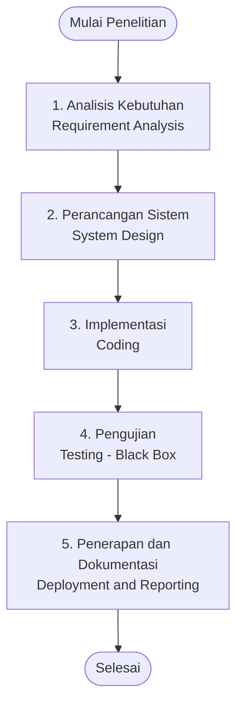
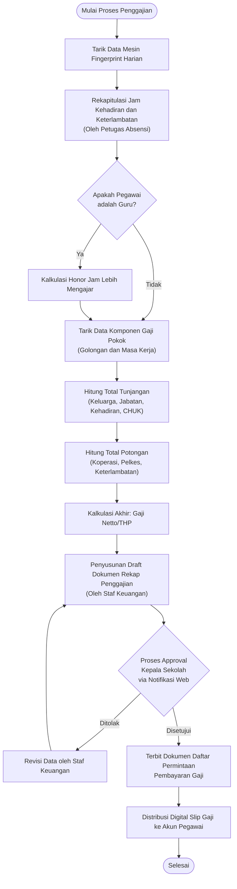

# BAB III METODE PENELITIAN

## A. Waktu dan Tempat Penelitian

### 1. Waktu Penelitian
Waktu yang digunakan dalam pelaksanaan penelitian ini selama 4 bulan, dimulai pada bulan Mei tahun 2026 sampai dengan bulan Agustus tahun 2026 dengan perincian jadwal sebagai berikut:

**Tabel 3.1 Jadwal Pelaksanaan Penelitian (Mei - Agustus 2026)**

| No | Tahapan Kegiatan | Mei M1 | Mei M2 | Mei M3 | Mei M4 | Jun M1 | Jun M2 | Jun M3 | Jun M4 | Jul M1 | Jul M2 | Jul M3 | Jul M4 | Agu M1 | Agu M2 | Agu M3 | Agu M4 |
|:--:|:---|:---:|:---:|:---:|:---:|:---:|:---:|:---:|:---:|:---:|:---:|:---:|:---:|:---:|:---:|:---:|:---:|
| 1 | Pengumpulan Data (Observasi, Wawancara, Dokumentasi) | ✓ | ✓ | ✓ | ✓ | | | | | | | | | | | | |
| 2 | Analisis Kebutuhan Sistem | | | | ✓ | ✓ | ✓ | | | | | | | | | | |
| 3 | Perancangan Sistem & Basis Data | | | | | | ✓ | ✓ | ✓ | | | | | | | | |
| 4 | Implementasi / Koding | | | | | | | | ✓ | ✓ | ✓ | ✓ | ✓ | ✓ | | | |
| 5 | Pengujian Sistem (*Black Box & White Box Testing*) | | | | | | | | | | | | | ✓ | ✓ | ✓ | |
| 6 | Penulisan Laporan Tugas Akhir | ✓ | ✓ | ✓ | ✓ | ✓ | ✓ | ✓ | ✓ | ✓ | ✓ | ✓ | ✓ | ✓ | ✓ | ✓ | ✓ |

*Sumber: Dokumen Pribadi (2026)*

### 2. Tempat Penelitian
Penelitian dilakukan di SMK PSKD 3 Jakarta, NPSN 20107453. Beralamat lengkap di Jl. Tanjung Wangi No. 1 (Pluit), RT.012 / RW.012, Kel. Penjaringan, Kec. Penjaringan, Kota Administrasi Jakarta Utara, DKI Jakarta 14440.

**Profil Instansi:**
Perkumpulan Sekolah Kristen Djakarta (PSKD) merupakan yayasan pendidikan yang memiliki sejarah panjang dalam menyelenggarakan pendidikan di wilayah DKI Jakarta. SMK PSKD 3 Jakarta adalah salah satu unit sekolah menengah kejuruan teknik dan vokasi di bawah naungan PSKD yang berlokasi di kawasan Pluit, Penjaringan, Jakarta Utara. Sekolah ini berfokus pada pembinaan karakter unggul serta keterampilan praktis vokasional yang adaptif terhadap kebutuhan dunia usaha dan dunia industri (DUDI). Visi dari SMK PSKD 3 Jakarta adalah mencetak lulusan yang beriman, kompeten, profesional, mandiri, dan berdaya saing tinggi di era industri modern. Sementara itu, misi utamanya meliputi penyelenggaraan pembelajaran praktik kejuruan berbasis kompetensi, penyediaan sarana bengkel dan laboratorium teknologi yang memadai, serta penguatan kemitraan strategis dengan industri.

SMK PSKD 3 Jakarta menyelenggarakan program pendidikan kejuruan yang mencakup Bidang Keahlian **Teknologi dan Rekayasa** serta **Teknologi Informasi dan Komunikasi**, dengan kompetensi keahlian (jurusan) meliputi:
1. **Teknik Pendinginan dan Tata Udara (TPTU)**
2. **Teknik Kendaraan Ringan Otomotif (TKRO)**
3. **Teknik Elektronika Industri (TEI)**
4. **Multimedia / Desain Komunikasi Visual (DKV)**

Berdasarkan struktur organisasinya, pengelolaan kegiatan operasional sekolah dipimpin oleh Kepala Sekolah, yakni Bapak Thomas. Kepala Sekolah membawahi para Kepala Program Keahlian / Rumpun Jurusan dan Kepala Bengkel, Staf Kurikulum yang mengatur pembagian jam mengajar guru, Staf Kesiswaan, serta Tata Usaha yang bertanggung jawab atas administrasi umum. Dalam aspek pengelolaan kehadiran dan kompensasi, terdapat Petugas Absensi (Bapak Rendy) yang bertugas merekapitulasi data presensi dari mesin *fingerprint*, staf administrasi penggajian (Ibu Maria) yang menyusun draft rekapitulasi gaji, serta Bendahara yang melaksanakan eksekusi pembayaran setelah dokumen permintaan penggajian disetujui Kepala Sekolah. Pengelolaan sumber daya manusia di lingkungan SMK PSKD 3 Jakarta Utara ini mencakup Guru Tetap Yayasan (GTY), Guru Tidak Tetap (GTT), Pegawai Tetap Yayasan (PTY), dan Pegawai Tidak Tetap (PTT).

*Gambar 3.1 Gedung Tampak Depan SMK PSKD 3 Jakarta (Placeholder)*
*Sumber: SMK PSKD 3 Jakarta (2026)*

---

## B. Tahapan Penelitian

Dalam rangka memperoleh data dan informasi yang valid, relevan, serta akurat sebagai landasan analisis kebutuhan sistem, peneliti menerapkan empat teknik pengumpulan data yang dilakukan secara komprehensif. Keempat metode tersebut meliputi observasi langsung, wawancara mendalam, studi dokumentasi, dan studi pustaka.

**1. Observasi Langsung (*Direct Observation*)**
Metode observasi dilakukan dengan melakukan pengamatan secara langsung terhadap aktivitas administratif dan proses operasional penggajian yang berjalan di SMK PSKD 3 Jakarta. Peneliti mengamati proses dari titik mula, yaitu saat Bapak Rendy selaku Petugas Absensi mengunduh rekaman dari mesin sidik jari (*fingerprint*) harian, menyalinnya ke dalam format *spreadsheet* sementara, dan merekap jam kehadiran. Selanjutnya, pengamatan dilanjutkan pada tahapan pengolahan data oleh staf penggajian/tata usaha (seperti Bu Maria) yang mengintegrasikan rekap absensi dengan perhitungan honor jam mengajar, gaji pokok, serta komponen potongan. Pengamatan ini secara spesifik menyoroti alur verifikasi data dan bagaimana proses *approval* (persetujuan) dilakukan oleh Bapak Thomas selaku Kepala Sekolah sebelum diserahkan kepada Bendahara. Observasi ini memberikan gambaran konkret mengenai *bottleneck* atau titik hambat yang kerap memicu penundaan penerbitan slip gaji dan memunculkan potensi *human error* akibat proses manual *copy-paste* data.

**2. Wawancara Mendalam (*In-depth Interview*)**
Wawancara mendalam dilakukan melalui proses komunikasi dua arah dengan para pemangku kepentingan (*stakeholders*) yang terlibat secara langsung dalam siklus penggajian. Peneliti mewawancarai Bapak Thomas (Kepala Sekolah) untuk menggali ekspektasi manajerial terhadap sistem validasi *approval* gaji serta pentingnya tingkat keamanan informasi. Wawancara juga dilakukan dengan staf Tata Usaha dan bagian Keuangan guna mengidentifikasi kesulitan riil terkait kompleksitas rumus yang digunakan di dalam *file spreadsheet*. Lebih lanjut, peneliti mewawancarai perwakilan guru dan karyawan (GTY/GTT) untuk mengetahui kendala minimnya transparansi rincian gaji, keterlambatan informasi, dan kesulitan mereka ketika hendak meminta riwayat slip gaji bulanan mereka yang pada sistem berjalan belum dapat diakses secara mandiri.

**3. Studi Dokumentasi**
Studi dokumentasi dilaksanakan dengan menelaah serta membedah berkas-berkas administratif yang selama ini menjadi artefak penggajian. Fokus utama dokumentasi ini adalah pada berkas *Microsoft Excel* bulanan yang digunakan secara riil oleh pihak sekolah, misalnya berkas `GAJI JUNI 2026.xlsx`. Berkas tersebut memuat lima *sheet* terpisah yang memiliki keterkaitan rumus matematis kompleks, yakni:
- *Sheet* `jam`: memuat rekapitulasi jumlah jam mengajar aktual setiap guru dibandingkan dengan batas beban jam wajibnya.
- *Sheet* `Tunjangan`: merinci jenis-jenis tunjangan yang didapatkan (fungsional, struktural, keluarga, dana CHUK).
- *Sheet* `GJ.POKOK`: menampung daftar matriks gaji pokok yang didasarkan pada perhitungan masa kerja dan golongan sesuai standar rujukan kepegawaian.
- *Sheet* `RECAP`: lembar rekapitulasi utama yang merangkum keseluruhan nilai *bruto* gaji, dikurangi berbagai iuran wajib, hingga menghasilkan *take-home pay*.
- *Sheet* `DAFTAR PERMINTAAN PEMBAYARAN`: merupakan *output* berformat cetak yang diserahkan ke Bendahara sebagai legalitas instruksi pencairan dana. 
Selain itu, peneliti juga mengkaji dokumen Surat Keputusan (SK) Yayasan yang mengatur kebijakan dan ketetapan besaran tunjangan khusus serta perhitungan potongan absensi.

**4. Studi Pustaka (*Literature Review*)**
Studi pustaka merupakan upaya penelusuran referensi dan literatur ilmiah guna menyusun kerangka teoritis dalam perancangan *software*. Peneliti merujuk pada regulasi perundang-undangan seperti Peraturan Pemerintah (PP) No. 85 Tahun 1997 dan PP No. 15 Tahun 1985 yang sebagian substansinya menjadi referensi penetapan indeks gaji pokok pegawai di lingkungan instansi/yayasan. Selain regulasi, peneliti mendalami literatur rekayasa perangkat lunak (*software engineering*) mengenai arsitektur sistem informasi berbasis web, konsep basis data relasional (PostgreSQL), teknologi Next.js, Node.js, dan mekanisme *scheduler node-cron* untuk notifikasi. Beragam jurnal ilmiah yang relevan tentang *Payroll Information System* dan implementasi *in-app notification* dari rentang tahun terbitan 2016-2026 turut ditelaah sebagai acuan metodologis dan komparasi fitur.

---

### Metode Pengembangan Sistem (Waterfall)

Dalam merancang dan merekayasa Sistem Informasi Penggajian ini, peneliti mengadopsi model *Software Development Life Cycle* (SDLC) dengan pendekatan *Waterfall* yang telah dimodifikasi. Model *Waterfall* dipilih karena karakteristiknya yang menjamin setiap fase diselesaikan dengan matang terlebih dahulu sebelum melanjutkan ke fase selanjutnya. Hal ini krusial dalam konteks sistem *payroll* (penggajian) yang membutuhkan ketelitian aritmetika tingkat tinggi, sehingga perubahan desain secara tiba-tiba di tengah fase *coding* dapat diminimalisasi.

Berikut adalah representasi visual diagram alir pelaksanaan tahapan penelitian menggunakan model SDLC *Waterfall*:

*Gambar 3.2 Diagram Alir Metode Pengembangan Sistem (SDLC Waterfall)*

Adapun rincian aktivitas pada masing-masing tahapan adalah sebagai berikut:

**1. Analisis Kebutuhan (*Requirement Analysis*)**
Tahap ini difokuskan pada identifikasi masalah dari sistem yang sedang berjalan (*as-is system*). Melalui data hasil wawancara dan observasi, peneliti menyusun spesifikasi kebutuhan sistem (*system requirements specification*) secara mendetail. Kebutuhan tersebut mencakup kebutuhan fungsional (kemampuan sistem menghitung *payroll* dari banyak *sheet* secara terpusat, notifikasi *in-app* untuk persetujuan dokumen, dan unduhan slip gaji mandiri) serta kebutuhan non-fungsional (performa akses aplikasi, hierarki hak akses *multi-user*, serta validasi tingkat ketersediaan *server*).

**2. Perancangan Sistem (*System Design - UML & DB*)**
Berdasarkan dokumen spesifikasi kebutuhan, sistem kemudian diterjemahkan ke dalam bentuk cetak biru (*blueprint*). Perancangan diwujudkan ke dalam pemodelan visual menggunakan *Unified Modeling Language* (UML) seperti *Use Case Diagram*, *Activity Diagram*, *Sequence Diagram*, dan *Class Diagram*. Di sisi penyimpanan data, dirancang *Entity Relationship Diagram* (ERD) dan skema *Database* PostgreSQL untuk mengatur relasi tabel pegawai, absensi, komponen gaji, dan *log approval*. Pada tahap ini juga dilakukan pembuatan *wireframe* atau desain *User Interface* (UI) untuk memberikan gambaran logis antarmuka aplikasi kepada calon *user*.

**3. Implementasi (*Coding - Node.js, Next.js, PostgreSQL*)**
Tahap ini merupakan pengerjaan perakitan arsitektur piranti lunak (*software construction*). Desain rancangan dikonversi menjadi baris-baris kode program secara nyata. *Front-end* (antarmuka pengguna) dikembangkan dengan memanfaatkan kerangka kerja Next.js guna mewujudkan pengalaman interaktif yang modern. *Back-end* (layanan *server*) menggunakan lingkungan Node.js dengan kerangka kerja Express.js untuk menciptakan RESTful API yang cepat, dengan bahasa pemrograman TypeScript demi keamanan pengetikan data (*type-safety*). Basis data relasional (PostgreSQL) dipasang untuk mengelola persistensi data transaksi gaji. Selain itu, fitur penjadwalan otomatis (*job scheduler*) menggunakan *library* `node-cron` diterapkan untuk mendeteksi *deadline* dan mengirim notifikasi *in-app* persetujuan secara periodik kepada Kepala Sekolah.

**4. Pengujian (*Testing - Black Box & White Box Testing*)**
Setelah prototipe perangkat lunak selesai diimplementasikan, tahap berikutnya adalah memastikan kualitas *software* dengan pengujian komprehensif dua arah:
a. *Black Box Testing*: Berfokus pada evaluasi fungsionalitas antarmuka dari sudut pandang pengguna akhir (operator), mencocokkan respon menu login, form absensi, aliran *approval*, dan penerbitan slip gaji PDF.
b. *White Box Testing (Automated Unit Testing)*: Menguji struktur logika internal kode backend menggunakan kerangka kerja Jest. Sebanyak 15 skenario fungsi murni komputasi finansial (`payroll.logic.ts`) diuji secara terisolasi tanpa ketergantungan database guna menjamin akurasi matematis formula gaji (tunjangan keluarga, honor jam lebih, kehadiran WFO, dan potongan kasbon) mencapai tingkat kelulusan 100%. 

**5. Penerapan dan Dokumentasi (*Deployment & Reporting*)**
Tahapan terakhir ini melibatkan pemasangan sistem web pada infrastruktur *server* lokal atau *cloud hosting* agar dapat diakses menggunakan jaringan internal (Intranet) dan eksternal SMK PSKD 3 Jakarta. Selain penyerahan sistem aplikasi yang siap pakai kepada instansi, tahap ini diiringi dengan penyelesaian penyusunan naskah Buku Laporan Tugas Akhir yang mendokumentasikan keseluruhan penelitian secara akademis.

---

## C. Algoritma dan Logika Bisnis

Sebuah Sistem Informasi Penggajian bertumpu secara masif pada ketepatan kalkulasi atau perhitungan matematika finansial. Agar perangkat lunak (web) yang dibangun menghasilkan nominal *Take-Home Pay* (THP) yang presisi dan akurat, maka algoritma aplikasi harus merangkum logika bisnis riil yang dianut oleh kebijakan SMK PSKD 3 Jakarta. Berikut merupakan struktur logika dan formula dasar komputasi penggajian:

**1. Formula Gaji Pokok (Berdasarkan Golongan & Masa Kerja)**
Nominal Gaji Pokok ditetapkan berdasarkan referensi struktur gaji kepegawaian (yang pada beberapa poin merujuk secara teknis ke formula turunan PP 85/1997 & PP 15/1985 yang disesuaikan dengan Yayasan PSKD). Nilainya ditentukan dari hasil irisan antara *Tingkat Golongan* (misal II/A, III/B, dsb.) dengan lama rentang *Masa Kerja Golongan* (MKG) dalam tahun.

**2. Tunjangan Keluarga**
Komponen tunjangan berbasis tanggungan diberikan kepada pegawai yang berstatus menikah dan memiliki anak yang terdaftar secara sah, dengan proporsi kalkulasi sebagai berikut:
- **Tunjangan Istri/Suami:** Ditetapkan sebesar 10% dari nominal Gaji Pokok.
- **Tunjangan Anak:** Ditetapkan sebesar 2% dari nominal Gaji Pokok untuk setiap anak. Tunjangan ini dibatasi secara mutlak untuk maksimal 2 (dua) orang anak per pegawai.

**3. Honor Jam Lebih Mengajar**
Bagi staf pengajar (Guru), sekolah menetapkan ambang batas Jam Wajib Mengajar (*JWM*). Apabila guru mengajar dengan kuantitas melampaui jumlah JWM, maka kelebihannya dihitung sebagai Honor Jam Lebih.
Formula kalkulasi:
*Honor Jam Lebih = (Total Jam Riil - Jam Wajib) × Tarif Jam Lebih*

**4. Tunjangan Kehadiran dan Operasional**
Tunjangan ini merupakan insentif yang berbasis pada rekam presensi *fingerprint* riil dari pegawai (baik saat WFO - *Work From Office* maupun WFH - *Work From Home*). Nominalnya akan dihitung proporsional dari jumlah hari kerja aktual pegawai dikalikan dengan ketetapan insentif kehadiran harian.

**5. Tunjangan Jabatan dan Dana CHUK**
Beberapa pegawai memiliki amanah ganda atau tanggung jawab manajerial tertentu. 
- **Tunjangan Jabatan Struktural & Fungsional:** Diberikan pada nominal tetap bagi mereka yang mengemban jabatan khusus (seperti Kepala Sekolah, Wakil Kepala Sekolah bidang tertentu, Wali Kelas, dll).
- **Dana CHUK (Catur Husada Utama Karyawan):** Merupakan alokasi insentif kesejahteraan pegawai berdasarkan ketetapan internal yayasan.

**6. Potongan Wajib dan Keterlambatan**
Dalam proses *payroll*, terdapat elemen-elemen pengurang (deduksi) yang secara otomatis akan mengurangi total perolehan penerimaan pegawai, yang meliputi:
- **Iuran Pelkes/Kesehatan:** Potongan persentase wajib asuransi kesehatan internal/eksternal.
- **Koperasi:** Terdiri dari Simpanan Wajib dan pemotongan Angsuran Pinjaman Koperasi (jika ada).
- **Potongan Indisipliner (Keterlambatan/Absen):** Pengurangan nominal yang dihitung otomatis dari *log fingerprint* yang merekam menit keterlambatan pegawai.

**7. Total *Take Home Pay* (Gaji Netto)**
Puncak dari proses komputasi adalah penentuan nilai bersih penggajian (THP) yang akan ditransfer ke rekening bank pegawai dan tercetak di dalam slip gaji.
Formula kalkulasi akhirnya dirumuskan sebagai berikut:
*Gaji Netto = (Gaji Pokok + Total Tunjangan + Honor Jam Lebih) - Total Potongan*

Untuk mempermudah pemahaman arsitektur sistem informasi dalam menangani komputasi di atas, alur perpindahan data dari entitas absensi hingga *output* slip gaji dapat dipresentasikan ke dalam diagram alir berikut:

*Gambar 3.3 Diagram Alir Logika Bisnis Sistem Penggajian*

Melalui metodologi yang telah dipaparkan pada Bab III ini, mulai dari teknis pengumpulan data lapangan, pemilihan model rekayasa perangkat lunak SDLC Waterfall, hingga kerangka dasar komputasi penggajian, diharapkan terbentuk sebuah landasan sistematis yang kokoh. Uraian spesifik dan detail mengenai rancang bangun perangkat lunak berbasis web beserta skenario pengujian fungsionalitas sistem tersebut akan dijabarkan secara rinci pada Bab IV.
