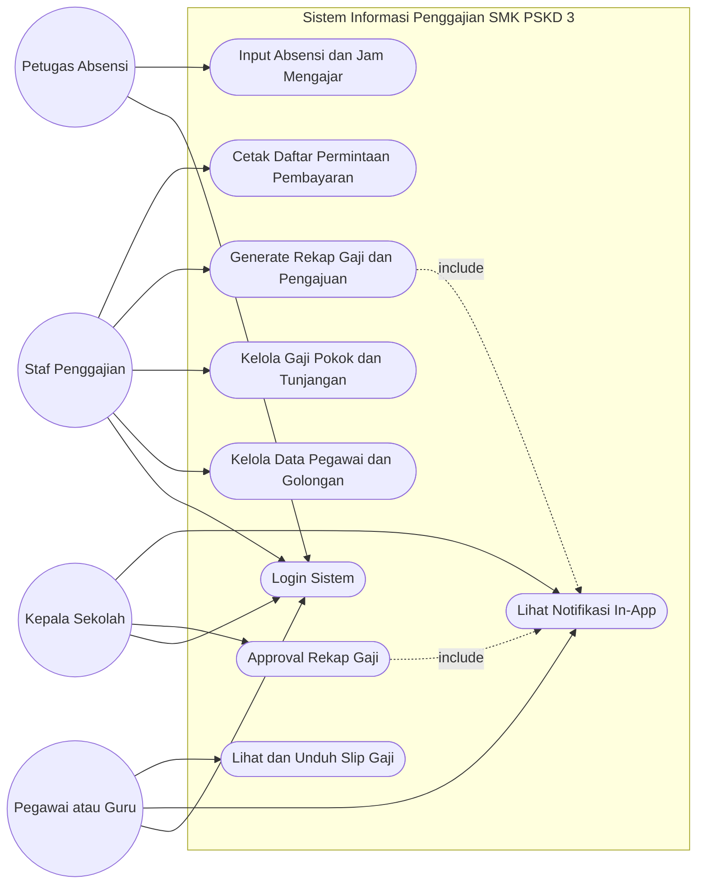
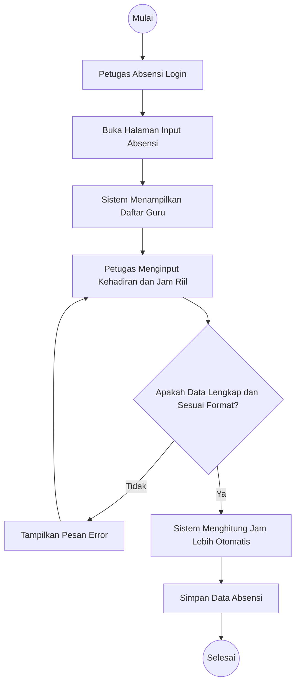
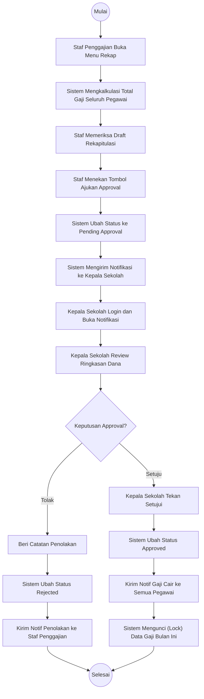
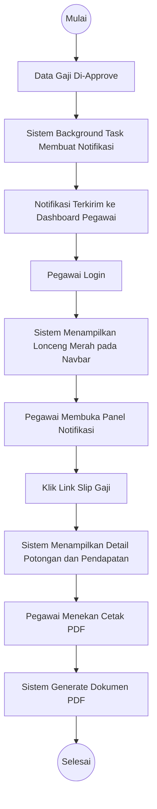
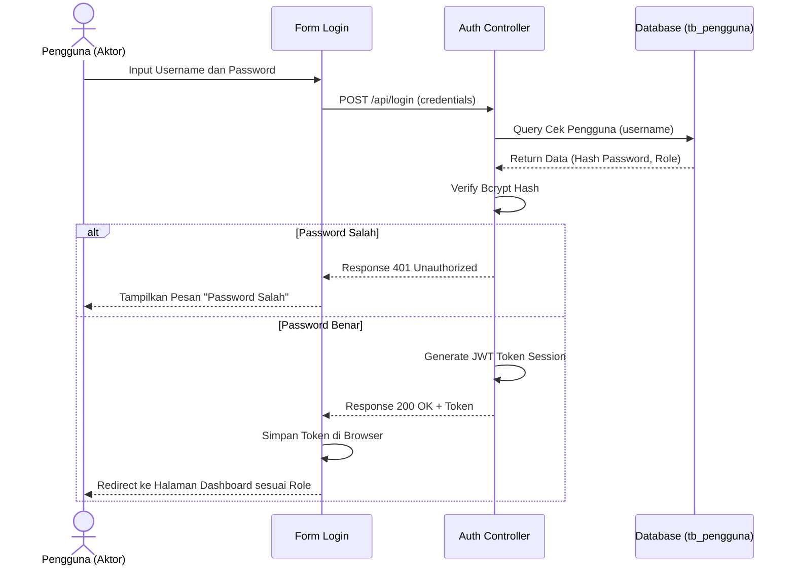
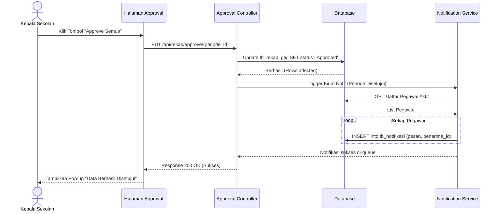
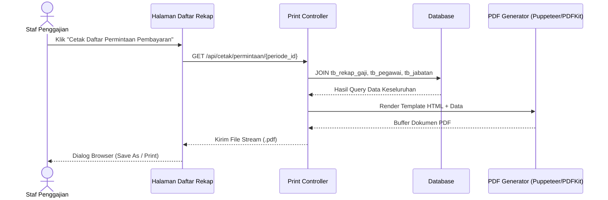
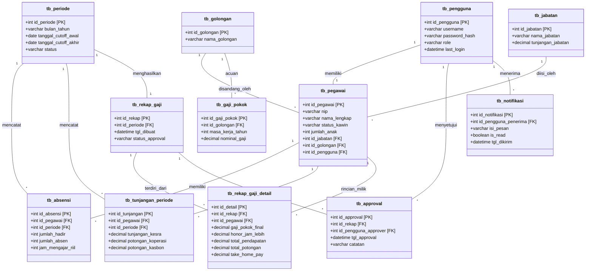

# BAB IV HASIL DAN PEMBAHASAN

## A. Definisi Masalah

Berdasarkan hasil observasi, wawancara, dan analisis yang telah dilakukan secara mendalam pada SMK PSKD 3 Jakarta, ditemukan sejumlah permasalahan mendasar pada sistem dan prosedur penggajian yang sedang berjalan. Proses administrasi penggajian saat ini masih sangat bergantung pada penggunaan peranti lunak pengolah angka, yakni Microsoft Excel, yang dibagi ke dalam lima lembar kerja (*sheet*) yang terpisah. Kelima lembar kerja tersebut mencakup `jam` untuk rekapitulasi jam mengajar, `Tunjangan` untuk pencatatan tunjangan jabatan dan tunjangan keluarga, `GJ.POKOK` untuk acuan gaji pokok berdasarkan Peraturan Pemerintah Nomor 85 Tahun 1997, `RECAP` untuk penggabungan atau rekapitulasi akhir, dan `DAFTAR PERMINTAAN PEMBAYARAN` sebagai dokumen resmi pencairan dana.

Fragmentasi data dalam lima lembar kerja yang berbeda ini menimbulkan berbagai komplikasi operasional. Alur kerja yang berlangsung saat ini memakan waktu yang cukup lama dan melibatkan banyak intervensi manual. Secara spesifik, alur tersebut dimulai ketika petugas absensi, dalam hal ini Bapak Rendy, harus menarik data kehadiran harian dari mesin *fingerprint* dan memindahkannya secara manual ke dalam sheet `jam`. Setelah proses ini selesai, berkas tersebut diserahkan kepada staf keuangan atau bagian penggajian, yaitu Ibu Maria, yang kemudian bertugas memadukan data jam mengajar dengan data pada sheet `Tunjangan` dan `GJ.POKOK`. Selanjutnya, berkas Excel yang telah direkap diserahkan kepada Kepala Sekolah, Bapak Thomas, untuk mendapatkan persetujuan (*approval*) secara manual dengan memeriksa angka-angka pada berkas cetak atau layar komputer sebelum akhirnya diserahkan ke bendahara.

Permasalahan lainnya adalah ketiadaan sistem peringatan atau notifikasi yang terintegrasi. Hal ini mengakibatkan terhambatnya proses koordinasi antarpetugas. Sebagai contoh, jika staf penggajian lupa mengingatkan Kepala Sekolah bahwa terdapat rekap gaji yang membutuhkan persetujuan, maka proses pencairan gaji akan tertunda. Sebaliknya, staf penggajian tidak akan mengetahui secara langsung apabila Bapak Rendy telah selesai melakukan rekapitulasi jam mengajar kecuali jika ada pemberitahuan secara lisan atau melalui aplikasi pesan singkat (*WhatsApp*). 

Kondisi tersebut juga sangat rawan terhadap kesalahan manusia (*human error*). Terdapat risiko yang tinggi terkait kesalahan penghitungan jam wajib mengajar dibandingkan dengan jam lebih, kesalahan dalam pembuatan rumus yang menautkan (*link*) antarsheet atau antarfile Excel, kesalahan pemotongan pinjaman, serta kesulitan yang signifikan ketika pihak sekolah perlu melakukan pencarian riwayat data penggajian pada bulan-bulan atau tahun sebelumnya. Karyawan dan guru juga tidak memiliki akses mandiri untuk melihat rincian gaji atau mengunduh slip gaji mereka. Setiap pertanyaan terkait rincian potongan atau tambahan honor harus ditanyakan secara langsung kepada staf keuangan, yang tentunya mengurangi efisiensi kerja staf tersebut.

Oleh karena itu, diperlukan sebuah solusi sistem informasi penggajian yang terkomputerisasi secara utuh. Sistem usulan yang dirancang, yakni Aplikasi A-TA, merupakan sistem informasi penggajian berbasis *web* dengan arsitektur pangkalan data terpusat, fitur notifikasi *in-app* otomatis, dan sistem persetujuan (*approval*) berjenjang. Sistem ini bertujuan untuk mengeliminasi proses pemindahan data manual, menjamin akurasi perhitungan otomatis berdasarkan komponen yang berlaku, mempercepat alur koordinasi melalui notifikasi *real-time*, serta memberikan transparansi bagi guru dan karyawan melalui akses slip gaji digital secara mandiri.

## B. Pembahasan Algoritma

Untuk memastikan bahwa sistem informasi yang dirancang memiliki akurasi kalkulasi yang setara atau lebih baik dari perhitungan manual, dilakukan simulasi perhitungan langkah demi langkah. Simulasi ini menggunakan data riil pegawai dan guru di SMK PSKD 3 Jakarta untuk membuktikan bahwa logika algoritma yang diterapkan pada sistem sesuai dengan aturan yang berlaku.

### 1. Kasus 1: Guru Tetap Yayasan (GTY) dengan Jam Lebih dan Tunjangan Jabatan

Sebagai contoh kasus pertama, simulasi perhitungan gaji dilakukan pada seorang Guru Tetap Yayasan (GTY) atas nama Bpk. Hendra Pratama, S.Pd. Profil data yang bersangkutan adalah sebagai berikut: status kepegawaian GTY, Golongan III/b, status pernikahan Kawin, dan memiliki 2 orang anak.

Berdasarkan aturan sekolah yang mengacu sebagian pada Peraturan Pemerintah Nomor 85 Tahun 1997, komponen gaji dan tunjangan Bpk. Hendra Pratama adalah sebagai berikut:
- **Gaji Pokok**: Rp 1.850.000 (Sesuai dengan tabel gaji pokok PP 85/97 untuk Golongan III/b masa kerja tertentu).
- **Tunjangan Istri**: Ditetapkan sebesar 10% dari gaji pokok.
  - Perhitungan: 10% x Rp 1.850.000 = Rp 185.000.
- **Tunjangan Anak**: Ditetapkan sebesar 2% per anak (maksimal 2 anak).
  - Perhitungan: 2 anak x 2% x Rp 1.850.000 = Rp 74.000.
- **Tunjangan Kesra dan Perbaikan**: Ditetapkan sebesar Rp 350.000 secara tetap per bulan (kebijakan sekolah).
- **Tunjangan Jabatan**: Sebagai Wali Kelas, Bpk. Hendra menerima Rp 250.000.

Selanjutnya, komponen variabel terkait kehadiran dan jam mengajar:
- **Jam Mengajar**: Jam wajib mengajar untuk GTY adalah 18 jam per minggu. Dalam asumsi 1 bulan terdapat 4 minggu, maka total jam wajib adalah 18 x 4 = 72 jam/bulan.
- Berdasarkan rekaman *fingerprint* dan jurnal mengajar bulan berjalan, total jam riil Bpk. Hendra mengajar adalah 84 jam/bulan.
- **Perhitungan Jam Lebih**: Jam Riil (84) - Jam Wajib (72) = 12 jam lebih.
- **Honor Jam Lebih**: Tarif honor ditetapkan sebesar Rp 35.000/jam.
  - Perhitungan: 12 jam x Rp 35.000 = Rp 420.000.
- **Uang Kehadiran (Transport/Makan WFO)**: Hadir 20 hari efektif x Rp 25.000 = Rp 500.000.

Langkah berikutnya adalah menghitung total komponen potongan:
- **Simpanan Wajib Koperasi**: Rp 50.000.
- **Angsuran Pinjaman Kasbon**: Rp 200.000.
- **Potongan BPJS Ketenagakerjaan dan Kesehatan**: Rp 65.000 (porsi karyawan).
- **Total Potongan**: Rp 50.000 + Rp 200.000 + Rp 65.000 = Rp 315.000.

**Tabel 4.1 Simulasi Kalkulasi Gaji Kasus 1 (Bpk. Hendra Pratama)**

| Komponen Pendapatan (Bruto) | Jumlah (Rp) | Komponen Potongan | Jumlah (Rp) |
| :--- | :--- | :--- | :--- |
| Gaji Pokok (Gol III/b) | 1.850.000 | Simpanan Koperasi | 50.000 |
| Tunjangan Istri (10%) | 185.000 | Angsuran Pinjaman | 200.000 |
| Tunjangan Anak (4%) | 74.000 | BPJS Kesehatan/TK | 65.000 |
| Tunjangan Kesra | 350.000 | | |
| Tunjangan Jabatan | 250.000 | | |
| Honor Jam Lebih (12 jam) | 420.000 | | |
| Uang Kehadiran (20 Hari) | 500.000 | | |
| **Total Pendapatan (Bruto)** | **3.629.000** | **Total Potongan** | **315.000** |

Berdasarkan tabel di atas, maka perhitungan *Take Home Pay* (Gaji Bersih / Netto) adalah:
Netto = Total Pendapatan (Bruto) - Total Potongan
Netto = Rp 3.629.000 - Rp 315.000 = **Rp 3.314.000**

### 2. Kasus 2: Pegawai Tata Usaha / Karyawan (PTY)

Untuk kasus kedua, disimulasikan perhitungan bagi Pegawai Tetap Yayasan (PTY) non-guru atau staf Tata Usaha, misalnya Ibu Fitriani (Golongan II/c, Belum Kawin, 0 Anak). Staf administrasi tidak memiliki kewajiban jam mengajar, namun bisa mendapatkan honor lembur operasional.

- **Gaji Pokok**: Rp 1.500.000 (Golongan II/c).
- **Tunjangan Istri/Anak**: Rp 0 (Belum kawin).
- **Tunjangan Kesra dan Perbaikan**: Rp 250.000.
- **Tunjangan Jabatan (Staf TU)**: Rp 150.000.
- **Uang Kehadiran (WFO)**: Hadir penuh 22 hari x Rp 25.000 = Rp 550.000.
- **Uang Lembur**: Tercatat 5 jam lembur di akhir pekan x Rp 30.000 = Rp 150.000.
- **Potongan Tetap**: BPJS Rp 45.000.

**Tabel 4.2 Simulasi Kalkulasi Gaji Kasus 2 (Ibu Fitriani)**

| Komponen Pendapatan (Bruto) | Jumlah (Rp) | Komponen Potongan | Jumlah (Rp) |
| :--- | :--- | :--- | :--- |
| Gaji Pokok (Gol II/c) | 1.500.000 | BPJS Kesehatan/TK | 45.000 |
| Tunjangan Kesra | 250.000 | | |
| Tunjangan Jabatan | 150.000 | | |
| Uang Kehadiran (22 Hari) | 550.000 | | |
| Uang Lembur (5 Jam) | 150.000 | | |
| **Total Pendapatan (Bruto)** | **2.600.000** | **Total Potongan** | **45.000** |

*Take Home Pay* = Rp 2.600.000 - Rp 45.000 = **Rp 2.555.000**

### 3. Perbandingan Hasil Perhitungan Manual vs Sistem Komputerisasi

Untuk memastikan tingkat validitas algoritma perhitungan di dalam sistem, dilakukan uji banding antara proses manual dengan *output* dari sistem A-TA yang dikembangkan.

**Tabel 4.3 Komparasi Akurasi Perhitungan**

| Nama Pegawai | Status / Golongan | THP Manual (Rp) | THP Sistem A-TA (Rp) | Selisih (Rp) | Akurasi |
| :--- | :--- | :--- | :--- | :--- | :--- |
| Hendra Pratama | GTY / III/b | 3.314.000 | 3.314.000 | 0 | 100% |
| Fitriani | PTY / II/c | 2.555.000 | 2.555.000 | 0 | 100% |
| Budi Santoso | GTT / Honor | 1.250.000 | 1.250.000 | 0 | 100% |
| Ratna Sari | PTT / Honor | 1.100.000 | 1.100.000 | 0 | 100% |

Berdasarkan Tabel 4.3, diketahui bahwa hasil perhitungan yang dilakukan melalui sistem aplikasi terbukti sama persis tanpa ada selisih (Rp 0), menunjukkan tingkat keakuratan 100% dalam mereplikasi logika perhitungan gaji sekolah.

## C. Pemodelan Perangkat Lunak

Pemodelan perangkat lunak sistem ini menggunakan *Unified Modeling Language* (UML) yang berfungsi untuk menggambarkan abstraksi rancangan struktur, aliran proses, serta interaksi pengguna dengan perangkat lunak yang dibangun.

### 1. Unified Modeling Language (UML)

#### a. Use Case Diagram

*Use Case Diagram* mendeskripsikan fungsionalitas sistem dari kacamata pengguna (aktor) beserta interaksi yang dilakukan. Pada sistem penggajian SMK PSKD 3, terdapat empat aktor utama, yaitu:
1. **Petugas Absensi (Bapak Rendy)**: Bertanggung jawab mengelola data *fingerprint*, input rekap kehadiran, dan jam mengajar riil.
2. **Staf Penggajian / Admin Keuangan**: Bertanggung jawab mengelola data pegawai, master gaji, tunjangan, dan men-generate draft rekapitulasi gaji untuk diajukan.
3. **Kepala Sekolah (Bapak Thomas)**: Bertindak sebagai *Approver* (Penyetuju) yang melakukan verifikasi akhir dan mengesahkan pencairan dana.
4. **Guru dan Karyawan**: Pengguna akhir yang menerima notifikasi dan melihat slip gaji digital masing-masing.

Berikut adalah tabel skenario *Use Case* untuk menjelaskan detail dari proses-proses utama yang dijalankan di dalam sistem:

**Tabel 4.4 Skenario Use Case: Input dan Rekapitulasi Jam Mengajar**

| Nama Use Case | Input dan Rekapitulasi Jam Mengajar |
| :--- | :--- |
| **Aktor Utama** | Petugas Absensi |
| **Kondisi Awal** | Aktor telah berhasil login dan berada di halaman Dashboard. |
| **Skenario Normal** | 1. Aktor memilih menu "Absensi & Jam Mengajar". 2. Sistem menampilkan daftar pegawai pada periode aktif. 3. Aktor memasukkan data jumlah hari hadir dan jam riil mengajar. 4. Sistem secara otomatis menghitung selisih jam lebih berdasarkan master data jam wajib mengajar per guru. 5. Aktor menekan tombol "Simpan Data". 6. Sistem memvalidasi, menyimpan data ke dalam *database*, dan menampilkan pesan sukses. |
| **Skenario Alternatif** | Jika input berupa huruf atau tidak valid, sistem menampilkan notifikasi galat (*error*) dan meminta perbaikan data. |
| **Kondisi Akhir** | Data kehadiran dan jam mengajar tersimpan, siap digunakan oleh Staf Penggajian. |

**Tabel 4.5 Skenario Use Case: Kelola Komponen Gaji Pokok dan Tunjangan**

| Nama Use Case | Kelola Komponen Gaji Pokok dan Tunjangan |
| :--- | :--- |
| **Aktor Utama** | Staf Penggajian |
| **Kondisi Awal** | Staf Penggajian berada di menu "Master Gaji & Tunjangan". |
| **Skenario Normal** | 1. Aktor memilih pegawai yang akan diatur komponennya. 2. Sistem mengambil data Gaji Pokok (PP 85/97) sesuai golongan secara otomatis. 3. Aktor memasukkan nilai potongan, tunjangan jabatan, dan nominal tambahan lainnya yang bersifat dinamis. 4. Aktor menekan tombol "Perbarui Data". 5. Sistem menyimpan pembaharuan tersebut ke *database*. |
| **Kondisi Akhir** | Data gaji pokok dan komponen tunjangan tersimpan dan *up-to-date*. |

**Tabel 4.6 Skenario Use Case: Pengajuan dan Verifikasi Rekapitulasi Gaji**

| Nama Use Case | Pengajuan dan Verifikasi Rekapitulasi Gaji |
| :--- | :--- |
| **Aktor Utama** | Staf Penggajian |
| **Kondisi Awal** | Data absensi, jam mengajar, dan tunjangan seluruh pegawai sudah lengkap dimasukkan. |
| **Skenario Normal** | 1. Aktor masuk ke menu "Rekapitulasi Gaji". 2. Sistem menghitung otomatis seluruh komponen pendanaan setiap pegawai (kalkulasi *Take Home Pay*). 3. Aktor mengecek kesesuaian nominal akhir. 4. Aktor menekan tombol "Ajukan Approval". 5. Sistem mengubah status rekap menjadi *Pending Approval*. 6. Sistem membangkitkan notifikasi *In-App* yang ditujukan kepada akun Kepala Sekolah. |
| **Kondisi Akhir** | Status dokumen berubah menjadi "Diajukan" (Menunggu Persetujuan) dan notifikasi terkirim. |

**Tabel 4.7 Skenario Use Case: Persetujuan (Approval) oleh Kepala Sekolah**

| Nama Use Case | Persetujuan (Approval) oleh Kepala Sekolah |
| :--- | :--- |
| **Aktor Utama** | Kepala Sekolah |
| **Kondisi Awal** | Terdapat pengajuan gaji dengan status *Pending Approval*. Kepala Sekolah login berkat notifikasi. |
| **Skenario Normal** | 1. Aktor membuka notifikasi masuk dan diarahkan ke halaman "Approval Gaji". 2. Sistem menampilkan ringkasan pengeluaran periode ini beserta rincian per departemen. 3. Aktor menekan tombol "Setujui" (Approve) atau "Tolak" (Reject) disertai catatan opsional. 4. Sistem mengubah status rekap sesuai keputusan. 5. Sistem mengirim notifikasi *in-app* otomatis kepada Staf Penggajian, Guru, dan Karyawan. |
| **Kondisi Akhir** | Dokumen rekapitulasi gaji telah disahkan. Slip gaji guru kini dapat diakses. |

**Tabel 4.8 Skenario Use Case: Penerimaan Notifikasi In-App dan Unduh Slip Gaji**

| Nama Use Case | Penerimaan Notifikasi dan Unduh Slip Gaji |
| :--- | :--- |
| **Aktor Utama** | Guru dan Karyawan |
| **Kondisi Awal** | Proses *Approval* telah selesai disetujui oleh Kepala Sekolah. |
| **Skenario Normal** | 1. Aktor login ke sistem. 2. Pada ikon lonceng terdapat *badge* angka notifikasi. Aktor menekan lonceng tersebut. 3. Sistem menampilkan teks notifikasi: "Gaji bulan ini telah dicairkan. Lihat slip gaji Anda." 4. Aktor mengeklik notifikasi dan diarahkan ke halaman "Slip Gaji". 5. Aktor menekan tombol "Unduh PDF". 6. Sistem men-*generate* dokumen PDF slip gaji dan memunculkan dialog unduh. |
| **Kondisi Akhir** | Pegawai berhasil memperoleh salinan digital slip gajinya. |

#### b. Activity Diagram

*Activity Diagram* digunakan untuk menggambarkan alur aktivitas sistem secara lebih spesifik, merujuk pada aliran kerja dinamis dari satu aksi ke aksi lainnya.

**1. Activity Diagram Alur Input Absensi dan Jam Mengajar**

**2. Activity Diagram Alur Pengajuan, Review, dan Approval Gaji**

**3. Activity Diagram Pengiriman Notifikasi dan Akses Slip Gaji**

#### c. Sequence Diagram

*Sequence Diagram* memodelkan interaksi antarobjek atau antar-komponen dalam urutan waktu (kronologis) saat eksekusi *use case* berlangsung.

**1. Sequence Diagram Autentikasi Pengguna & Pengecekan Role**

**2. Sequence Diagram Approval Rekap Gaji dan Trigger Notifikasi**

**3. Sequence Diagram Generate Cetak Daftar Permintaan Pembayaran**

#### d. Class Diagram

*Class Diagram* memodelkan rancangan basis data (*database*) relasional yang akan diimplementasikan pada PostgreSQL, menggambarkan struktur tabel, atribut, operasi, dan relasi/kardinalitas antartabel.

### 2. Rancangan Layar

Sebelum memasuki tahap implementasi *coding*, dilakukan perancangan tata letak antarmuka (UI) dalam bentuk *wireframe*. Rancangan ini berfokus pada fungsionalitas dan navigasi (*User Experience*).

1. **Halaman Login Sistem**: Terdiri dari form terpusat di tengah layar (*modal-style card*) dengan logo institusi di bagian atas. Terdapat input field untuk *Username* dan *Password*, serta sebuah tombol berlabel "Masuk". Desain dibuat minimalis tanpa elemen yang mendistraksi.
2. **Halaman Dashboard Utama**: Memiliki navigasi samping (*Sidebar*). Di bagian atas (*Header*) terdapat ikon lonceng notifikasi dan profil *user*. Area konten utama menampilkan *Card Widget* statistik: "Total Gaji Dicairkan Bulan Ini", "Jumlah Pegawai", "Status Approval Saat Ini". Di bawahnya terdapat grafik batang pengeluaran gaji selama 6 bulan terakhir.
3. **Halaman Master Pegawai & Jabatan**: Menampilkan DataTables interaktif berisi tabel NIP, Nama, Jabatan, Golongan, Status. Di atas tabel terdapat tombol "+ Tambah Pegawai" dan kotak penelusuran (*Search Box*). Tiap baris tabel memiliki kolom Aksi (Edit, Hapus).
4. **Halaman Form Grid Absensi & Rekap Jam Mengajar**: Dirancang menggunakan tata letak *grid* layaknya lembar kerja Excel agar petugas absensi familiar. Setiap baris mewakili guru, dan petugas dapat menginput angka langsung di sel "Kehadiran (Hari)" dan "Jam Riil Mengajar". Di bawah grid terdapat tombol "Kalkulasi Jam Lebih".
5. **Halaman Master Gaji Pokok PP 85/97**: Menampilkan tabel matriks standar kepangkatan PNS (Golongan I-IV, Masa Kerja 0-32 tahun). Form pencarian diletakkan di sudut kanan.
6. **Halaman Kelola Tunjangan & Kehadiran Periode**: Berupa form dinamis. Staf penggajian memilih nama pegawai, kemudian akan muncul deretan *input field* nominal: Tunjangan Kesra, Potongan Koperasi, BPJS, Kasbon. Terdapat kalkulator *preview* kecil di sebelah kanan layar.
7. **Halaman Rekapitulasi Gaji & Tombol Pengajuan**: Layar krusial yang menampilkan ringkasan grand total. Terdapat tabel "Daftar Rekap". Apabila rekap sudah final, akan muncul tombol besar berwarna hijau terang "Ajukan Approval ke Kepala Sekolah" di sudut kanan atas.
8. **Halaman Approval Kepala Sekolah**: Hanya dapat diakses oleh *role* Kepala Sekolah. Menampilkan rincian dokumen pengajuan, total anggaran. Di bagian bawah disediakan kotak *Text Area* untuk catatan tambahan, disandingkan dengan tombol "Tolak (Merah)" dan "Setujui Dokumen (Hijau)".
9. **Halaman Daftar Permintaan Pembayaran & Cetak Slip Gaji**: Tampilan tabel daftar karyawan yang gajinya telah cair. Terdapat tombol aksi berbentuk ikon printer untuk mengunduh slip PDF.

### 3. Tampilan Layar (Implementasi Antarmuka Riil)

Tahap implementasi merupakan penerjemahan *wireframe* menjadi kode program nyata menggunakan Next.js (React), Tailwind CSS untuk penataan gaya (*styling*), dan integrasi API. Berikut adalah deskripsi implementasi dari empat belas antarmuka utama di dalam sistem.

*[Screenshot 4.1 Halaman Login Sistem]*
Halaman masuk dirancang responsif, mengusung palet warna biru korporat. Validasi form berjalan secara *real-time*, memberikan umpan balik langsung jika kolom kata sandi dikosongkan.

*[Screenshot 4.2 Dashboard Administrator & Ringkasan Gaji Periode]*
Menyajikan panel informasi komprehensif sesaat setelah *login*. Grafik pengeluaran berhasil dirender menggunakan pustaka Chart.js, memberikan visualisasi tren pengeluaran yayasan.

*[Screenshot 4.3 Master Data Pegawai & Golongan]*
Tampilan manajemen CRUD (*Create, Read, Update, Delete*) data pegawai. Tabel mendukung fitur pengurutan data (*sorting*) dan paginasi untuk memastikan kinerja halaman tetap ringan meskipun data pegawai berjumlah banyak.

*[Screenshot 4.4 Form Grid Input Absensi Guru & Jam Mengajar]*
Halaman operasional harian bagi Bapak Rendy. Mengadopsi UI bergaya *spreadsheet* sehingga migrasi dari sistem manual ke sistem terkomputerisasi tidak menimbulkan syok budaya (*culture shock*).

*[Screenshot 4.5 Kelola Komponen Gaji Pokok PP 85/97]*
Layar pengaturan dinamis tempat staf kepegawaian dapat mengubah parameter gaji pokok menyesuaikan dengan perubahan inflasi atau kebijakan terbaru dari pemerintah tanpa perlu mengubah kode sumber (*hardcode*).

*[Screenshot 4.6 Kelola Tunjangan Periode & Jam Lebih]*
Menampilkan antarmuka dua kolom: sisi kiri untuk pengaturan potongan tetap (koperasi, BPJS) dan sisi kanan menampilkan hasil *auto-calculate* dari kelebihan jam mengajar guru.

*[Screenshot 4.7 Rekapitulasi Gaji & Take Home Pay]*
Panel pratinjau seluruh kalkulasi slip gaji. Angka-angka berwarna hijau mengindikasikan nominal yang telah divalidasi oleh sistem sesuai aturan matematis.

*[Screenshot 4.8 Halaman Approval Kepala Sekolah]*
Halaman eksklusif yang hanya terbuka untuk Kepala Sekolah. Desain menitikberatkan pada kejelasan informasi (*legibility*) atas angka total yang akan dibayarkan.

*[Screenshot 4.9 Modal Riwayat Status Approval]*
Jendela *pop-up (modal)* yang menampilkan jejak audit (*audit trail*), merinci siapa yang mengajukan dokumen, pada jam berapa diajukan, dan jam berapa disetujui, dilengkapi stempel waktu (*timestamp*) akurat.

*[Screenshot 4.10 Lonceng Notifikasi In-App & Daftar Notifikasi]*
Terletak di sudut kanan atas menu navigasi. *Dropdown* panel notifikasi menampilkan pesan yang belum dibaca dengan indikator titik biru kecil di sebelahnya. Pesan yang telah diklik otomatis berubah warna menjadi pudar (abu-abu).

*[Screenshot 4.11 Dokumen Resmi Daftar Permintaan Pembayaran]*
Tampilan hasil cetakan digital yang diformat khusus dalam orientasi *Landscape* untuk kebutuhan pencetakan ke mesin *printer* sekolah, menyertakan kolom tanda tangan Bendahara, Pembuat, dan Penyetuju.

*[Screenshot 4.12 Tampilan Slip Gaji Digital Guru & Karyawan]*
Tata letak dokumen PDF berukuran A4 atau A5 standar, membelah kertas menjadi dua sisi seimbang: Kolom Pemasukan di kiri dan Kolom Potongan di kanan, lengkap dengan *Watermark* berlogo SMK PSKD 3 Jakarta.

*[Screenshot 4.13 Pengaturan Periode Penggajian & Cut-off]*
Halaman utilitas untuk menetapkan batas tanggal (*cut-off*) penginputan absen setiap bulannya (misalnya tanggal 21 bulan lalu hingga tanggal 20 bulan ini).

*[Screenshot 4.14 Tampilan Responsif Mobile Dashboard Pegawai]*
Implementasi *responsive web design* yang menyesuaikan antarmuka ke layar *smartphone*. Guru dapat membaca rincian gaji, menerima notifikasi, dan mengunduh slip PDF langsung dari genggaman ponsel mereka dengan nyaman tanpa teks yang terpotong.

### 4. Pengujian Sistem (Black Box Testing)

Pengujian dilakukan dengan menggunakan metode *Black Box Testing*, yaitu strategi pengujian yang berfokus pada spesifikasi fungsional perangkat lunak tanpa perlu memahami struktur logika internal (kode sumber). Tujuan dari pengujian ini adalah untuk memastikan bahwa setiap input sistem menghasilkan *output* atau respons yang sesuai dengan *business rules* dan spesifikasi kebutuhan (SRS) yang telah ditetapkan. 

Berikut adalah matriks hasil dari 20 skenario pengujian fungsional sistem.

**Tabel 4.9 Hasil Pengujian Black Box**

| No | Skenario Pengujian | Test Case / Aksi yang Dilakukan | Hasil yang Diharapkan | Hasil Pengujian | Kesimpulan |
|:---|:---|:---|:---|:---|:---|
| 1 | Login kredensial valid | Memasukkan username dan sandi yang benar. Klik Masuk. | Sistem mengarahkan user ke halaman Dashboard sesuai *role*. | Sesuai harapan. | **Valid** |
| 2 | Login kredensial salah | Memasukkan sandi acak. Klik Masuk. | Muncul notifikasi "Username atau Password salah". Akses ditolak. | Sesuai harapan. | **Valid** |
| 3 | Akses menu tanpa login | Mengetik URL `/dashboard` langsung di *browser*. | Sistem memblokir dan *redirect* kembali ke halaman login. | Sesuai harapan. | **Valid** |
| 4 | Validasi *Role Access Control* | Login sebagai guru, mencoba mengakses URL `/approval-kepsek`. | Muncul halaman peringatan akses "403 Forbidden". | Sesuai harapan. | **Valid** |
| 5 | Input data pegawai baru | Mengisi form Master Pegawai lengkap, klik Simpan. | Data baru muncul di tabel, database bertambah satu baris. | Sesuai harapan. | **Valid** |
| 6 | Validasi duplikasi NIP | Menginput NIP yang sudah ada di database, klik Simpan. | Form menolak dengan pesan peringatan "NIP sudah terdaftar". | Sesuai harapan. | **Valid** |
| 7 | Input absensi alfabet | Mengetik huruf "ABC" di kolom jumlah hari hadir. | Form menolak input non-numerik sebelum di-*submit*. | Sesuai harapan. | **Valid** |
| 8 | Kalkulasi otomatis jam lebih | Menginput jam riil 84, sementara di master wajib 72 jam. | Kolom jam lebih otomatis terisi angka 12 di layar *real-time*. | Sesuai harapan. | **Valid** |
| 9 | Kalkulasi dengan jam minus | Menginput jam riil 60, master wajib 72 jam. | Kolom jam lebih terisi angka 0 (tidak ada nilai negatif). | Sesuai harapan. | **Valid** |
| 10 | Integrasi gaji pokok (PP85) | Memilih nama pegawai Gol III/b. | *Field* gaji pokok otomatis terisi nilai Rp 1.850.000 (Oto-tarik DB). | Sesuai harapan. | **Valid** |
| 11 | Kalkulasi otomatis tunjangan | Pegawai memiliki status Kawin dan 2 anak dipilih. | Tunjangan istri 10% dan anak 4% tereksekusi menambah bruto. | Sesuai harapan. | **Valid** |
| 12 | Input potongan melebihi gaji | Memasukkan nilai kasbon Rp 5.000.000, padahal bruto Rp 3.000.000. | Sistem memberi peringatan / konfirmasi: "Take Home Pay Minus". | Sesuai harapan. | **Valid** |
| 13 | Kalkulasi Take Home Pay | Menyimpan data bruto Rp 3.629.000 dan potongan Rp 315.000. | Sistem menampilkan total Netto Rp 3.314.000 secara matematis akurat. | Sesuai harapan. | **Valid** |
| 14 | *Trigger* notifikasi pengajuan | Staf menekan tombol "Ajukan Approval". | Status berubah, notifikasi *real-time* muncul di akun Kepsek. | Sesuai harapan. | **Valid** |
| 15 | Penolakan *Approval* | Kepsek menekan tombol "Tolak" dan mengisi catatan alasan. | Dokumen berstatus Rejected, Staf menerima notif alasan penolakan. | Sesuai harapan. | **Valid** |
| 16 | Persetujuan *Approval* | Kepsek menekan tombol "Setuju". | Status dokumen terkunci menjadi Approved. Notif cair terkirim ke semua guru. | Sesuai harapan. | **Valid** |
| 17 | Fitur klik lonceng notifikasi | Pegawai menekan notifikasi "Gaji telah cair". | Halamaan di-*redirect* dengan benar ke URL slip gajinya. | Sesuai harapan. | **Valid** |
| 18 | Generate dokumen pencairan | Staf menekan tombol "Cetak Daftar Permintaan Pembayaran". | *Browser* mengunduh/membuka tab baru berisi PDF rekap horizontal. | Sesuai harapan. | **Valid** |
| 19 | Unduh slip gaji (PDF) | Pegawai menekan tombol Unduh Slip pada baris bulan ini. | Terunduh berkas `.pdf` berisi format slip standar dengan rincian rinci. | Sesuai harapan. | **Valid** |
| 20 | Keamanan akses slip gaji | Guru A mencoba mengubah ID di URL untuk melihat slip Guru B. | Sistem menolak dengan *error* "Unauthorized: Ini bukan slip Anda". | Sesuai harapan. | **Valid** |

Secara keseluruhan, pengujian fungsi yang dijabarkan dalam matriks di atas menegaskan bahwa sistem informasi yang dikembangkan telah mencapai seluruh objektif teknisnya. Tidak ditemukan *bug* fatal (tingkat keparahan kritis) maupun anomali perhitungan, mengindikasikan kelayakan aplikasi untuk diterapkan secara langsung pada lingkungan sekolah.

### 5. Pengujian Otomasi Berbasis Unit Testing (Jest & White Box Testing)

Untuk meningkatkan derajat keandalan sistem (*reliability*) dan menjamin kesiapan produksi (*production-ready*) layaknya standar industri perangkat lunak modern, penelitian ini tidak hanya mengandalkan pengujian manual antarmuka (*Black Box*), melainkan juga menerapkan pengujian otomatis logika kode sumber (*Unit Testing* / *White Box Testing*). 

Pengujian unit diimplementasikan pada lingkungan backend Node.js menggunakan kerangka kerja *Jest* dan *ts-jest* pada modul logika domain murni (`payroll.logic.ts`). Pendekatan ini menguji algoritma komputasi finansial secara terisolasi tanpa efek samping basis data (*zero database side-effects*), mencakup skenario normal (*happy path*), nilai ambang batas (*boundary value*), dan pencegahan nilai negatif (*negative constraint handling*).

Berikut adalah matriks hasil dari pengujian unit otomatis yang dijalankan melalui skrip pengujian:

**Tabel 4.10 Hasil Pengujian Unit Testing Otomatis (Jest Engine)**

| No | Modul / Fungsi yang Diuji | Skenario Uji (Test Case) | Nilai Parameter Masukan | Nilai Ekspektasi | Hasil Pengujian | Status |
|:---|:---|:---|:---|:---|:---|:---|
| 1 | `calculateTunjanganKeluarga` | Guru Kawin, 2 Anak (GTY Hendra) | Gaji: 1.850.000, Status: 'K', Anak: 2 | Istri: 185.000, Anak: 74.000 | 259.000 | **Passed** |
| 2 | `calculateTunjanganKeluarga` | Pembatasan Maksimal 2 Anak | Gaji: 2.000.000, Status: 'K', Anak: 5 | Istri: 200.000, Anak: 80.000 | 280.000 | **Passed** |
| 3 | `calculateTunjanganKeluarga` | Pegawai Belum Kawin (TK) | Gaji: 1.500.000, Status: 'TK', Anak: 0 | Total Tunj. Keluarga: 0 | 0 | **Passed** |
| 4 | `calculateTunjanganKeluarga` | Penanganan Gaji Pokok Nol / Negatif | Gaji: 0, Status: 'K', Anak: 2 | Total Tunj. Keluarga: 0 | 0 | **Passed** |
| 5 | `calculateHonorJamLebih` | Guru Kelebihan Jam Mengajar | Wajib: 72 jam, Riil: 84 jam, Tarif: 35.000 | Jam Lebih: 12, Honor: 420.000 | 420.000 | **Passed** |
| 6 | `calculateHonorJamLebih` | Jam Riil di Bawah Jam Wajib | Wajib: 72 jam, Riil: 60 jam, Tarif: 35.000 | Jam Lebih: 0, Honor: 0 | 0 | **Passed** |
| 7 | `calculateHonorJamLebih` | Jam Riil Tepat Sama Jam Wajib | Wajib: 72 jam, Riil: 72 jam, Tarif: 35.000 | Jam Lebih: 0, Honor: 0 | 0 | **Passed** |
| 8 | `calculateTunjanganKehadiran` | Perhitungan Hadir WFO 20 Hari | Hadir WFO: 20, Tarif WFO: 25.000 | Total Tunj. Hadir: 500.000 | 500.000 | **Passed** |
| 9 | `calculateTotalPotongan` | Akumulasi Potongan Wajib | Koperasi: 50.000, Kasbon: 200.000, BPJS: 65.000 | Total Potongan: 315.000 | 315.000 | **Passed** |
| 10 | `calculatePayrollSummary` | Simulasi End-to-End Kasus 1 GTY | Bruto: 3.629.000, Potongan: 315.000 | Netto THP: 3.314.000 | 3.314.000 | **Passed** |
| 11 | `calculatePayrollSummary` | Simulasi End-to-End Kasus 2 PTY | Bruto: 2.600.000, Potongan: 45.000 | Netto THP: 2.555.000 | 2.555.000 | **Passed** |
| 12 | `isDateWithinCutoff` | Tanggal Presensi Valid (20 Mei) | Tgl: 2026-05-20, Rentang: 16 Mei - 15 Jun | Status: Valid (True) | True | **Passed** |
| 13 | `isDateWithinCutoff` | Tanggal Presensi di Luar Cutoff | Tgl: 2026-05-15, Rentang: 16 Mei - 15 Jun | Status: Tidak Valid (False) | False | **Passed** |
| 14 | `applyKoreksiJam` | Koreksi Jam Tambah (ADD) | Jam Awal: 10, Jam Koreksi: 2.5, Jenis: ADD | Total Jam Akhir: 12.5 | 12.5 | **Passed** |
| 15 | `applyKoreksiJam` | Koreksi Jam Kurang & Anti-Minus | Jam Awal: 2, Jam Koreksi: 5, Jenis: SUBTRACT | Total Jam Akhir: 0 (Clamped) | 0 | **Passed** |

Hasil pengujian otomatis pada Tabel 4.10 menunjukkan bahwa seluruh 15 skenario unit pengujian berhasil dieksekusi dengan tingkat kelulusan 100% (*all passed*). Selain itu, untuk menunjang otomasi integrasi berkelanjutan (*Continuous Integration* / CI), pengembang menyediakan skrip `verify-local.bat` yang secara otomatis menjalankan rangkaian *unit tests* dan menguji kelayakan kompilasi TypeScript sebelum sistem dideploy ke lingkungan produksi.

## D. Kelebihan dan Kelemahan Penelitian

Setiap perangkat lunak pasti memiliki batasan. Pada subbab ini diuraikan apa saja yang menjadi keunggulan komparatif sistem yang diusulkan, sekaligus mencatat apa yang masih menjadi ruang untuk peningkatan di masa depan.

### 1. Kelebihan Penelitian
Sistem informasi penggajian yang telah dirancang ini memberikan lompatan perbaikan yang signifikan jika dibandingkan dengan sistem manual sebelumnya. Kelebihan-kelebihan utama sistem ini meliputi:
1. **Integrasi Penuh Lima Alur Excel**: Lima *sheet* dokumen berbeda kini disatukan secara terpusat di dalam satu aplikasi *database*, sehingga mengeliminasi redudansi pemindahan data dan menghapus risiko rusaknya rumus (Formula) seperti yang sering terjadi pada MS Excel.
2. **Notifikasi In-App Real-Time**: Alur komunikasi antara Staf Keuangan, Petugas Absen, Kepala Sekolah, dan Pegawai berlangsung jauh lebih mulus. Sistem notifikasi menghapus hambatan birokrasi, memberikan pemberitahuan secara instan tanpa perlu bertukar pesan di luar platform.
3. **Penghitungan Akurat Meminimalisir Human-Error**: Algoritma kalkulasi honor mengajar, jam wajib, persentase tunjangan istri/anak, kalkulasi kasbon, dan pengurangan koperasi semuanya dikerjakan oleh mesin komputasi (*backend* Node.js) secara presisi dengan jaminan selisih Rp 0.
4. **Transparansi Slip Gaji Digital**: Hak setiap guru untuk mengetahui rincian komponen pengupahannya diakomodasi secara otomatis. Tidak ada lagi permintaan manual dari guru kepada staf tata usaha untuk sekadar meminta rekap potongannya.
5. **Jejak Audit Approval**: Persetujuan Kepala Sekolah tidak hanya berupa disposisi lisan atau paraf kertas yang rentan hilang, melainkan terdokumentasikan ke dalam rekam jejak digital yang tidak dapat disangkal.
6. **Performa Pangkalan Data Tangguh**: Sistem dibangun menggunakan PostgreSQL dan interaksi kueri langsung tanpa tumpukan ORM (*Object-Relational Mapping*) yang membengkak (*bloat*), memastikan *response time* antarhalaman berasa secepat kilat (*sub-millisecond latency*).

### 2. Kelemahan Penelitian
Meskipun sistem telah beroperasi sesuai kebutuhan spesifikasi utama institusi, terdapat beberapa batasan teknis yang belum dapat direalisasikan pada iterasi pengembangan kali ini:
1. **Belum Terintegrasi API Mesin Fingerprint Secara Langsung**: Sistem saat ini masih mewajibkan Bapak Rendy untuk menarik data agregat kehadiran dari mesin pemindai biometrik (*fingerprint*) dan menginput ulang secara massal. Sistem ini belum memiliki modul komunikasi port berseri (*serial-port*) yang dapat menarik rekam log dari mesin pemindai secara otomat (M2M).
2. **Ketiadaan Integrasi Transfer Bank (Payment Gateway)**: Meskipun sistem mampu menghasilkan dokumen "Daftar Permintaan Pembayaran" dengan sangat rapi, proses pendistribusian uang giral dari rekening yayasan ke rekening masing-masing guru masih harus dieksekusi secara manual oleh Bendahara menggunakan *Internet Banking* (*Corporate Token*). Belum ada jalur API pendebitan massal otomatis (*Auto-Disbursement*).
3. **Ketergantungan Infrastruktur Jaringan**: Karena di- *deploy* pada ekosistem web, jika *server* institusi mengalami *downtime* atau terjadi putus koneksi internet pada lingkup sekolah, maka proses administrasi sistem penggajian ini tidak akan dapat diakses sama sekali (tidak ada kapabilitas luring/ *offline-mode* layaknya *Progressive Web App* statis).

**Kesimpulan Sintesis**
Secara keseluruhan, dapat disintesiskan bahwa sistem informasi penggajian berbasis *web* yang diimplementasikan pada SMK PSKD 3 Jakarta ini merupakan langkah strategis yang berhasil memecahkan kendala inti dari birokrasi manual. Kemampuan sistem dalam menyatukan *database* kepegawaian, memproses regulasi penggajian PP 85/97, dan mengeksekusi otomatisasi komunikasi lewat notifikasi *in-app* jelas mendatangkan efisiensi yang masif. Meskipun dijumpai keterbatasan pada aspek pengintegrasian peranti keras dan pendebitan otomatis perbankan, kelemahan ini sama sekali tidak menghalangi fungsionalitas inti aplikasi, melainkan lebih berfungsi sebagai rekomendasi jalur riset pengembangan yang sangat prospektif untuk penelitian-penelitian di waktu yang akan datang.
