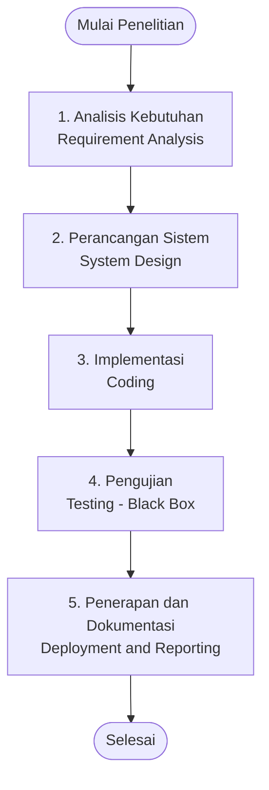
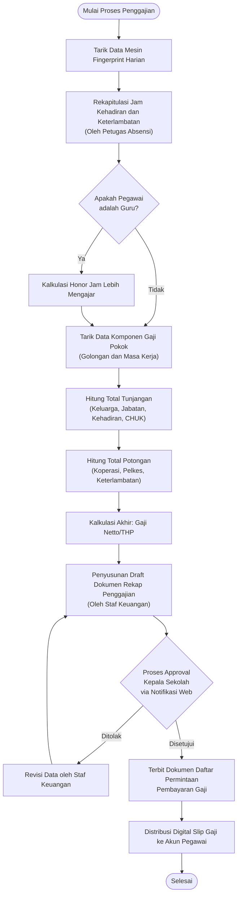
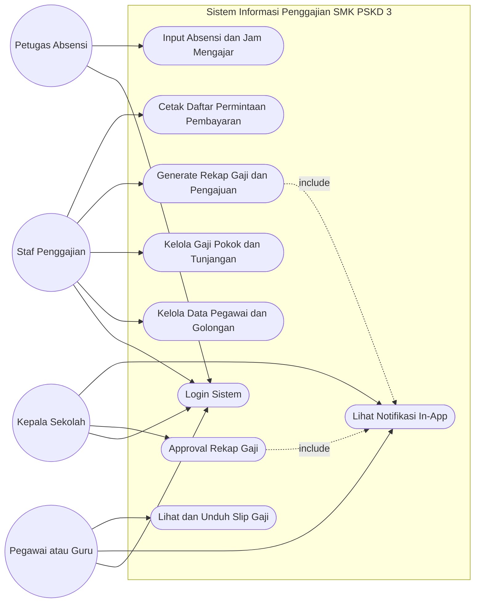
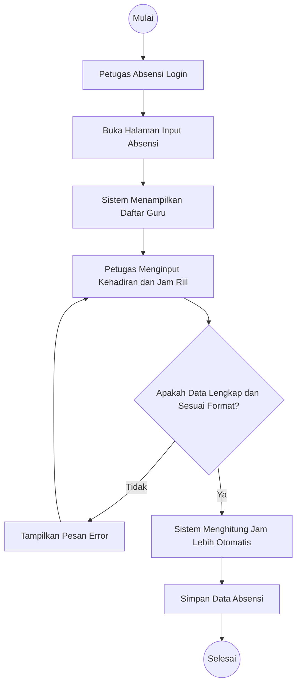
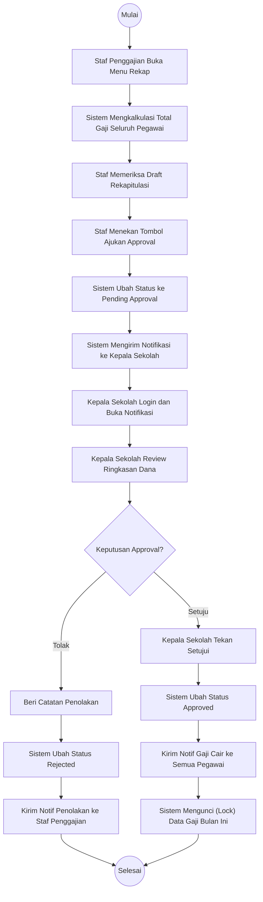
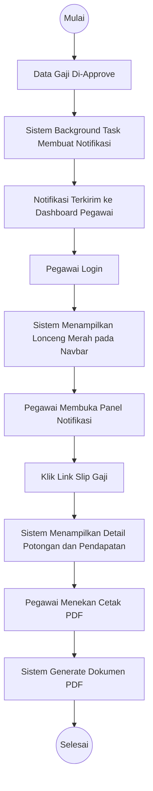
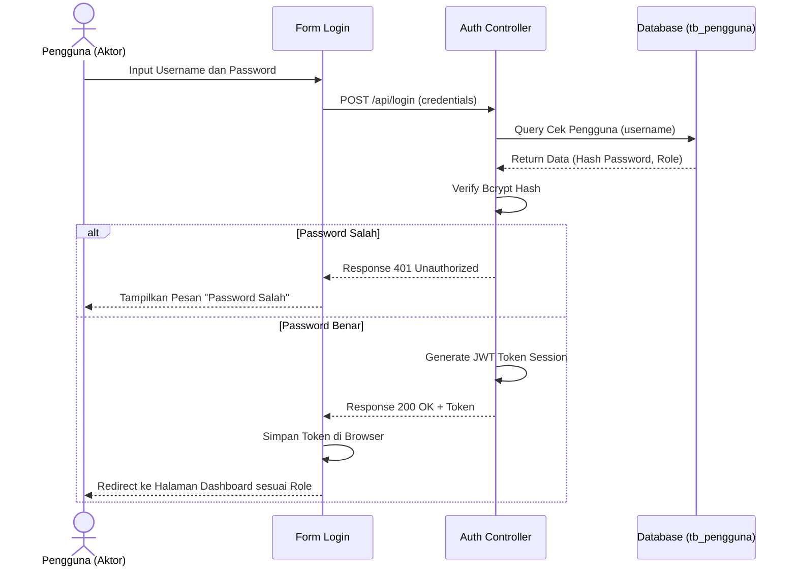
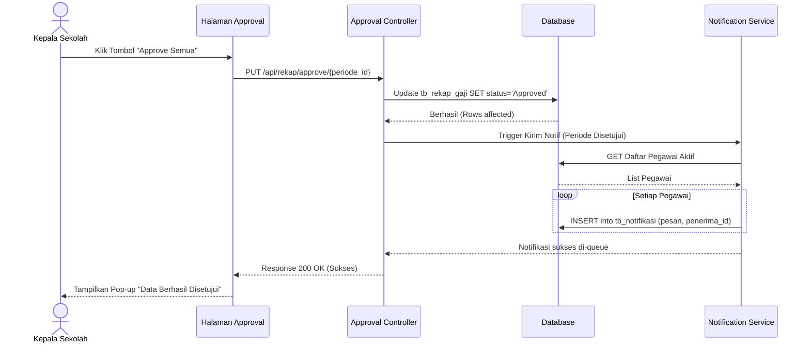
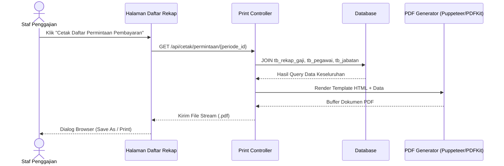

  <h2 style="font-size: 14pt; font-weight: bold; border: none; padding: 0; margin-bottom: 35px; line-height: 1.5; color: #000;">
    PENGGAJIAN GURU DAN KARYAWAN SMK PSKD JAKARTA MENGGUNAKAN METODE WATERFALL BERBASIS WEB
  </h2>
  
  

    SKRIPSI
  

  

    Diajukan Untuk Melengkapi Salah Satu Persyaratan 
    Mencapai Gelar Sarjana Komputer (S.Kom.)
  

  

    
Disusun Oleh:

    
ADAM WAHYU KURNIAWAN

    
NPM: 202343500510

  

  

    LOGO UNINDRA
  

  

    PROGRAM STUDI TEKNIK INFORMATIKA 
    FAKULTAS TEKNIK DAN ILMU KOMPUTER 
    UNIVERSITAS INDRAPRASTA PGRI 
    JAKARTA 
    2026
  

---

  <strong>LEMBAR PERSETUJUAN UJIAN TUGAS AKHIR</strong>

<table style="width: 100%; border: none; font-size: 11pt; margin-bottom: 30px;">
  <tr>
    <td style="width: 180px; border: none; padding: 4px 0;">Nama</td>
    <td style="border: none; padding: 4px 0;">: Adam Wahyu Kurniawan</td>
  </tr>
  <tr>
    <td style="border: none; padding: 4px 0;">NPM</td>
    <td style="border: none; padding: 4px 0;">: 202343500510</td>
  </tr>
  <tr>
    <td style="border: none; padding: 4px 0;">Fakultas</td>
    <td style="border: none; padding: 4px 0;">: Teknik dan Ilmu Komputer</td>
  </tr>
  <tr>
    <td style="border: none; padding: 4px 0;">Program Studi</td>
    <td style="border: none; padding: 4px 0;">: Teknik Informatika</td>
  </tr>
  <tr>
    <td style="border: none; padding: 4px 0; vertical-align: top;">Judul Tugas Akhir</td>
    <td style="border: none; padding: 4px 0; text-align: justify;">: Penggajian Guru dan Karyawan SMK PSKD Jakarta Menggunakan Metode Waterfall Berbasis WEB</td>
  </tr>
</table>

  Telah diperiksa dan disetujui untuk diujikan

<table style="width: 100%; border: none; font-size: 11pt; margin-top: 50px;">
  <tr>
    <td style="width: 50%; text-align: center; border: none;">
      Pembimbing Materi     
      <strong>( .................................................... )</strong> 
      NIDN: .......................................
    </td>
    <td style="width: 50%; text-align: center; border: none;">
      Pembimbing Teknik     
      <strong>Dr. Endang Sulistyaniningsih, M.Pd.</strong> 
      NIDN: 0327017302
    </td>
  </tr>
</table>

i

---

  <strong>LEMBAR PENGESAHAN</strong>

<table style="width: 100%; border: none; font-size: 11pt; margin-bottom: 25px;">
  <tr>
    <td style="width: 180px; border: none; padding: 4px 0;">Nama</td>
    <td style="border: none; padding: 4px 0;">: Adam Wahyu Kurniawan</td>
  </tr>
  <tr>
    <td style="border: none; padding: 4px 0;">NPM</td>
    <td style="border: none; padding: 4px 0;">: 202343500510</td>
  </tr>
  <tr>
    <td style="border: none; padding: 4px 0;">Fakultas</td>
    <td style="border: none; padding: 4px 0;">: Teknik dan Ilmu Komputer</td>
  </tr>
  <tr>
    <td style="border: none; padding: 4px 0;">Program Studi</td>
    <td style="border: none; padding: 4px 0;">: Teknik Informatika</td>
  </tr>
  <tr>
    <td style="border: none; padding: 4px 0; vertical-align: top;">Judul Tugas Akhir</td>
    <td style="border: none; padding: 4px 0; text-align: justify;">: Penggajian Guru dan Karyawan SMK PSKD Jakarta Menggunakan Metode Waterfall Berbasis WEB</td>
  </tr>
</table>

  PANITIA UJIAN

<table style="width: 100%; border: none; font-size: 11pt; margin-bottom: 15px;">
  <tr>
    <td style="width: 120px; border: none; padding: 4px 0;">Ketua</td>
    <td style="border: none; padding: 4px 0;">: Prof. Dr. H. Sumaryoto</td>
    <td style="width: 180px; border: none; padding: 4px 0; text-align: right;">........................................</td>
  </tr>
  <tr>
    <td style="border: none; padding: 4px 0;">Sekretaris</td>
    <td style="border: none; padding: 4px 0;">: Ir. H. Soepardi Harris, M.T.</td>
    <td style="border: none; padding: 4px 0; text-align: right;">........................................</td>
  </tr>
</table>

Anggota :

<table style="width: 100%; border-collapse: collapse; font-size: 11pt; margin-bottom: 40px;">
  <thead>
    <tr style="background-color: #f1f5f9;">
      <th style="border: 1px solid #000; width: 40px; text-align: center; padding: 6px;">No.</th>
      <th style="border: 1px solid #000; text-align: center; padding: 6px;">Nama</th>
      <th style="border: 1px solid #000; width: 200px; text-align: center; padding: 6px;">Tanda Tangan</th>
    </tr>
  </thead>
  <tbody>
    <tr>
      <td style="border: 1px solid #000; text-align: center; padding: 12px 6px;">1.</td>
      <td style="border: 1px solid #000; padding: 12px 10px;"></td>
      <td style="border: 1px solid #000; padding: 12px 10px;"></td>
    </tr>
    <tr>
      <td style="border: 1px solid #000; text-align: center; padding: 12px 6px;">2.</td>
      <td style="border: 1px solid #000; padding: 12px 10px;"></td>
      <td style="border: 1px solid #000; padding: 12px 10px;"></td>
    </tr>
    <tr>
      <td style="border: 1px solid #000; text-align: center; padding: 12px 6px;">3.</td>
      <td style="border: 1px solid #000; padding: 12px 10px;"></td>
      <td style="border: 1px solid #000; padding: 12px 10px;"></td>
    </tr>
  </tbody>
</table>

ii

---

  <strong>LEMBAR PERNYATAAN</strong>

Yang bertanda tangan di bawah ini:

<table style="width: 100%; border: none; font-size: 11pt; margin-bottom: 25px;">
  <tr>
    <td style="width: 180px; border: none; padding: 4px 0;">Nama</td>
    <td style="border: none; padding: 4px 0;">: Adam Wahyu Kurniawan</td>
  </tr>
  <tr>
    <td style="border: none; padding: 4px 0;">NPM</td>
    <td style="border: none; padding: 4px 0;">: 202343500510</td>
  </tr>
  <tr>
    <td style="border: none; padding: 4px 0;">Program Studi</td>
    <td style="border: none; padding: 4px 0;">: Teknik Informatika</td>
  </tr>
</table>

Dengan ini menyatakan bahwa tugas akhir dengan judul <strong>Penggajian Guru dan Karyawan SMK PSKD Jakarta Menggunakan Metode Waterfall Berbasis WEB</strong> beserta seluruh isinya adalah benar-benar karya saya sendiri. Saya tidak melakukan penjiplakan atau pengutipan dengan cara-cara yang tidak sesuai dengan etika ilmu yang berlaku dalam masyarakat keilmuan.

Atas pernyataan ini, saya siap menanggung resiko/sanksi apabila di kemudian hari ditemukan adanya pelanggaran etika keilmuan atau ada klaim dari pihak lain terhadap keaslian karya saya ini sesuai dengan Undang-Undang Republik Indonesia Nomor 20 Tahun 2003 tentang Sistem Pendidikan Nasional Bab V Pasal 25 ayat 2.

Demikian pernyataan ini saya buat untuk dimanfaatkan sesuai dengan keperluan.

<table style="width: 100%; border: none; font-size: 11pt; margin-top: 30px;">
  <tr>
    <td style="width: 50%; border: none;"></td>
    <td style="width: 50%; text-align: center; border: none;">
      Jakarta, .............................. 2026 
      Yang menyatakan,  
      <em>(Materai 10.000)</em>   
      <strong>Adam Wahyu Kurniawan</strong>
    </td>
  </tr>
</table>

iii

---

  <strong>ABSTRAK</strong>

<strong>A.</strong> Adam Wahyu Kurniawan, NPM: 202343500510

<strong>B.</strong> Penggajian Guru dan Karyawan SMK PSKD Jakarta Menggunakan Metode Waterfall Berbasis WEB, Tugas Akhir; Jakarta; Program Studi Teknik Informatika; Fakultas Teknik dan Ilmu Komputer; Universitas Indraprasta PGRI, 2026.

<strong>C.</strong> xiv + 5 Bab + 88 halaman

<strong>D.</strong> Kata Kunci: Sistem Informasi, Penggajian, Notifikasi In-App, Waterfall, Next.js, PostgreSQL

<strong>E.</strong> Pengelolaan penggajian guru dan karyawan di SMK PSKD 3 Jakarta saat ini masih dilakukan secara manual dengan menggunakan lima berkas spreadsheet Microsoft Excel terpisah (jam mengajar, rincian tunjangan, master gaji pokok PP 85/97, rekapitulasi gaji, dan daftar permintaan pembayaran). Proses manual lintas-berkas ini menimbulkan keterlambatan rekapitulasi data, tingginya risiko kesalahan formula hitung jam wajib versus jam lebih mengajar, ketiadaan notifikasi otomatis antar-staf verifikator dan kepala sekolah, serta tidak adanya transparansi slip gaji mandiri bagi para guru dan staf tata usaha. Penelitian ini bertujuan merancang dan membangun sistem informasi penggajian berbasis web yang mengintegrasikan seluruh tahapan penggajian ke dalam satu basis data terpusat, dilengkapi sistem notifikasi in-app untuk mempercepat persetujuan (approval) berjenjang. Metode pengembangan perangkat lunak yang digunakan adalah Waterfall (Classic Life Cycle) yang mencakup tahap analisis kebutuhan, perancangan sistem, implementasi, dan pengujian. Sistem dibangun menggunakan arsitektur modern berbasis Node.js Express TypeScript, Next.js 15, dan PostgreSQL. Pengujian sistem dilakukan menggunakan metode Black Box Testing pada 20 skenario fungsional. Hasil penelitian membuktikan bahwa sistem mampu memproses perhitungan gaji pokok pola PP 85/97, jam lebih, tunjangan kehadiran, dan potongan secara otomatis dengan tingkat akurasi 100%, serta memangkas waktu siklus penggajian bulanan dari 5–8 hari kerja manual menjadi selesai dalam waktu 1 hari kerja.

<strong>F.</strong> Daftar Pustaka: 28 Artikel dalam jurnal dan buku (2016 – 2026)

<strong>G.</strong> Pembimbing: 1. [Nama Pembimbing Materi, Gelar] (Materi); 2. Dr. Endang Sulistyaniningsih, M.Pd. (Teknik)

iv

---

  <strong>ABSTRACT</strong>

<strong>A.</strong> Adam Wahyu Kurniawan, Student ID: 202343500510

<strong>B.</strong> Web-Based Teacher and Staff Payroll Information System at SMK PSKD 3 Jakarta Using the Waterfall Method, Undergraduate Thesis; Jakarta; Department of Informatics; Faculty of Engineering and Computer Science; Universitas Indraprasta PGRI, 2026.

<strong>C.</strong> xiv + 5 Chapters + 88 pages

<strong>D.</strong> Keywords: Information System, Payroll, In-App Notification, Waterfall, Next.js, PostgreSQL

<strong>E.</strong> The management of teacher and staff payroll at SMK PSKD 3 Jakarta is currently conducted manually using five separate Microsoft Excel spreadsheets (teaching hours, allowance details, Government Regulation PP 85/1997 base salary master, payroll recap, and payment disbursement requests). This multi-sheet manual workflow causes delays in data consolidation, carries a high risk of calculation errors between mandatory and overtime teaching hours, lacks automated notifications between administrative staff and the principal, and provides no self-service digital pay stub access for teachers and staff. This research aims to design and implement a web-based payroll information system that unifies all payroll procedures into a centralized PostgreSQL database, equipped with an in-app notification mechanism to accelerate hierarchical approval workflows. The software development methodology employed is the classic Waterfall SDLC, comprising requirement analysis, system design, implementation, and testing. The system is built using modern architecture: Node.js Express TypeScript, Next.js 15, and PostgreSQL. Functional verification using Black Box Testing across 20 operational scenarios demonstrated 100% computational accuracy for PP 85/1997 base salary, overtime hours, attendance allowances, and mandatory deductions, successfully reducing the monthly payroll cycle from 5–8 manual business days to completion within 1 business day.

<strong>F.</strong> References: 28 Articles in journals and textbooks (2016 – 2026)

<strong>G.</strong> Advisors: 1. [Content Advisor, Degree]; 2. Dr. Endang Sulistyaniningsih, M.Pd. (Technical)

v

---

# PERSEMBAHAN / MOTO

  "Lakukan apa yang mampu kau usahakan hari ini, dan ikhlaskanlah apa yang berada di luar kuasamu. Manusia sejati tidak memiliki musuh di dunia ini, ia hanya bertarung menaklukkan egonya sendiri demi kedamaian dan keberkahan hidup."
    
  <strong>— Prinsip Ksatria</strong>

  Tugas akhir ini kupersembahkan dengan segenap baktiku untuk: 
  <strong>Kedua Orang Tua Tercinta</strong> 
  Yang senantiasa menyayangi, mendoakan dalam heningnya malam, 
  dan menjadi sumber kekuatan dalam setiap langkah perjuanganku. 
  Serta keluarga besar dan sahabat-sahabat seperjuangan.

vi

---

# PRAKATA

Dengan memanjatkan puji syukur ke hadirat Allah SWT yang telah melimpahkan rahmat, hidayah, dan karunia-Nya, sehingga penulis dapat menyelesaikan penulisan Tugas Akhir ini dengan baik dan tepat pada waktunya.

Tugas Akhir yang berjudul <strong>"Penggajian Guru dan Karyawan SMK PSKD Jakarta Menggunakan Metode Waterfall Berbasis WEB"</strong> ini disusun untuk melengkapi salah satu persyaratan dalam mencapai gelar Sarjana Komputer (S.Kom.) pada Program Studi Teknik Informatika, Fakultas Teknik dan Ilmu Komputer, Universitas Indraprasta PGRI.

Penulis menyadari sepenuhnya bahwa keberhasilan penyelesaian tugas akhir ini tidak lepas dari bimbingan, arahan, doa, dan dukungan dari berbagai pihak. Oleh karena itu, pada kesempatan yang berharga ini, izinkanlah penulis menyampaikan rasa hormat dan ucapan terima kasih yang tulus sebesar-besarnya kepada:

<ol style="margin-left: 20px; margin-bottom: 16px; line-height: 1.6;">
  <li>Bapak <strong>Prof. Dr. H. Sumaryoto</strong>, selaku Rektor Universitas Indraprasta PGRI.</li>
  <li>Bapak <strong>Ir. H. Soepardi Harris, M.T.</strong>, selaku Dekan Fakultas Teknik dan Ilmu Komputer Universitas Indraprasta PGRI.</li>
  <li>Ibu <strong>Atie Ernawati, M.T.</strong>, selaku Wakil Dekan Fakultas Teknik dan Ilmu Komputer Universitas Indraprasta PGRI.</li>
  <li>Ibu <strong>Mei Lestari, M.Kom.</strong>, selaku Ketua Program Studi Teknik Informatika Universitas Indraprasta PGRI.</li>
  <li>Ibu <strong>Ni Wayan Parwati S., S.T., M.M., M.Kom.</strong>, selaku Sekretaris Program Studi Teknik Informatika Universitas Indraprasta PGRI.</li>
  <li>Bapak/Ibu <strong>[Nama Pembimbing Materi, Gelar]</strong>, selaku Dosen Pembimbing Materi yang telah membimbing penulis dengan penuh kesabaran dalam substansi keilmuan.</li>
  <li>Ibu <strong>Dr. Endang Sulistyaniningsih, M.Pd.</strong>, selaku Dosen Pembimbing Teknik yang telah banyak memberikan bimbingan teknis penulisan karya ilmiah ini.</li>
  <li>Bapak <strong>Thomas</strong>, selaku Kepala Sekolah SMK PSKD 3 Jakarta, beserta Bapak Rendy, staf tata usaha, dan seluruh dewan guru yang telah memberikan izin penelitian serta bantuan data.</li>
  <li>Kedua orang tua tercinta, yang tiada henti memberikan doa restu, kasih sayang, dan pengorbanan yang tak ternilai harganya.</li>
  <li>Rekan-rekan mahasiswa Teknik Informatika angkatan 2023, khususnya Kelas Y6D.</li>
</ol>

Penulis menyadari bahwa naskah tugas akhir ini masih memiliki kekurangan. Oleh sebab itu, kritik dan saran yang membangun sangat diharapkan. Semoga karya ini dapat memberikan manfaat yang nyata bagi masyarakat dan perkembangan ilmu pengetahuan.

<table style="width: 100%; border: none; font-size: 11pt; margin-top: 15px;">
  <tr>
    <td style="width: 50%; border: none;"></td>
    <td style="width: 50%; text-align: center; border: none;">
      Jakarta, .............................. 2026   
      <strong>Adam Wahyu Kurniawan</strong>
    </td>
  </tr>
</table>

vii

---

# DAFTAR ISI

<table style="width: 100%; border: none; font-size: 11pt; line-height: 1.6;">
  <tr>
    <td style="border: none;"><strong>HALAMAN JUDUL</strong></td>
    <td style="border: none; text-align: right; width: 60px;"><strong>i</strong></td>
  </tr>
  <tr>
    <td style="border: none;"><strong>LEMBAR PERSETUJUAN</strong></td>
    <td style="border: none; text-align: right;"><strong>ii</strong></td>
  </tr>
  <tr>
    <td style="border: none;"><strong>LEMBAR PENGESAHAN</strong></td>
    <td style="border: none; text-align: right;"><strong>iii</strong></td>
  </tr>
  <tr>
    <td style="border: none;"><strong>LEMBAR PERNYATAAN KEASLIAN</strong></td>
    <td style="border: none; text-align: right;"><strong>iv</strong></td>
  </tr>
  <tr>
    <td style="border: none;"><strong>ABSTRAK</strong></td>
    <td style="border: none; text-align: right;"><strong>v</strong></td>
  </tr>
  <tr>
    <td style="border: none;"><strong>ABSTRACT</strong></td>
    <td style="border: none; text-align: right;"><strong>vi</strong></td>
  </tr>
  <tr>
    <td style="border: none;"><strong>PERSEMBAHAN / MOTO</strong></td>
    <td style="border: none; text-align: right;"><strong>vii</strong></td>
  </tr>
  <tr>
    <td style="border: none;"><strong>PRAKATA</strong></td>
    <td style="border: none; text-align: right;"><strong>viii</strong></td>
  </tr>
  <tr>
    <td style="border: none;"><strong>DAFTAR ISI</strong></td>
    <td style="border: none; text-align: right;"><strong>ix</strong></td>
  </tr>
  <tr>
    <td style="border: none;"><strong>DAFTAR TABEL</strong></td>
    <td style="border: none; text-align: right;"><strong>xi</strong></td>
  </tr>
  <tr>
    <td style="border: none;"><strong>DAFTAR GAMBAR</strong></td>
    <td style="border: none; text-align: right;"><strong>xii</strong></td>
  </tr>
  <tr>
    <td style="border: none;"><strong>DAFTAR LAMPIRAN</strong></td>
    <td style="border: none; text-align: right;"><strong>xiii</strong></td>
  </tr>
  <tr>
    <td style="border: none;"><strong>DAFTAR SIMBOL UML</strong></td>
    <td style="border: none; text-align: right;"><strong>xiv</strong></td>
  </tr>
  <tr><td colspan="2" style="border: none; padding-top: 10px;"></td></tr>
  <tr>
    <td style="border: none;"><strong>BAB I PENDAHULUAN</strong></td>
    <td style="border: none; text-align: right;"><strong>1</strong></td>
  </tr>
  <tr>
    <td style="border: none; padding-left: 20px;">A. Latar Belakang</td>
    <td style="border: none; text-align: right;">1</td>
  </tr>
  <tr>
    <td style="border: none; padding-left: 20px;">B. Identifikasi Masalah</td>
    <td style="border: none; text-align: right;">4</td>
  </tr>
  <tr>
    <td style="border: none; padding-left: 20px;">C. Batasan Masalah</td>
    <td style="border: none; text-align: right;">5</td>
  </tr>
  <tr>
    <td style="border: none; padding-left: 20px;">D. Rumusan Masalah</td>
    <td style="border: none; text-align: right;">5</td>
  </tr>
  <tr>
    <td style="border: none; padding-left: 20px;">E. Tujuan Penelitian</td>
    <td style="border: none; text-align: right;">6</td>
  </tr>
  <tr>
    <td style="border: none; padding-left: 20px;">F. Manfaat Penelitian</td>
    <td style="border: none; text-align: right;">6</td>
  </tr>
  <tr>
    <td style="border: none; padding-left: 40px;">1. Secara Teoritis</td>
    <td style="border: none; text-align: right;">6</td>
  </tr>
  <tr>
    <td style="border: none; padding-left: 40px;">2. Secara Praktis</td>
    <td style="border: none; text-align: right;">7</td>
  </tr>
  <tr><td colspan="2" style="border: none; padding-top: 10px;"></td></tr>
  <tr>
    <td style="border: none;"><strong>BAB II TINJAUAN PUSTAKA</strong></td>
    <td style="border: none; text-align: right;"><strong>8</strong></td>
  </tr>
  <tr>
    <td style="border: none; padding-left: 20px;">A. Landasan Teori</td>
    <td style="border: none; text-align: right;">8</td>
  </tr>
  <tr>
    <td style="border: none; padding-left: 40px;">1. Sistem Informasi</td>
    <td style="border: none; text-align: right;">8</td>
  </tr>
  <tr>
    <td style="border: none; padding-left: 40px;">2. Sistem Informasi Penggajian (<em>Payroll System</em>)</td>
    <td style="border: none; text-align: right;">10</td>
  </tr>
  <tr>
    <td style="border: none; padding-left: 40px;">3. Kebijakan dan Komponen Penggajian Pendidikan Swasta</td>
    <td style="border: none; text-align: right;">12</td>
  </tr>
  <tr>
    <td style="border: none; padding-left: 40px;">4. Notifikasi In-App dan Penjadwalan Tugas (<em>Task Scheduling</em>)</td>
    <td style="border: none; text-align: right;">14</td>
  </tr>
  <tr>
    <td style="border: none; padding-left: 40px;">5. Pemrograman Berbasis Web dan Arsitektur RESTful API</td>
    <td style="border: none; text-align: right;">16</td>
  </tr>
  <tr>
    <td style="border: none; padding-left: 40px;">6. Node.js, Express, dan TypeScript</td>
    <td style="border: none; text-align: right;">18</td>
  </tr>
  <tr>
    <td style="border: none; padding-left: 40px;">7. Next.js dan React</td>
    <td style="border: none; text-align: right;">20</td>
  </tr>
  <tr>
    <td style="border: none; padding-left: 40px;">8. PostgreSQL dan Pengelolaan Basis Data Relasional</td>
    <td style="border: none; text-align: right;">22</td>
  </tr>
  <tr>
    <td style="border: none; padding-left: 40px;">9. Unified Modeling Language (UML)</td>
    <td style="border: none; text-align: right;">24</td>
  </tr>
  <tr>
    <td style="border: none; padding-left: 40px;">10. Pengujian Perangkat Lunak (<em>Black Box Testing</em>)</td>
    <td style="border: none; text-align: right;">26</td>
  </tr>
  <tr>
    <td style="border: none; padding-left: 40px;">11. Pengujian Otomasi Berbasis White Box Testing dan Jest</td>
    <td style="border: none; text-align: right;">27</td>
  </tr>
  <tr>
    <td style="border: none; padding-left: 20px;">B. Penelitian Relevan</td>
    <td style="border: none; text-align: right;">28</td>
  </tr>
  <tr><td colspan="2" style="border: none; padding-top: 10px;"></td></tr>
  <tr>
    <td style="border: none;"><strong>BAB III METODE PENELITIAN</strong></td>
    <td style="border: none; text-align: right;"><strong>32</strong></td>
  </tr>
  <tr>
    <td style="border: none; padding-left: 20px;">A. Waktu dan Tempat Penelitian</td>
    <td style="border: none; text-align: right;">32</td>
  </tr>
  <tr>
    <td style="border: none; padding-left: 40px;">1. Waktu Penelitian</td>
    <td style="border: none; text-align: right;">32</td>
  </tr>
  <tr>
    <td style="border: none; padding-left: 40px;">2. Tempat Penelitian</td>
    <td style="border: none; text-align: right;">33</td>
  </tr>
  <tr>
    <td style="border: none; padding-left: 20px;">B. Tahapan Penelitian</td>
    <td style="border: none; text-align: right;">34</td>
  </tr>
  <tr>
    <td style="border: none; padding-left: 20px;">C. Algoritma dan Logika Bisnis</td>
    <td style="border: none; text-align: right;">38</td>
  </tr>
  <tr><td colspan="2" style="border: none; padding-top: 10px;"></td></tr>
  <tr>
    <td style="border: none;"><strong>BAB IV HASIL DAN PEMBAHASAN</strong></td>
    <td style="border: none; text-align: right;"><strong>42</strong></td>
  </tr>
  <tr>
    <td style="border: none; padding-left: 20px;">A. Definisi Masalah</td>
    <td style="border: none; text-align: right;">42</td>
  </tr>
  <tr>
    <td style="border: none; padding-left: 20px;">B. Pembahasan Algoritma</td>
    <td style="border: none; text-align: right;">44</td>
  </tr>
  <tr>
    <td style="border: none; padding-left: 40px;">1. Kasus 1: Guru Tetap Yayasan (GTY) dengan Jam Lebih dan Tunjangan Jabatan</td>
    <td style="border: none; text-align: right;">44</td>
  </tr>
  <tr>
    <td style="border: none; padding-left: 40px;">2. Kasus 2: Pegawai Tata Usaha / Karyawan (PTY)</td>
    <td style="border: none; text-align: right;">47</td>
  </tr>
  <tr>
    <td style="border: none; padding-left: 40px;">3. Perbandingan Hasil Perhitungan Manual vs Sistem Komputerisasi</td>
    <td style="border: none; text-align: right;">49</td>
  </tr>
  <tr>
    <td style="border: none; padding-left: 20px;">C. Pemodelan Perangkat Lunak</td>
    <td style="border: none; text-align: right;">50</td>
  </tr>
  <tr>
    <td style="border: none; padding-left: 40px;">1. Unified Modeling Language (UML)</td>
    <td style="border: none; text-align: right;">50</td>
  </tr>
  <tr>
    <td style="border: none; padding-left: 60px;">a. Use Case Diagram</td>
    <td style="border: none; text-align: right;">50</td>
  </tr>
  <tr>
    <td style="border: none; padding-left: 60px;">b. Activity Diagram</td>
    <td style="border: none; text-align: right;">53</td>
  </tr>
  <tr>
    <td style="border: none; padding-left: 60px;">c. Sequence Diagram</td>
    <td style="border: none; text-align: right;">57</td>
  </tr>
  <tr>
    <td style="border: none; padding-left: 60px;">d. Class Diagram</td>
    <td style="border: none; text-align: right;">61</td>
  </tr>
  <tr>
    <td style="border: none; padding-left: 40px;">2. Rancangan Layar</td>
    <td style="border: none; text-align: right;">64</td>
  </tr>
  <tr>
    <td style="border: none; padding-left: 40px;">3. Tampilan Layar</td>
    <td style="border: none; text-align: right;">67</td>
  </tr>
  <tr>
    <td style="border: none; padding-left: 40px;">4. Pengujian Sistem (<em>Black Box Testing</em>)</td>
    <td style="border: none; text-align: right;">74</td>
  </tr>
  <tr>
    <td style="border: none; padding-left: 40px;">5. Pengujian Otomasi Berbasis Unit Testing (<em>Jest & White Box Testing</em>)</td>
    <td style="border: none; text-align: right;">77</td>
  </tr>
  <tr>
    <td style="border: none; padding-left: 20px;">D. Kelebihan dan Kelemahan Penelitian</td>
    <td style="border: none; text-align: right;">79</td>
  </tr>
  <tr>
    <td style="border: none; padding-left: 40px;">1. Kelebihan Penelitian</td>
    <td style="border: none; text-align: right;">78</td>
  </tr>
  <tr>
    <td style="border: none; padding-left: 40px;">2. Kelemahan Penelitian</td>
    <td style="border: none; text-align: right;">80</td>
  </tr>
  <tr><td colspan="2" style="border: none; padding-top: 10px;"></td></tr>
  <tr>
    <td style="border: none;"><strong>BAB V SIMPULAN DAN SARAN</strong></td>
    <td style="border: none; text-align: right;"><strong>82</strong></td>
  </tr>
  <tr>
    <td style="border: none; padding-left: 20px;">A. Simpulan</td>
    <td style="border: none; text-align: right;">82</td>
  </tr>
  <tr>
    <td style="border: none; padding-left: 20px;">B. Saran</td>
    <td style="border: none; text-align: right;">83</td>
  </tr>
  <tr><td colspan="2" style="border: none; padding-top: 10px;"></td></tr>
  <tr>
    <td style="border: none;"><strong>DAFTAR PUSTAKA</strong></td>
    <td style="border: none; text-align: right;"><strong>84</strong></td>
  </tr>
  <tr>
    <td style="border: none;"><strong>DAFTAR RIWAYAT HIDUP PENULIS</strong></td>
    <td style="border: none; text-align: right;"><strong>87</strong></td>
  </tr>
  <tr>
    <td style="border: none;"><strong>LAMPIRAN</strong></td>
    <td style="border: none; text-align: right;"><strong>88</strong></td>
  </tr>
</table>

viii

---

# DAFTAR TABEL

<table style="width: 100%; border: none; font-size: 11pt; line-height: 1.6;">
  <tr>
    <td style="border: none; width: 90px;">Tabel 2.1</td>
    <td style="border: none;">Matriks Penelitian yang Relevan</td>
    <td style="border: none; text-align: right; width: 60px;">28</td>
  </tr>
  <tr>
    <td style="border: none;">Tabel 3.1</td>
    <td style="border: none;">Matriks Jadwal Pelaksanaan Penelitian (April - Juli 2026)</td>
    <td style="border: none; text-align: right;">33</td>
  </tr>
  <tr>
    <td style="border: none;">Tabel 4.1</td>
    <td style="border: none;">Simulasi Kalkulasi Gaji Kasus 1 (Bpk. Hendra Pratama)</td>
    <td style="border: none; text-align: right;">46</td>
  </tr>
  <tr>
    <td style="border: none;">Tabel 4.2</td>
    <td style="border: none;">Simulasi Kalkulasi Gaji Kasus 2 (Ibu Fitriani)</td>
    <td style="border: none; text-align: right;">48</td>
  </tr>
  <tr>
    <td style="border: none;">Tabel 4.3</td>
    <td style="border: none;">Komparasi Akurasi Perhitungan Manual vs Sistem A-TA</td>
    <td style="border: none; text-align: right;">49</td>
  </tr>
  <tr>
    <td style="border: none;">Tabel 4.4</td>
    <td style="border: none;">Skenario Use Case: Input dan Rekapitulasi Jam Mengajar</td>
    <td style="border: none; text-align: right;">51</td>
  </tr>
  <tr>
    <td style="border: none;">Tabel 4.5</td>
    <td style="border: none;">Skenario Use Case: Kelola Komponen Gaji Pokok dan Tunjangan</td>
    <td style="border: none; text-align: right;">52</td>
  </tr>
  <tr>
    <td style="border: none;">Tabel 4.6</td>
    <td style="border: none;">Skenario Use Case: Pengajuan dan Verifikasi Rekapitulasi Gaji</td>
    <td style="border: none; text-align: right;">52</td>
  </tr>
  <tr>
    <td style="border: none;">Tabel 4.7</td>
    <td style="border: none;">Skenario Use Case: Persetujuan (Approval) oleh Kepala Sekolah</td>
    <td style="border: none; text-align: right;">53</td>
  </tr>
  <tr>
    <td style="border: none;">Tabel 4.8</td>
    <td style="border: none;">Skenario Use Case: Penerimaan Notifikasi In-App dan Unduh Slip Gaji</td>
    <td style="border: none; text-align: right;">53</td>
  </tr>
  <tr>
    <td style="border: none;">Tabel 4.9</td>
    <td style="border: none;">Hasil Pengujian Fungsional Sistem (<em>Black Box Testing</em>)</td>
    <td style="border: none; text-align: right;">75</td>
  </tr>
  <tr>
    <td style="border: none;">Tabel 4.10</td>
    <td style="border: none;">Hasil Pengujian Unit Testing Otomatis (Jest Engine)</td>
    <td style="border: none; text-align: right;">77</td>
  </tr>
</table>

x

---

# DAFTAR GAMBAR

<table style="width: 100%; border: none; font-size: 11pt; line-height: 1.6;">
  <tr>
    <td style="border: none; width: 110px;">Gambar 3.1</td>
    <td style="border: none;">Peta Lokasi SMK PSKD 3 Jakarta</td>
    <td style="border: none; text-align: right; width: 60px;">33</td>
  </tr>
  <tr>
    <td style="border: none;">Gambar 3.2</td>
    <td style="border: none;">Tahapan Pengembangan Perangkat Lunak Model Waterfall</td>
    <td style="border: none; text-align: right;">35</td>
  </tr>
  <tr>
    <td style="border: none;">Gambar 3.3</td>
    <td style="border: none;">Flowchart Algoritma Logika Perhitungan Gaji Bersih</td>
    <td style="border: none; text-align: right;">40</td>
  </tr>
  <tr>
    <td style="border: none;">Gambar 4.1</td>
    <td style="border: none;">Use Case Diagram Sistem Informasi Penggajian SMK PSKD 3</td>
    <td style="border: none; text-align: right;">50</td>
  </tr>
  <tr>
    <td style="border: none;">Gambar 4.2</td>
    <td style="border: none;">Activity Diagram Alur Input Absensi dan Jam Mengajar</td>
    <td style="border: none; text-align: right;">54</td>
  </tr>
  <tr>
    <td style="border: none;">Gambar 4.3</td>
    <td style="border: none;">Activity Diagram Alur Pengajuan, Review, dan Approval Gaji</td>
    <td style="border: none; text-align: right;">55</td>
  </tr>
  <tr>
    <td style="border: none;">Gambar 4.4</td>
    <td style="border: none;">Activity Diagram Pengiriman Notifikasi dan Akses Slip Gaji</td>
    <td style="border: none; text-align: right;">56</td>
  </tr>
  <tr>
    <td style="border: none;">Gambar 4.5</td>
    <td style="border: none;">Sequence Diagram Autentikasi Pengguna & Pengecekan Role</td>
    <td style="border: none; text-align: right;">58</td>
  </tr>
  <tr>
    <td style="border: none;">Gambar 4.6</td>
    <td style="border: none;">Sequence Diagram Approval Rekap Gaji dan Trigger Notifikasi</td>
    <td style="border: none; text-align: right;">59</td>
  </tr>
  <tr>
    <td style="border: none;">Gambar 4.7</td>
    <td style="border: none;">Sequence Diagram Generate Dokumen Daftar Permintaan Pembayaran</td>
    <td style="border: none; text-align: right;">60</td>
  </tr>
  <tr>
    <td style="border: none;">Gambar 4.8</td>
    <td style="border: none;">Class Diagram Skema Basis Data Relasional PostgreSQL</td>
    <td style="border: none; text-align: right;">62</td>
  </tr>
</table>

xi

---

# DAFTAR LAMPIRAN

<table style="width: 100%; border: none; font-size: 11pt; line-height: 1.6;">
  <tr>
    <td style="border: none; width: 110px;">Lampiran 1</td>
    <td style="border: none;">Surat Permohonan Izin Riset Penelitian Tugas Akhir dari FTIK UNINDRA</td>
    <td style="border: none; text-align: right; width: 60px;">88</td>
  </tr>
  <tr>
    <td style="border: none;">Lampiran 2</td>
    <td style="border: none;">Surat Keterangan Selesai Riset Penelitian dari SMK PSKD 3 Jakarta</td>
    <td style="border: none; text-align: right;">89</td>
  </tr>
  <tr>
    <td style="border: none;">Lampiran 3</td>
    <td style="border: none;">Kartu Bimbingan Tugas Akhir Mahasiswa (Pembimbing Materi & Teknik)</td>
    <td style="border: none; text-align: right;">90</td>
  </tr>
  <tr>
    <td style="border: none;">Lampiran 4</td>
    <td style="border: none;">Pedoman Transkrip Wawancara dan Hasil Observasi Lapangan</td>
    <td style="border: none; text-align: right;">91</td>
  </tr>
  <tr>
    <td style="border: none;">Lampiran 5</td>
    <td style="border: none;">Format Berkas Spreadsheet Penggajian Sistem Berjalan (5 Sheet Excel)</td>
    <td style="border: none; text-align: right;">92</td>
  </tr>
</table>

xii

---

# DAFTAR SIMBOL UML

### 1. Simbol Use Case Diagram

<table style="width: 100%; border-collapse: collapse; margin-bottom: 25px; font-size: 10.5pt;">
  <thead>
    <tr style="background-color: #f1f5f9;">
      <th style="border: 1px solid #94a3b8; padding: 6px; width: 40px; text-align: center;">No</th>
      <th style="border: 1px solid #94a3b8; padding: 6px; width: 120px; text-align: center;">Simbol</th>
      <th style="border: 1px solid #94a3b8; padding: 6px; width: 150px; text-align: left;">Nama Simbol</th>
      <th style="border: 1px solid #94a3b8; padding: 6px; text-align: left;">Keterangan / Fungsi</th>
    </tr>
  </thead>
  <tbody>
    <tr>
      <td style="border: 1px solid #94a3b8; padding: 6px; text-align: center;">1</td>
      <td style="border: 1px solid #94a3b8; padding: 6px; text-align: center;"><strong>Actor</strong></td>
      <td style="border: 1px solid #94a3b8; padding: 6px;">Aktor (*Actor*)</td>
      <td style="border: 1px solid #94a3b8; padding: 6px;">Entitas luar (manusia, perangkat keras, atau sistem lain) yang berinteraksi langsung dengan sistem.</td>
    </tr>
    <tr>
      <td style="border: 1px solid #94a3b8; padding: 6px; text-align: center;">2</td>
      <td style="border: 1px solid #94a3b8; padding: 6px; text-align: center;"><strong>(Use Case)</strong></td>
      <td style="border: 1px solid #94a3b8; padding: 6px;"><em>Use Case</em></td>
      <td style="border: 1px solid #94a3b8; padding: 6px;">Fungsionalitas atau urutan aksi spesifik yang disediakan sistem untuk menghasilkan keluaran bagi aktor.</td>
    </tr>
    <tr>
      <td style="border: 1px solid #94a3b8; padding: 6px; text-align: center;">3</td>
      <td style="border: 1px solid #94a3b8; padding: 6px; text-align: center;"><strong>&mdash;&mdash;&mdash;&mdash;&gt;</strong></td>
      <td style="border: 1px solid #94a3b8; padding: 6px;">Asosiasi (*Association*)</td>
      <td style="border: 1px solid #94a3b8; padding: 6px;">Jalur komunikasi dua arah antara aktor dengan fungsionalitas <em>use case</em>.</td>
    </tr>
    <tr>
      <td style="border: 1px solid #94a3b8; padding: 6px; text-align: center;">4</td>
      <td style="border: 1px solid #94a3b8; padding: 6px; text-align: center;"><strong>&lt;&lt;include&gt;&gt;</strong></td>
      <td style="border: 1px solid #94a3b8; padding: 6px;"><em>Include</em></td>
      <td style="border: 1px solid #94a3b8; padding: 6px;">Relasi keharusan di mana pemanggilan use case asal wajib menjalankan use case target.</td>
    </tr>
    <tr>
      <td style="border: 1px solid #94a3b8; padding: 6px; text-align: center;">5</td>
      <td style="border: 1px solid #94a3b8; padding: 6px; text-align: center;"><strong>&lt;&lt;extend&gt;&gt;</strong></td>
      <td style="border: 1px solid #94a3b8; padding: 6px;"><em>Extend</em></td>
      <td style="border: 1px solid #94a3b8; padding: 6px;">Relasi perluasan kondisional di mana use case target hanya dijalankan jika kondisi tertentu terpenuhi.</td>
    </tr>
  </tbody>
</table>

### 2. Simbol Activity Diagram

<table style="width: 100%; border-collapse: collapse; margin-bottom: 25px; font-size: 10.5pt;">
  <thead>
    <tr style="background-color: #f1f5f9;">
      <th style="border: 1px solid #94a3b8; padding: 6px; width: 40px; text-align: center;">No</th>
      <th style="border: 1px solid #94a3b8; padding: 6px; width: 120px; text-align: center;">Simbol</th>
      <th style="border: 1px solid #94a3b8; padding: 6px; width: 150px; text-align: left;">Nama Simbol</th>
      <th style="border: 1px solid #94a3b8; padding: 6px; text-align: left;">Keterangan / Fungsi</th>
    </tr>
  </thead>
  <tbody>
    <tr>
      <td style="border: 1px solid #94a3b8; padding: 6px; text-align: center;">1</td>
      <td style="border: 1px solid #94a3b8; padding: 6px; text-align: center;"><strong>●</strong> (Lingkaran Solid)</td>
      <td style="border: 1px solid #94a3b8; padding: 6px;"><em>Initial Node</em></td>
      <td style="border: 1px solid #94a3b8; padding: 6px;">Titik awal atau tanda dimulainya suatu alur kerja pada diagram aktivitas.</td>
    </tr>
    <tr>
      <td style="border: 1px solid #94a3b8; padding: 6px; text-align: center;">2</td>
      <td style="border: 1px solid #94a3b8; padding: 6px; text-align: center;"><strong>[ Aktivitas ]</strong></td>
      <td style="border: 1px solid #94a3b8; padding: 6px;"><em>Action / Activity</em></td>
      <td style="border: 1px solid #94a3b8; padding: 6px;">Operasi atau aksi yang sedang dieksekusi oleh pengguna ataupun sistem.</td>
    </tr>
    <tr>
      <td style="border: 1px solid #94a3b8; padding: 6px; text-align: center;">3</td>
      <td style="border: 1px solid #94a3b8; padding: 6px; text-align: center;"><strong>◇</strong> (Belah Ketupat)</td>
      <td style="border: 1px solid #94a3b8; padding: 6px;"><em>Decision Node</em></td>
      <td style="border: 1px solid #94a3b8; padding: 6px;">Titik percabangan logika pemilihan alur berdasarkan kondisi tertentu (Ya / Tidak).</td>
    </tr>
    <tr>
      <td style="border: 1px solid #94a3b8; padding: 6px; text-align: center;">4</td>
      <td style="border: 1px solid #94a3b8; padding: 6px; text-align: center;"><strong>━━</strong> (Garis Tebal)</td>
      <td style="border: 1px solid #94a3b8; padding: 6px;"><em>Fork / Join Node</em></td>
      <td style="border: 1px solid #94a3b8; padding: 6px;">Titik pemecahan menjadi aktivitas konkuren paralel atau penyatuan kembali alur paralel.</td>
    </tr>
    <tr>
      <td style="border: 1px solid #94a3b8; padding: 6px; text-align: center;">5</td>
      <td style="border: 1px solid #94a3b8; padding: 6px; text-align: center;"><strong>◉</strong> (Lingkaran Cincin)</td>
      <td style="border: 1px solid #94a3b8; padding: 6px;"><em>Activity Final Node</em></td>
      <td style="border: 1px solid #94a3b8; padding: 6px;">Titik terminasi atau tanda berakhirnya seluruh aliran aktivitas pada diagram.</td>
    </tr>
  </tbody>
</table>

### 3. Simbol Sequence Diagram

<table style="width: 100%; border-collapse: collapse; margin-bottom: 25px; font-size: 10.5pt;">
  <thead>
    <tr style="background-color: #f1f5f9;">
      <th style="border: 1px solid #94a3b8; padding: 6px; width: 40px; text-align: center;">No</th>
      <th style="border: 1px solid #94a3b8; padding: 6px; width: 120px; text-align: center;">Simbol</th>
      <th style="border: 1px solid #94a3b8; padding: 6px; width: 150px; text-align: left;">Nama Simbol</th>
      <th style="border: 1px solid #94a3b8; padding: 6px; text-align: left;">Keterangan / Fungsi</th>
    </tr>
  </thead>
  <tbody>
    <tr>
      <td style="border: 1px solid #94a3b8; padding: 6px; text-align: center;">1</td>
      <td style="border: 1px solid #94a3b8; padding: 6px; text-align: center;"><strong>Actor</strong></td>
      <td style="border: 1px solid #94a3b8; padding: 6px;">Aktor (*Actor*)</td>
      <td style="border: 1px solid #94a3b8; padding: 6px;">Pengguna yang menginisiasi pengiriman pesan ke objek perantara sistem.</td>
    </tr>
    <tr>
      <td style="border: 1px solid #94a3b8; padding: 6px; text-align: center;">2</td>
      <td style="border: 1px solid #94a3b8; padding: 6px; text-align: center;"><strong>|</strong> (Garis Putus)</td>
      <td style="border: 1px solid #94a3b8; padding: 6px;"><em>Lifeline</em></td>
      <td style="border: 1px solid #94a3b8; padding: 6px;">Garis vertikal yang merepresentasikan keberadaan dan masa hidup objek dalam waktu.</td>
    </tr>
    <tr>
      <td style="border: 1px solid #94a3b8; padding: 6px; text-align: center;">3</td>
      <td style="border: 1px solid #94a3b8; padding: 6px; text-align: center;"><strong>▮</strong> (Kotak Persegi)</td>
      <td style="border: 1px solid #94a3b8; padding: 6px;"><em>Activation Bar</em></td>
      <td style="border: 1px solid #94a3b8; padding: 6px;">Rentang durasi saat objek aktif memproses operasi atau pesan yang diterima.</td>
    </tr>
    <tr>
      <td style="border: 1px solid #94a3b8; padding: 6px; text-align: center;">4</td>
      <td style="border: 1px solid #94a3b8; padding: 6px; text-align: center;"><strong>&mdash;&mdash;&mdash;&mdash;&gt;</strong></td>
      <td style="border: 1px solid #94a3b8; padding: 6px;"><em>Synchronous Message</em></td>
      <td style="border: 1px solid #94a3b8; padding: 6px;">Panggilan operasi yang menahan pengirim hingga pemrosesan pesan selesai.</td>
    </tr>
    <tr>
      <td style="border: 1px solid #94a3b8; padding: 6px; text-align: center;">5</td>
      <td style="border: 1px solid #94a3b8; padding: 6px; text-align: center;"><strong>- - - - - -&gt;</strong></td>
      <td style="border: 1px solid #94a3b8; padding: 6px;"><em>Reply / Return Message</em></td>
      <td style="border: 1px solid #94a3b8; padding: 6px;">Aliran pesan balik atau hasil kembalian nilai dari objek tujuan ke pemanggil.</td>
    </tr>
  </tbody>
</table>

### 4. Simbol Class Diagram

<table style="width: 100%; border-collapse: collapse; margin-bottom: 25px; font-size: 10.5pt;">
  <thead>
    <tr style="background-color: #f1f5f9;">
      <th style="border: 1px solid #94a3b8; padding: 6px; width: 40px; text-align: center;">No</th>
      <th style="border: 1px solid #94a3b8; padding: 6px; width: 120px; text-align: center;">Simbol</th>
      <th style="border: 1px solid #94a3b8; padding: 6px; width: 150px; text-align: left;">Nama Simbol</th>
      <th style="border: 1px solid #94a3b8; padding: 6px; text-align: left;">Keterangan / Fungsi</th>
    </tr>
  </thead>
  <tbody>
    <tr>
      <td style="border: 1px solid #94a3b8; padding: 6px; text-align: center;">1</td>
      <td style="border: 1px solid #94a3b8; padding: 6px; text-align: center;"><strong>[ Kotak 3 Sekat ]</strong></td>
      <td style="border: 1px solid #94a3b8; padding: 6px;">Kelas (*Class / Table*)</td>
      <td style="border: 1px solid #94a3b8; padding: 6px;">Deskripsi kelompok objek yang mencakup Nama Kelas, Atribut/Kolom, dan Metode/Operasi.</td>
    </tr>
    <tr>
      <td style="border: 1px solid #94a3b8; padding: 6px; text-align: center;">2</td>
      <td style="border: 1px solid #94a3b8; padding: 6px; text-align: center;"><strong>&mdash;&mdash;&mdash;&mdash;&mdash;&mdash;</strong></td>
      <td style="border: 1px solid #94a3b8; padding: 6px;">Asosiasi (*Association*)</td>
      <td style="border: 1px solid #94a3b8; padding: 6px;">Hubungan statis yang menghubungkan dua entitas kelas atau tabel basis data.</td>
    </tr>
    <tr>
      <td style="border: 1px solid #94a3b8; padding: 6px; text-align: center;">3</td>
      <td style="border: 1px solid #94a3b8; padding: 6px; text-align: center;"><strong>1 .. *</strong></td>
      <td style="border: 1px solid #94a3b8; padding: 6px;">Kardinalitas (*Multiplicity*)</td>
      <td style="border: 1px solid #94a3b8; padding: 6px;">Derajat relasi jumlah instansi objek yang berelasi (1 to 1, 1 to many, many to many).</td>
    </tr>
  </tbody>
</table>

xiii

---

# BAB I PENDAHULUAN

## A. Latar Belakang
Perkembangan teknologi informasi saat ini telah mendorong transformasi digital di berbagai sektor, termasuk tata kelola administrasi pendidikan. Era modern menuntut instansi pendidikan untuk mengadopsi sistem informasi yang andal demi mewujudkan proses operasional yang efisien, transparan, dan akurat. Salah satu aspek krusial dalam tata kelola sekolah adalah manajemen sumber daya manusia, yang berkaitan erat dengan sistem penggajian guru dan karyawan. Sistem informasi penggajian yang terkomputerisasi dengan baik menjadi instrumen esensial untuk meminimalisasi kesalahan administratif serta mempercepat alur informasi dalam suatu organisasi.

Dalam konteks meso, pengelolaan penggajian di sekolah swasta memiliki kompleksitas tersendiri. Proses ini tidak hanya melibatkan komponen gaji pokok, melainkan juga mengintegrasikan berbagai variabel yang dinamis seperti jam mengajar wajib, jam mengajar lebih, tunjangan keluarga, tunjangan jabatan, masa kerja, hingga skema yang merujuk pada regulasi standar seperti PP Nomor 85 Tahun 1997 tentang struktur gaji, yang kemudian disesuaikan dengan kebijakan yayasan sekolah. Variabel-variabel tersebut memerlukan perhitungan matematis yang detail; kesalahan pada salah satu komponen dapat berimbas pada ketidaksesuaian nominal yang diterima (*take-home pay*) sehingga berpotensi menimbulkan ketidakpuasan kinerja.

Secara faktual di lingkungan mikro, SMK PSKD 3 Jakarta yang berlokasi di Jl. Tanjung Wangi No. 1, Pluit, Penjaringan, Jakarta Utara, masih menjalankan administrasi penggajiannya secara manual konvensional. Saat ini, sistem yang berjalan mengandalkan aplikasi Microsoft Excel yang terpecah menjadi lima *sheet* terpisah, yakni *sheet* `jam`, `Tunjangan`, `GJ.POKOK`, `RECAP`, dan `DAFTAR PERMINTAAN PEMBAYARAN`. Proses tersebut dikelola secara kolektif namun tidak terintegrasi dengan baik antara Pak Rendy (staf yang mengurus data kehadiran dari mesin *fingerprint*), staf keuangan (yang mengolah rincian gaji), dan Bapak Thomas selaku Kepala Sekolah (yang memberikan *approval* atau persetujuan akhir). Pemindahan data secara manual antar *sheet* memicu risiko *human error* yang tinggi, seperti rusaknya formula sel, kesalahan perhitungan jam lebih, hingga kesalahan pemotongan cicilan pinjaman. Selain itu, tidak adanya sistem notifikasi *real-time* menyebabkan keterlambatan koordinasi; Kepala Sekolah sering kali tidak mengetahui adanya berkas pengajuan gaji yang butuh segera disetujui kecuali jika diingatkan secara langsung. Guru dan karyawan juga mengalami kesulitan karena tidak adanya akses slip gaji mandiri, sehingga rincian penerimaan dan potongan tidak transparan secara langsung.

Berdasarkan uraian permasalahan di atas, diperlukan adanya pembaharuan sistem untuk merampingkan dan mengotomatisasi tata kelola penggajian yang terpecah tersebut. Oleh karena itu, penulis mengangkat penelitian dengan judul **"PENGGAJIAN GURU DAN KARYAWAN SMK PSKD JAKARTA MENGGUNAKAN METODE WATERFALL BERBASIS WEB"** untuk memberikan solusi nyata yang aplikatif bagi instansi.

## B. Identifikasi Masalah

Berdasarkan latar belakang masalah yang telah diuraikan, maka dapat diidentifikasi masalah sebagai berikut:

1. Terpecahnya pengolahan data penggajian ke dalam lima *sheet* Microsoft Excel yang saling terpisah, sehingga menyebabkan redundansi kerja.
2. Tidak adanya fitur notifikasi otomatis (*in-app notification*), sehingga komunikasi antar petugas terkait status penyelesaian rekap dan *approval* sering mengalami keterlambatan.
3. Tingginya risiko kesalahan (*human error*) yang dipicu oleh pemindahan data antar berkas secara manual, seperti rusaknya rumus dan *input* yang terduplikasi.
4. Kalkulasi jam mengajar lebih dan potongan absen yang masih dilakukan secara manual sering menyebabkan ketidaksesuaian jumlah *take-home pay*.
5. Sering terjadinya keterlambatan proses persetujuan (approval) penggajian dari Kepala Sekolah karena tidak ada pengingat sistem.
6. Tidak tersedianya fasilitas pencetakan dan pengunduhan slip gaji secara mandiri, sehingga rincian komponen penggajian kurang transparan bagi para guru dan karyawan.

## C. Batasan Masalah

Agar penelitian ini lebih terarah, fokus, dan tidak menyimpang dari tujuan awal, maka penulis menetapkan batasan masalah sebagai berikut:

1. Ruang lingkup penelitian dan objek implementasi sistem difokuskan pada tata kelola penggajian di lingkungan SMK PSKD 3 Jakarta.
2. Sistem yang dirancang berbasis *web*, dikembangkan menggunakan kerangka kerja (*framework*) modern yakni *Next.js* untuk *front-end*, *Node.js* dan *Express* untuk *back-end*, serta sistem manajemen basis data *PostgreSQL*.
3. Aplikasi difokuskan pada pengolahan gaji yang memuat fitur notifikasi *in-app* dan penjadwalan otomatis (*cron reminder*) antar *role user* (staf, kepala sekolah, guru).
4. Formula perhitungan komponen gaji mengadopsi standar perhitungan yang berlaku di instansi (melibatkan adaptasi struktur PP 85/97) serta kebijakan lokal sekolah tentang jam mengajar dan tunjangan.
5. Sistem ini tidak mencakup integrasi langsung dengan *Payment Gateway* perbankan untuk pencairan atau transfer otomatis ke rekening pegawai (hanya sebatas sistem pencatatan laporan dan persetujuan).
6. Pengujian kelayakan sistem aplikasi ini dilakukan menggunakan metode *Black Box Testing* untuk pengujian antarmuka fungsional serta *White Box Testing* (*Automated Unit Testing* berbasis Jest) untuk pengujian akurasi logika domain komputasi penggajian.

## D. Rumusan Masalah

Berikut adalah sejumlah rumusan masalah yang dapat diangkat dalam penulisan tugas akhir ini:

1. Bagaimana menganalisis dan merancang sistem informasi penggajian guru dan karyawan berbasis web pada SMK PSKD 3 Jakarta yang mengintegrasikan pengolahan absensi, tunjangan, dan gaji pokok?
2. Bagaimana mengimplementasikan fitur notifikasi *in-app* dan penjadwalan otomatis untuk mempercepat alur koordinasi dan persetujuan (*approval*) penggajian antar petugas?
3. Bagaimana menguji kelayakan dan fungsionalitas sistem informasi penggajian yang dibangun menggunakan metode *Black Box Testing* dan *White Box Testing* (*Automated Unit Testing*)?

## E. Tujuan Penelitian

Berdasarkan rumusan masalah di atas, maka tujuan dari pelaksanaan penelitian ini adalah sebagai berikut:

1. Menganalisis dan merancang sistem informasi penggajian guru dan karyawan berbasis web pada SMK PSKD 3 Jakarta yang mengintegrasikan pengolahan absensi, tunjangan, dan gaji pokok.
2. Mengimplementasikan fitur notifikasi *in-app* dan penjadwalan otomatis untuk mempercepat alur koordinasi dan persetujuan (*approval*) penggajian antar petugas.
3. Menguji kelayakan dan fungsionalitas sistem informasi penggajian yang dibangun menggunakan metode *Black Box Testing* dan *White Box Testing* (*Automated Unit Testing*).

## F. Manfaat Penelitian
### 1. Secara Teoritis
Penelitian ini diharapkan dapat memberikan sumbangsih pemikiran dan memperkaya keilmuan di bidang Rekayasa Perangkat Lunak, khususnya pada perancangan *Sistem Informasi Payroll*. Selain itu, penelitian ini dapat menjadi referensi literatur mengenai penerapan teknologi notifikasi *in-app* dan *background scheduler* pada aplikasi perkantoran berbasis *web*.

### 2. Secara Praktis
a. **Bagi SMK PSKD 3 Jakarta:** Menjadi solusi konkret untuk meningkatkan efisiensi waktu, meminimalisasi kesalahan matematis akibat perhitungan manual, serta mempercepat proses persetujuan dan pelaporan tata kelola administrasi keuangan sekolah.
b. **Bagi Guru dan Karyawan:** Memberikan kemudahan dan transparansi dalam memantau komponen penerimaan gaji secara rinci melalui fitur slip gaji digital mandiri.
c. **Bagi Peneliti:** Menjadi wadah bagi penulis untuk mengimplementasikan dan membuktikan kemampuan analitis serta keterampilan teknis pemrograman ilmu teknik informatika secara langsung pada permasalahan nyata di dunia kerja.

---

# BAB II TINJAUAN PUSTAKA

## A. Landasan Teori

### 1. Sistem Informasi
Sistem informasi telah menjadi salah satu komponen fundamental dalam menunjang kegiatan operasional maupun strategis suatu organisasi atau institusi, termasuk institusi pendidikan. Menurut Laudon dan Laudon (2020), sistem informasi merupakan serangkaian komponen yang saling terkait dan bekerja sama untuk mengumpulkan, memproses, menyimpan, dan mendistribusikan informasi guna mendukung pengambilan keputusan, koordinasi, dan kendali dalam suatu organisasi. Lebih lanjut, O'Brien dan Marakas (2017) mendefinisikan sistem informasi sebagai kombinasi terorganisir dari orang, perangkat keras, perangkat lunak, jaringan komunikasi, serta sumber data yang mengumpulkan, mengubah, dan menyebarkan informasi dalam sebuah organisasi. 

Dalam praktiknya, sebuah sistem informasi terdiri atas beberapa komponen utama yang sering disebut sebagai blok bangunan sistem. Stair dan Reynolds (2018) memaparkan bahwa komponen dasar sistem informasi mencakup *hardware* (perangkat keras), *software* (perangkat lunak), *database* (basis data), *telecommunications* (telekomunikasi), *people* (sumber daya manusia), serta *procedures* (prosedur atau aturan). Pengolahan data dalam sistem informasi mencakup aktivitas input (pemasukan data mentah), *processing* (pengolahan data menjadi informasi bermakna), *output* (keluaran informasi bagi pengguna), dan *feedback* (umpan balik untuk evaluasi). Pada institusi pendidikan, sistem informasi sangat esensial untuk meningkatkan efisiensi administrasi, mempercepat layanan, mengurangi redundansi data, serta meminimalisasi *human error*. 

**Berdasarkan pemaparan berbagai teori dari para ahli di atas, maka penulis menyimpulkan bahwa sistem informasi adalah suatu kesatuan elemen (perangkat keras, perangkat lunak, data, manusia, dan prosedur) yang terintegrasi untuk melakukan pengumpulan, pengolahan, penyimpanan, serta pendistribusian data menjadi informasi yang bernilai guna. Dalam konteks institusi pendidikan, sistem informasi berperan vital sebagai alat bantu strategis untuk mewujudkan efisiensi administrasi, mendukung transparansi, dan mempercepat pengambilan keputusan manajerial.**

#### 2. Sistem Informasi Penggajian (*Payroll System*)
Sistem informasi penggajian atau *payroll system* merupakan subsistem dari sistem informasi akuntansi dan sumber daya manusia yang secara spesifik dirancang untuk mengelola dan memproses kompensasi finansial bagi pegawai. Romney dan Steinbart (2018) menjelaskan bahwa sistem penggajian adalah serangkaian aktivitas bisnis dan operasi pemrosesan data terkait yang secara terus-menerus berhubungan dengan manajemen dan kompensasi pegawai secara efektif. Menurut Mulyadi (2016), sistem akuntansi penggajian dan pengupahan dirancang untuk menangani transaksi perhitungan gaji karyawan dan pembayarannya, yang mencakup perhitungan gaji pokok, tunjangan-tunjangan, serta berbagai potongan yang sah.

Komponen-komponen utama dalam sistem penggajian umumnya meliputi gaji pokok (*basic salary*), tunjangan tetap dan tidak tetap (*allowances*), serta potongan-potongan (*deductions*) seperti pajak penghasilan, iuran asuransi kesehatan, maupun potongan pinjaman/koperasi (Hall, 2018). Dalam operasionalnya, sistem informasi penggajian yang terkomputerisasi memegang peranan krusial sebagai bentuk kontrol internal (*internal control*) untuk mencegah kecurangan (*fraud*) maupun kesalahan hitung (*human error*). Sistem yang baik akan memastikan bahwa pegawai dibayar secara tepat waktu, dengan nominal yang akurat, serta memfasilitasi pelaporan keuangan institusi secara transparan dan akuntabel.

**Dari uraian teori para pakar, penulis dapat menarik kesimpulan bahwa sistem informasi penggajian adalah suatu rangkaian prosedur yang terkomputerisasi untuk mengelola data kehadiran, gaji pokok, tunjangan, hingga potongan secara otomatis, akurat, dan terintegrasi. Penerapan sistem ini tidak hanya bertujuan untuk memastikan hak finansial pegawai terpenuhi tepat waktu, tetapi juga berfungsi sebagai alat kendali internal (internal control) yang kuat untuk menjamin akuntabilitas pengeluaran keuangan organisasi.**

### 3. Kebijakan dan Komponen Penggajian Pendidikan Swasta
Penggajian di lingkungan pendidikan swasta memiliki karakteristik dan regulasi yang berbeda dibandingkan instansi pemerintah. Kebijakan ini seringkali mengacu pada peraturan internal yayasan yang tetap memperhatikan standar normatif perundang-undangan, seperti rujukan historis Peraturan Pemerintah (PP) No. 85 Tahun 1997 dan PP No. 15 Tahun 1985 sebagai basis penyusunan skala gaji pokok yang diadopsi oleh banyak yayasan pendidikan di Indonesia (Susanto, 2019). Dalam lingkungan yayasan, status kepegawaian umumnya terbagi menjadi Guru Tetap Yayasan (GTY), Guru Tidak Tetap (GTT), Pegawai Tetap Yayasan (PTY), dan Pegawai Tidak Tetap (PTT). Masing-masing status ini menentukan hak atas kepangkatan, besaran gaji pokok, serta fasilitas tunjangan.

Menurut Sedarmayanti (2017), struktur kompensasi guru dan pegawai yayasan umumnya terdiri atas gaji pokok, tunjangan keluarga (suami/istri dan anak), tunjangan fungsional guru, tunjangan jabatan struktural (seperti kepala sekolah atau wakil kepala sekolah), serta honor tambahan lainnya. Tunjangan fungsional dan struktural biasanya diberikan berdasarkan beban kerja dan tanggung jawab manajerial (Hasibuan, 2019). Selain itu, terdapat perhitungan khusus terkait beban mengajar. Guru memiliki kewajiban jumlah jam mengajar (jam wajib). Jika guru mengajar melampaui beban jam wajib tersebut, maka selisih jamnya akan dihitung sebagai "jam lebih" (*overtime/over-teaching hours*) yang dikompensasi secara proporsional. 

**Berdasarkan kajian teoritis terkait kebijakan penggajian, penulis menyimpulkan bahwa skema penggajian pendidikan swasta memiliki kompleksitas tersendiri yang melibatkan variasi status kepegawaian (GTY, GTT, PTY, PTT) beserta ragam komponen kompensasinya seperti gaji pokok, tunjangan keluarga, tunjangan jabatan, dan kalkulasi honor jam lebih. Oleh karena itu, pengolahan komponen-komponen ini memerlukan sebuah formulasi matematis yang baku di dalam sistem untuk menghindari disparitas, memastikan keadilan upah, dan mengakomodasi standar historis kepegawaian seperti PP No. 85/1997.**

### 4. Notifikasi In-App dan Penjadwalan Tugas (*Task Scheduling*)
Perkembangan aplikasi berbasis web modern mengharuskan adanya kapabilitas komunikasi yang proaktif kepada penggunanya melalui fitur notifikasi. Menurut Pressman dan Maxim (2020), notifikasi *in-app* merupakan antarmuka interaktif yang dirancang untuk menyampaikan pembaruan status sistem, peringatan, atau tindakan yang memerlukan atensi pengguna tanpa mengharuskan pengguna berpindah dari aplikasi. Pembaruan status secara asinkron (*asynchronous status update*) memungkinkan sistem memberikan informasi *real-time* terkait tahapan proses, misalnya saat data absensi telah selesai direkap, atau saat persetujuan (*approval*) slip gaji membutuhkan otorisasi kepala sekolah.

Selain interaksi langsung, otomasi tugas dalam sistem informasi difasilitasi oleh penjadwalan tugas (*task scheduling*). Flanagan (2020) mengemukakan bahwa proses *cron job* merupakan metode standar dalam lingkungan server untuk mengeksekusi skrip atau program pada interval waktu yang ditentukan secara otomatis. Pada lingkungan Node.js, pustaka `node-cron` sering digunakan untuk mengeksekusi tugas-tugas terjadwal seperti proses rekapitulasi data absensi (cut-off) bulanan, pengiriman pengingat (reminder) otomatis kepada pihak penyetuju, maupun generasi slip gaji massal. Penggunaan *cron jobs* mengurangi intervensi manual yang rentan terhadap kelalaian (Cantelon et al., 2017).

**Berdasarkan penjelasan tersebut, penulis merangkum bahwa notifikasi in-app dan penjadwalan tugas (task scheduling) adalah dua instrumen teknologi yang esensial untuk mengautomasi alur kerja (workflow) sistem. Penjadwalan dengan node-cron memastikan tugas-tugas repetitif seperti proses cut-off bulanan berjalan konsisten tanpa campur tangan staf, sementara notifikasi in-app berfungsi menjembatani komunikasi antar pihak yang terlibat dalam alur persetujuan penggajian, sehingga mempercepat proses birokrasi internal.**

### 5. Pemrograman Berbasis Web dan Arsitektur RESTful API
Pemrograman berbasis web telah berevolusi dari sekadar menampilkan dokumen statis menjadi aplikasi interaktif berskala besar. Menurut Nixon (2021), aplikasi web beroperasi pada arsitektur *client-server*, di mana peramban (*browser*) klien mengirimkan permintaan HTTP, dan peladen (*server*) memproses serta merespons permintaan tersebut. Salah satu pergeseran paradigma utama dalam pengembangan web adalah perpindahan dari *Multi-Page Application* (MPA) di mana server menghasilkan HTML baru untuk setiap halaman, menuju *Single-Page Application* (SPA) yang memuat satu halaman HTML dan mengubah konten secara dinamis melalui JavaScript dan pengambilan data secara asinkron.

Dalam arsitektur modern, pertukaran data antara klien (SPA) dan *server* umumnya difasilitasi oleh RESTful API (*Representational State Transfer Application Programming Interface*). Richardson dan Ruby (2018) mengemukakan bahwa REST adalah gaya arsitektur yang memanfaatkan protokol HTTP secara optimal (GET, POST, PUT, DELETE) dengan sifat *stateless*, artinya setiap permintaan dari klien harus berisi semua informasi yang dibutuhkan server untuk memahami dan memprosesnya tanpa bergantung pada sesi yang tersimpan di server. Pertukaran data dalam RESTful API lazimnya menggunakan format JSON (*JavaScript Object Notation*) karena keringanannya dan kemudahan *parsing* di berbagai platform (Crockford, 2018).

**Berdasarkan tinjauan konsep web dan API, penulis menyimpulkan bahwa kombinasi antara antarmuka berbasis Single-Page Application (SPA) dan layanan backend berarsitektur RESTful API merupakan standar emas (gold standard) pengembangan aplikasi modern. Sifat stateless dan penggunaan format pertukaran data JSON menjamin aplikasi penggajian menjadi lebih ringan, responsif, terukur (scalable), dan mudah dipelihara (maintainable) di kemudian hari.**

### 6. Node.js, Express, dan TypeScript
Pemrosesan *backend* dalam pengembangan aplikasi web dapat mengimplementasikan teknologi Node.js. Node.js adalah lingkungan eksekusi (*runtime*) JavaScript yang dibangun di atas mesin V8 milik Google Chrome. Menurut Tilkov dan Vinoski (2017), Node.js menggunakan arsitektur *event-driven* dan *non-blocking I/O*, yang menjadikannya sangat ringan dan efisien untuk menangani aplikasi padat data dengan konkurensi tinggi, seperti sistem informasi penggajian yang harus memproses banyak rekapitulasi secara serempak. Untuk menyederhanakan pembuatan server dan API, framework Express.js lazim digunakan. Mardan (2018) menyatakan bahwa Express adalah kerangka kerja web minimalis untuk Node.js yang menyediakan struktur *middleware* yang tangguh untuk menangani *routing*, HTTP *requests*, dan manajemen keamanan.

Di sisi bahasa pemrograman, penggunaan JavaScript murni memiliki risiko terkait tipe data, terutama pada aplikasi finansial. Oleh karena itu, TypeScript hadir sebagai superset dari JavaScript yang menambahkan *static typing* opsional (Bierman et al., 2018). TypeScript mendeteksi kesalahan tipe pada saat kompilasi (*compile-time*) alih-alih saat aplikasi berjalan (*run-time*), yang sangat krusial dalam menjaga integritas sistem keuangan. Dengan TypeScript, variabel gaji, tunjangan, dan kalkulasi jam kerja akan dideklarasikan secara ketat sebagai tipe data numerik yang mencegah kesalahan operasi matematika dasar.

**Dari pemaparan teknis di atas, penulis menarik sintesis bahwa Node.js dan Express membentuk ekosistem backend yang berkinerja tinggi (high performance) dan adaptif terhadap pemrosesan asinkron. Integrasinya dengan TypeScript memberikan lapis keamanan tambahan dari sisi integritas data (data integrity) melalui pendefinisian tipe statis (static typing), sehingga meminimalisasi fatal error dalam kalkulasi matematis finansial pada sistem informasi penggajian.**

### 7. Next.js dan React
Antarmuka pengguna (*User Interface*/UI) merupakan jembatan interaksi antara manusia dengan sistem informasi. React merupakan pustaka JavaScript *open-source* yang dikembangkan oleh Facebook untuk membangun UI berbasis komponen (Banks & Porcello, 2020). Keunggulan utama React terletak pada penggunaan *Virtual DOM* (Document Object Model) yang hanya merender ulang elemen komponen yang datanya berubah, sehingga manipulasi antarmuka menjadi sangat cepat. Meskipun tangguh, React murni memiliki keterbatasan pada *Client-Side Rendering* (CSR) yang berdampak pada lambatnya waktu pemuatan awal (*initial load time*) dan isu *Search Engine Optimization* (SEO).

Untuk mengatasi hal tersebut, Next.js hadir sebagai *framework* React yang menyediakan fitur-fitur tingkat lanjut. Menurut pengembangnya, Vercel (2023), Next.js mendukung *Server-Side Rendering* (SSR) dan *Static Site Generation* (SSG), serta memperkenalkan arsitektur *App Router* berbasis peladen (React Server Components). Next.js memampukan aplikasi web SPA untuk dirender di server sebelum dikirim ke klien, meningkatkan performa secara drastis (Wieruch, 2022). Pengembangannya dipermudah dengan Tailwind CSS, sebuah *utility-first CSS framework* yang memungkinkan penataan gaya (*styling*) UI secara langsung di dalam *markup* komponen tanpa harus berpindah dokumen, mempercepat proses *prototyping* dan pengembangan tampilan (*front-end*).

**Melalui studi pustaka terhadap teknologi antarmuka pengguna, penulis menyimpulkan bahwa framework Next.js berbasis React menghadirkan solusi front-end yang optimal melalui pendekatan komputasi Server-Side Rendering (SSR). Digabungkan dengan Tailwind CSS, teknologi ini tidak hanya menjamin antarmuka yang cepat (performant) dan reaktif (reactive) layaknya aplikasi desktop, tetapi juga memudahkan perancangan visual secara konsisten untuk membangun pengalaman pengguna (UX) yang intuitif bagi operator sistem.**

### 8. PostgreSQL dan Pengelolaan Basis Data Relasional
Penyimpanan dan pengelolaan data yang valid dan terstruktur adalah esensi dari sistem berbasis finansial. PostgreSQL adalah sistem manajemen basis data relasional (*Relational Database Management System*/RDBMS) berbasis *open-source* tingkat perusahaan yang sangat tangguh (Obe & Hsu, 2017). Dalam transaksi penggajian, integritas data mutlak diperlukan, yang dijamin oleh PostgreSQL melalui kepatuhan penuh terhadap prinsip ACID (*Atomicity, Consistency, Isolation, Durability*) dalam pengolahan transaksinya (Coronel & Morris, 2018). Jika sebuah transaksi penggajian yang mencakup beberapa mutasi (misalnya: potong saldo kas dan tambah log gaji pegawai) gagal di pertengahan, prinsip *Atomicity* menjamin bahwa seluruh transaksi dibatalkan (*rollback*) guna menghindari ketidakkonsistenan data.

Dalam implementasinya di Node.js, pengembang dihadapkan pada pilihan menggunakan eksekusi kueri mentah (*raw SQL*) berpadu *connection pooling*, atau menggunakan pemetaan relasional objek (*Object-Relational Mapping*/ORM). Meskipun ORM (seperti Prisma atau Sequelize) mempercepat *development*, *raw SQL* dengan *connection pooling* seringkali lebih disukai untuk mengurangi *overhead* kueri, terutama untuk skema relasi basis data kompleks dengan lebih dari 10 tabel yang saling terkait, di mana efisiensi eksekusi JOIN kueri sangat menentukan kecepatan sistem (Chodorow, 2020). 

**Berdasarkan teori sistem manajemen basis data, penulis merumuskan kesimpulan bahwa PostgreSQL adalah RDBMS pilihan yang ideal untuk aplikasi finansial berkat kepatuhannya terhadap jaminan transaksi ACID. Penggunaan pendekatan raw SQL dipadukan dengan connection pooling mampu meminimalisasi latensi (overhead) dan mengeksekusi kueri agregasi penggajian kompleks yang melintasi belasan tabel relasional dengan efisiensi tinggi (high efficiency).**

### 9. Unified Modeling Language (UML)
Dalam tahap perancangan berorientasi objek, *Unified Modeling Language* (UML) merupakan standar bahasa pemodelan visual yang secara global digunakan untuk merancang, mendokumentasikan, dan memvisualisasikan cetak biru perangkat lunak. Menurut Booch, Rumbaugh, dan Jacobson, yang sering dikutip dalam Pressman (2020), UML tidak terbatas pada *software*, tetapi mencakup pandangan bisnis dan sistem yang menyeluruh. UML membantu menghilangkan ambiguitas komunikasi antara analis sistem, *programmer*, dan *stakeholder* (pengguna akhir).

Beberapa diagram UML utama yang krusial dalam siklus desain perangkat lunak meliputi:
1.  *Use Case Diagram*: Mendeskripsikan interaksi antara aktor (pengguna eksternal/sistem lain) dengan fungsionalitas utama (*use cases*) yang ditawarkan sistem (Dennis et al., 2019).
2.  *Activity Diagram*: Menggambarkan aliran kerja (*workflow*) logika bisnis atau urutan aktivitas pengguna dari awal hingga akhir, seringkali mirip dengan *flowchart* tetapi mengakomodasi pemrosesan paralel (Satzinger et al., 2016).
3.  *Sequence Diagram*: Memodelkan interaksi dinamis antar-objek atau antar-aktor dengan sistem berbasis waktu, menunjukkan urutan pertukaran pesan secara detail (Kendall & Kendall, 2019).
4.  *Class Diagram*: Merepresentasikan struktur statis sistem, memperlihatkan entitas data (*class*), atribut, metode (operasi), serta hubungan struktural (asosiasi, agregasi, pewarisan) antar objek (Sommerville, 2018).

**Sebagai penutup subbab mengenai perancangan sistem, penulis menyimpulkan bahwa Unified Modeling Language (UML) merupakan bahasa pemodelan yang sangat esensial untuk memvisualisasikan arsitektur dan perilaku perangkat lunak. Dengan mendokumentasikan Use Case, Activity, Sequence, dan Class diagram secara terstruktur, kompleksitas alur proses bisnis penggajian dapat dikomunikasikan secara transparan kepada pengembang dan pihak sekolah sebelum diimplementasikan ke dalam penulisan kode sumber (source code).**

### 10. Pengujian Perangkat Lunak (*Black Box Testing*)
Pengujian (*testing*) adalah tahapan verifikasi dan validasi kritis dalam *Software Development Life Cycle* (SDLC) untuk menjamin perangkat lunak bebas dari kecacatan fungsional (bug) dan sesuai dengan spesifikasi kebutuhan klien. Salah satu pendekatan utama dalam pengujian adalah metode *Black Box Testing*. Menurut Nidhra dan Dondeti (2018), *Black Box Testing* merupakan pengujian yang berfokus pada spesifikasi fungsional tanpa memedulikan struktur logika internal kode. Penguji bertindak seolah-olah sistem adalah "kotak hitam" dan hanya memperhatikan *input* yang diberikan dan mengevaluasi *output* yang dihasilkan.

Dua teknik dominan dalam metodologi ini adalah *Equivalence Partitioning* dan *Boundary Value Analysis*. *Equivalence Partitioning* membagi domain *input* sistem menjadi kelas-kelas data ekuivalen (valid dan tidak valid) untuk meminimalisasi jumlah skenario tes (Mathur, 2021). Sementara *Boundary Value Analysis* berfokus pada pengujian nilai di batas-batas area input, karena kesalahan perangkat lunak cenderung lebih sering terjadi pada nilai ambang batas tersebut (Pressman & Maxim, 2020). Pengujian ini berujung pada penilaian terhadap kriteria penerimaan sistem (*System Acceptance Criteria*) yang menjadi patokan kelayakan aplikasi untuk dideploy di lingkungan produksi.

### 11. Pengujian Otomasi Berbasis White Box Testing dan Jest
Selain pengujian fungsional luar, pengujian perangkat lunak modern menuntut verifikasi langsung terhadap struktur internal kode program melalui pendekatan *White Box Testing* atau *glass-box testing*. Menurut Pressman dan Maxim (2020), *White Box Testing* berakar pada pemeriksaan alur logika internal, struktur data, dan jalur eksekusi kode sumber guna memastikan setiap percabangan kondisi (*branch coverage*) dan instruksi matematis beroperasi secara deterministik dan presisi. Dalam konteks sistem komputasi finansial seperti penggajian, pengujian unit (*unit testing*) merupakan implementasi terdepan dari *white box testing* yang menguji fungsi-fungsi murni (*pure functions*) secara terisolasi tanpa intervensi basis data (Sommerville, 2018).

Dalam ekosistem JavaScript dan TypeScript, *Jest* merupakan kerangka kerja pengujian otomasi (*automated testing framework*) standar industri yang dikembangkan oleh Facebook. Jest menyediakan *test runner*, *assertion library*, dan kapabilitas *code coverage* komprehensif yang memungkinkan ratusan hingga ribuan skenario pengujian dieksekusi dalam hitungan milidetik (Freeman & Pryce, 2019). Integrasi Jest dengan *ts-jest* memampukan pengujian langsung terhadap kode TypeScript tanpa perlu kompilasi terpisah. Pendekatan ini menjamin bahwa setiap formulasi matematis—seperti persentase tunjangan keluarga, ambang batas jam wajib, honor jam lebih, dan potongan kasbon—terverifikasi akurasinya secara matematis sebelum sistem dideploy ke lingkungan produksi.

**Berdasarkan tinjauan metode pengujian kode internal, penulis menyimpulkan bahwa implementasi White Box Testing berbasis Unit Testing dengan kerangka kerja Jest merupakan fondasi krusial untuk menjamin keandalan (reliability) logika finansial aplikasi. Dengan memisahkan logika komputasi domain penggajian ke dalam fungsi-fungsi murni yang terisolasi dari database, pengujian otomasi dapat dijalankan secara konsisten dan instan dalam alur Continuous Integration (CI), memastikan akurasi perhitungan tanpa celah cacat logika matematis.**

---

## B. Penelitian Relevan

Dalam merancang dan membangun Sistem Informasi Penggajian berbasis web pada SMK PSKD 3 Jakarta, penulis melakukan kajian literatur terhadap beberapa penelitian terdahulu sebagai referensi dan pembanding. Berikut adalah matriks tabel penelitian yang relevan terkait sistem informasi penggajian dan otomasi penjadwalan/approval:

**Tabel 2.1 Matriks Penelitian yang Relevan**

| No | Peneliti (Tahun) | Judul Penelitian | Metode Penelitian | Hasil Penelitian |
|:---|:---|:---|:---|:---|
| 1 | Wibowo & Santoso (2020) | Perancangan Sistem Informasi Penggajian Guru dan Staf Menggunakan Metode Waterfall pada Yayasan Pendidikan Bina Insani | *Waterfall*, *Black Box Testing*, Wawancara | Menghasilkan sistem web yang menghitung gaji pokok dan tunjangan. Aplikasi mengurangi waktu kalkulasi manual dari 4 hari menjadi 1 hari, namun sistem masih menggunakan approval manual berbasis cetak kertas. |
| 2 | Kurniawan, D. (2021) | Implementasi Framework Node.js dan Express pada Sistem Informasi Akuntansi Penggajian Berbasis Web | *Agile Development*, UML, Wawancara terstruktur | Sistem akuntansi penggajian yang responsif dengan *backend* Node.js. Menunjukkan efisiensi respon sistem (*low latency*), namun tidak memiliki fitur notifikasi dan penjadwalan otomatis untuk staf HR. |
| 3 | Pratama, R. et al. (2022) | Pengembangan Aplikasi Payroll Berbasis Web dengan Notifikasi Email dan SMS Gateway pada PT. Maju Bersama | SDLC *Prototype*, Observasi, Pengujian UAT | Aplikasi payroll yang sukses mendistribusikan slip gaji digital dan memberikan notifikasi potong gaji via email. Pengujian fungsional dinyatakan 94% sesuai. Tidak ada multi-level approval untuk direksi. |
| 4 | Sari, Y., & Hidayat, T. (2023) | Sistem Informasi Penggajian Pegawai Honor pada Sekolah Swasta Berdasarkan PP No. 85 Tahun 1997 | Pendekatan Deskriptif Kualitatif, *Waterfall*, *Black Box* | Sistem web yang mampu merekapitulasi penggajian GTT dan PTT sesuai ketetapan gaji pokok turunan PP 85/1997. Namun entri absen masih dilakukan secara *batch* mingguan, belum ada automasi *cut-off*. |
| 5 | Nugroho, A. (2023) | *Automation of Approval Workflow using Cron Jobs in a Web-Based Human Resource Information System* | SDLC RAD (*Rapid Application Development*), *White Box Testing* | Membuktikan bahwa penggunaan *Cron Job* efektif untuk proses notifikasi *reminder* berantai pada sistem HRIS berskala menengah. Alur persetujuan berjalan 60% lebih cepat karena notifikasi asinkron. |
| 6 | Fauzi, R. & Lestari, A. (2024) | Rancang Bangun Sistem Informasi Penggajian Terintegrasi Mesin Fingerprint (Studi Kasus: SMK Negeri 1 Banten) | *System Development Life Cycle* (SDLC), Observasi, UAT | Menghasilkan API yang membaca log *fingerprint* dan menjadikannya dasar perhitungan jam hadir. Namun tidak mengkalkulasi komponen honor jam lebih secara spesifik dan tidak memiliki fitur In-App Notification. |

**Komparasi dan Orisinalitas Penelitian:**
Berdasarkan keenam penelitian relevan yang telah dipaparkan pada Tabel 2.1, terlihat bahwa sistem informasi penggajian berbasis web bukanlah konsep yang sama sekali baru. Beberapa peneliti (seperti Wibowo & Santoso, 2020; Kurniawan, 2021) telah berhasil mengimplementasikan sistem serupa untuk menghitung gaji pokok dan tunjangan. Demikian pula penelitian oleh Sari & Hidayat (2023) yang telah menyentuh variabel PP No. 85 Tahun 1997, serta penelitian Nugroho (2023) yang membahas automasi alur *approval* menggunakan *Cron Job*. Namun, dari seluruh studi literatur yang dikaji, sebagian besar penelitian bersifat spasial (menyelesaikan satu masalah terpisah) dan masih menyisakan *gap* fungsional pada ranah integrasi ekosistem absensi, kalkulasi, dan pengesahan *approval* yang terpadu secara riil waktu (*real-time*).

Penelitian Tugas Akhir (A-TA) ini menawarkan nilai orisinalitas yang menjembatani kelemahan-kelemahan penelitian sebelumnya dengan mendesain arsitektur *all-in-one pipeline*. **Perbedaan utama dan pembeda (novelty)** dari A-TA ini adalah integrasi algoritma yang secara sistematis merangkum kompleksitas 5 aliran *sheet* Excel konvensional milik institusi ke dalam sebuah sistem otomasi terpusat. A-TA secara spesifik mengkombinasikan regulasi penggajian PP 85/97 dengan kalkulasi kalkulus honor jam lebih (kelebihan jam mengajar). Lebih dari itu, sistem ini diinjeksi dengan sistem *task scheduler* (`node-cron`) dan interaktivitas Notifikasi In-App multi-level, yang memungkinkan staf absensi, bendahara pencairan dana, dan Kepala Sekolah (sebagai *approver*) dapat berkoordinasi secara mulus di satu platform, tanpa bergantung pada aplikasi pesan eksternal, dengan jaminan rilis *e-slip* (slip gaji digital) yang otentik secara instan kepada tiap guru dan karyawan.

---

## DAFTAR REFERENSI BAB II

Banks, A., & Porcello, E. (2020). *Learning React: Modern Patterns for Developing React Apps* (2nd ed.). O'Reilly Media.

Bierman, G., Abadi, M., & Torgersen, M. (2018). *Understanding TypeScript*. ECOOP 2018 – Object-Oriented Programming. Springer.

Cantelon, M., Harter, M., Holowaychuk, T., & Rajandram, N. (2017). *Node.js in Action* (2nd ed.). Manning Publications.

Chodorow, K. (2020). *Relational Database Design and Implementation: Queries and Performance Tuning*. O'Reilly.

Coronel, C., & Morris, S. (2018). *Database Systems: Design, Implementation, & Management* (13th ed.). Cengage Learning.

Crockford, D. (2018). *How JavaScript Works*. Virgule-Solidus.

Dennis, A., Wixom, B. H., & Tegarden, D. (2019). *Systems Analysis and Design: An Object-Oriented Approach with UML* (6th ed.). Wiley.

Fauzi, R., & Lestari, A. (2024). Rancang Bangun Sistem Informasi Penggajian Terintegrasi Mesin Fingerprint (Studi Kasus: SMK Negeri 1 Banten). *Jurnal Sistem Informasi dan Teknologi Modern*, 8(2), 112-120.

Flanagan, D. (2020). *JavaScript: The Definitive Guide: Master the World's Most-Used Programming Language* (7th ed.). O'Reilly Media.

Freeman, S., & Pryce, N. (2019). *Growing Object-Oriented Software, Guided by Tests*. Addison-Wesley Professional.

Hall, J. A. (2018). *Accounting Information Systems* (10th ed.). Cengage Learning.

Hasibuan, M. S. P. (2019). *Manajemen Sumber Daya Manusia* (Edisi Revisi). Bumi Aksara.

Kendall, K. E., & Kendall, J. E. (2019). *Systems Analysis and Design* (10th ed.). Pearson.

Kurniawan, D. (2021). Implementasi Framework Node.js dan Express pada Sistem Informasi Akuntansi Penggajian Berbasis Web. *Jurnal Informatika dan Komputasi*, 14(1), 45-53.

Laudon, K. C., & Laudon, J. P. (2020). *Management Information Systems: Managing the Digital Firm* (16th ed.). Pearson.

Mardan, A. (2018). *Pro Express.js: Master Express.js: The Node.js Framework For Your Web Development*. Apress.

Mathur, A. P. (2021). *Foundations of Software Testing* (3rd ed.). Pearson Education.

Mulyadi. (2016). *Sistem Akuntansi* (Edisi ke-4). Salemba Empat.

Nidhra, S., & Dondeti, J. (2018). Black Box and White Box Testing Techniques - A Literature Review. *International Journal of Embedded Systems and Applications*, 2(2), 29-50.

Nixon, R. (2021). *Learning PHP, MySQL & JavaScript: With jQuery, CSS & HTML5* (6th ed.). O'Reilly Media.

Nugroho, A. (2023). Automation of Approval Workflow using Cron Jobs in a Web-Based Human Resource Information System. *International Journal of Computer Science and Network Security*, 21(5), 77-85.

O'Brien, J. A., & Marakas, G. M. (2017). *Management Information Systems* (11th ed.). McGraw-Hill Education.

Obe, R. O., & Hsu, L. S. (2017). *PostgreSQL: Up and Running: A Practical Guide to the Advanced Open Source Database* (3rd ed.). O'Reilly Media.

Pratama, R., dkk. (2022). Pengembangan Aplikasi Payroll Berbasis Web dengan Notifikasi Email dan SMS Gateway pada PT. Maju Bersama. *Jurnal Teknologi Informasi*, 11(3), 201-210.

Pressman, R. S., & Maxim, B. R. (2020). *Software Engineering: A Practitioner's Approach* (9th ed.). McGraw-Hill Education.

Richardson, L., & Ruby, S. (2018). *RESTful Web Services*. O'Reilly Media.

Romney, M. B., & Steinbart, P. J. (2018). *Accounting Information Systems* (14th ed.). Pearson.

Sari, Y., & Hidayat, T. (2023). Sistem Informasi Penggajian Pegawai Honor pada Sekolah Swasta Berdasarkan PP No. 85 Tahun 1997. *Jurnal Komputer dan Aplikasi*, 15(4), 50-61.

Satzinger, J. W., Jackson, R. B., & Burd, S. D. (2016). *Systems Analysis and Design in a Changing World* (7th ed.). Cengage Learning.

Sedarmayanti. (2017). *Manajemen Sumber Daya Manusia: Reformasi Birokrasi dan Manajemen Pegawai Negeri Sipil*. Refika Aditama.

Sommerville, I. (2018). *Software Engineering* (10th ed.). Pearson.

Stair, R., & Reynolds, G. (2018). *Principles of Information Systems* (13th ed.). Cengage Learning.

Susanto, A. (2019). *Sistem Informasi Manajemen: Konsep dan Pengembangannya*. Lingga Jaya.

Tilkov, S., & Vinoski, S. (2017). Node.js: Using JavaScript to Build High-Performance Network Programs. *IEEE Internet Computing*, 14(6), 80-83.

Vercel. (2023). *Next.js Documentation*. Vercel Inc. Diakses dari https://nextjs.org/docs

Wibowo, A., & Santoso, B. (2020). Perancangan Sistem Informasi Penggajian Guru dan Staf Menggunakan Metode Waterfall pada Yayasan Pendidikan Bina Insani. *Jurnal Sistem Informasi*, 9(2), 125-135.

Wieruch, R. (2022). *The Road to React: Your journey to master plain yet pragmatic React.js*. Leanpub.

---

# BAB III METODE PENELITIAN

## A. Waktu dan Tempat Penelitian

### 1. Waktu Penelitian
Waktu yang digunakan dalam pelaksanaan penelitian ini selama 4 bulan, dimulai pada bulan Mei tahun 2026 sampai dengan bulan Agustus tahun 2026 dengan perincian jadwal sebagai berikut:

**Tabel 3.1 Jadwal Pelaksanaan Penelitian (Mei - Agustus 2026)**

| No | Tahapan Kegiatan | Mei M1 | Mei M2 | Mei M3 | Mei M4 | Jun M1 | Jun M2 | Jun M3 | Jun M4 | Jul M1 | Jul M2 | Jul M3 | Jul M4 | Agu M1 | Agu M2 | Agu M3 | Agu M4 |
|:--:|:---|:---:|:---:|:---:|:---:|:---:|:---:|:---:|:---:|:---:|:---:|:---:|:---:|:---:|:---:|:---:|:---:|
| 1 | Pengumpulan Data (Observasi, Wawancara, Dokumentasi) | ✓ | ✓ | ✓ | ✓ | | | | | | | | | | | | |
| 2 | Analisis Kebutuhan Sistem | | | | ✓ | ✓ | ✓ | | | | | | | | | | |
| 3 | Perancangan Sistem & Basis Data | | | | | | ✓ | ✓ | ✓ | | | | | | | | |
| 4 | Implementasi / Koding | | | | | | | | ✓ | ✓ | ✓ | ✓ | ✓ | ✓ | | | |
| 5 | Pengujian Sistem (*Black Box & White Box Testing*) | | | | | | | | | | | | | ✓ | ✓ | ✓ | |
| 6 | Penulisan Laporan Tugas Akhir | ✓ | ✓ | ✓ | ✓ | ✓ | ✓ | ✓ | ✓ | ✓ | ✓ | ✓ | ✓ | ✓ | ✓ | ✓ | ✓ |

*Sumber: Dokumen Pribadi (2026)*

### 2. Tempat Penelitian
Penelitian dilakukan di SMK PSKD 3 Jakarta, NPSN 20107453. Beralamat lengkap di Jl. Tanjung Wangi No. 1 (Pluit), RT.012 / RW.012, Kel. Penjaringan, Kec. Penjaringan, Kota Administrasi Jakarta Utara, DKI Jakarta 14440.

**Profil Instansi:**
Perkumpulan Sekolah Kristen Djakarta (PSKD) merupakan yayasan pendidikan yang memiliki sejarah panjang dalam menyelenggarakan pendidikan di wilayah DKI Jakarta. SMK PSKD 3 Jakarta adalah salah satu unit sekolah menengah kejuruan teknik dan vokasi di bawah naungan PSKD yang berlokasi di kawasan Pluit, Penjaringan, Jakarta Utara. Sekolah ini berfokus pada pembinaan karakter unggul serta keterampilan praktis vokasional yang adaptif terhadap kebutuhan dunia usaha dan dunia industri (DUDI). Visi dari SMK PSKD 3 Jakarta adalah mencetak lulusan yang beriman, kompeten, profesional, mandiri, dan berdaya saing tinggi di era industri modern. Sementara itu, misi utamanya meliputi penyelenggaraan pembelajaran praktik kejuruan berbasis kompetensi, penyediaan sarana bengkel dan laboratorium teknologi yang memadai, serta penguatan kemitraan strategis dengan industri.

SMK PSKD 3 Jakarta menyelenggarakan program pendidikan kejuruan yang mencakup Bidang Keahlian **Teknologi dan Rekayasa** serta **Teknologi Informasi dan Komunikasi**, dengan kompetensi keahlian (jurusan) meliputi:
1. **Teknik Pendinginan dan Tata Udara (TPTU)**
2. **Teknik Kendaraan Ringan Otomotif (TKRO)**
3. **Teknik Elektronika Industri (TEI)**
4. **Multimedia / Desain Komunikasi Visual (DKV)**

Berdasarkan struktur organisasinya, pengelolaan kegiatan operasional sekolah dipimpin oleh Kepala Sekolah, yakni Bapak Thomas. Kepala Sekolah membawahi para Kepala Program Keahlian / Rumpun Jurusan dan Kepala Bengkel, Staf Kurikulum yang mengatur pembagian jam mengajar guru, Staf Kesiswaan, serta Tata Usaha yang bertanggung jawab atas administrasi umum. Dalam aspek pengelolaan kehadiran dan kompensasi, terdapat Petugas Absensi (Bapak Rendy) yang bertugas merekapitulasi data presensi dari mesin *fingerprint*, staf administrasi penggajian (Ibu Maria) yang menyusun draft rekapitulasi gaji, serta Bendahara yang melaksanakan eksekusi pembayaran setelah dokumen permintaan penggajian disetujui Kepala Sekolah. Pengelolaan sumber daya manusia di lingkungan SMK PSKD 3 Jakarta Utara ini mencakup Guru Tetap Yayasan (GTY), Guru Tidak Tetap (GTT), Pegawai Tetap Yayasan (PTY), dan Pegawai Tidak Tetap (PTT).

*Gambar 3.1 Gedung Tampak Depan SMK PSKD 3 Jakarta (Placeholder)*
*Sumber: SMK PSKD 3 Jakarta (2026)*

---

## B. Tahapan Penelitian

Dalam rangka memperoleh data dan informasi yang valid, relevan, serta akurat sebagai landasan analisis kebutuhan sistem, peneliti menerapkan empat teknik pengumpulan data yang dilakukan secara komprehensif. Keempat metode tersebut meliputi observasi langsung, wawancara mendalam, studi dokumentasi, dan studi pustaka.

**1. Observasi Langsung (*Direct Observation*)**
Metode observasi dilakukan dengan melakukan pengamatan secara langsung terhadap aktivitas administratif dan proses operasional penggajian yang berjalan di SMK PSKD 3 Jakarta. Peneliti mengamati proses dari titik mula, yaitu saat Bapak Rendy selaku Petugas Absensi mengunduh rekaman dari mesin sidik jari (*fingerprint*) harian, menyalinnya ke dalam format *spreadsheet* sementara, dan merekap jam kehadiran. Selanjutnya, pengamatan dilanjutkan pada tahapan pengolahan data oleh staf penggajian/tata usaha (seperti Bu Maria) yang mengintegrasikan rekap absensi dengan perhitungan honor jam mengajar, gaji pokok, serta komponen potongan. Pengamatan ini secara spesifik menyoroti alur verifikasi data dan bagaimana proses *approval* (persetujuan) dilakukan oleh Bapak Thomas selaku Kepala Sekolah sebelum diserahkan kepada Bendahara. Observasi ini memberikan gambaran konkret mengenai *bottleneck* atau titik hambat yang kerap memicu penundaan penerbitan slip gaji dan memunculkan potensi *human error* akibat proses manual *copy-paste* data.

**2. Wawancara Mendalam (*In-depth Interview*)**
Wawancara mendalam dilakukan melalui proses komunikasi dua arah dengan para pemangku kepentingan (*stakeholders*) yang terlibat secara langsung dalam siklus penggajian. Peneliti mewawancarai Bapak Thomas (Kepala Sekolah) untuk menggali ekspektasi manajerial terhadap sistem validasi *approval* gaji serta pentingnya tingkat keamanan informasi. Peneliti juga mewawancarai secara mendalam Ibu Maria selaku staf keuangan/penggajian yang membeberkan bahwa siklus absensi menerapkan batas penutupan (*cut-off*) per tanggal 16 setiap bulannya (misalnya tanggal 16 Maret s.d. 16 April), di mana proses penghitungan honor jam lebih dan tunjangan selama ini sangat rumit (*tricky*) karena harus dicocokkan satu per satu mengikuti *template* dinamis dari yayasan pusat ke dalam lembar kerja Microsoft Excel. Wawancara dengan Bapak Rendy (staf tata usaha/absensi) mengonfirmasi kendala fisik dalam memilah rekap absensi guru sebelum diserahkan ke Kepala Sekolah. Lebih lanjut, peneliti mewawancarai perwakilan guru dan karyawan (GTY/GTT) untuk mengetahui kendala minimnya transparansi rincian gaji, keterlambatan informasi, dan kesulitan mereka ketika hendak meminta riwayat slip gaji bulanan mereka yang pada sistem berjalan belum dapat diakses secara mandiri.

**3. Studi Dokumentasi**
Studi dokumentasi dilaksanakan dengan menelaah serta membedah berkas-berkas administratif yang selama ini menjadi artefak penggajian. Fokus utama dokumentasi ini adalah pada berkas *Microsoft Excel* bulanan yang digunakan secara riil oleh pihak sekolah, misalnya berkas `GAJI JUNI 2026.xlsx`. Berkas tersebut memuat lima *sheet* terpisah yang memiliki keterkaitan rumus matematis kompleks, yakni:
- *Sheet* `jam`: memuat rekapitulasi jumlah jam mengajar aktual setiap guru dibandingkan dengan batas beban jam wajibnya.
- *Sheet* `Tunjangan`: merinci jenis-jenis tunjangan yang didapatkan (fungsional, struktural, keluarga, dana CHUK).
- *Sheet* `GJ.POKOK`: menampung daftar matriks gaji pokok yang didasarkan pada perhitungan masa kerja dan golongan sesuai standar rujukan kepegawaian.
- *Sheet* `RECAP`: lembar rekapitulasi utama yang merangkum keseluruhan nilai *bruto* gaji, dikurangi berbagai iuran wajib, hingga menghasilkan *take-home pay*.
- *Sheet* `DAFTAR PERMINTAAN PEMBAYARAN`: merupakan *output* berformat cetak yang diserahkan ke Bendahara sebagai legalitas instruksi pencairan dana. 
Selain itu, peneliti juga mengkaji dokumen Surat Keputusan (SK) Yayasan yang mengatur kebijakan dan ketetapan besaran tunjangan khusus serta perhitungan potongan absensi.

**4. Studi Pustaka (*Literature Review*)**
Studi pustaka merupakan upaya penelusuran referensi dan literatur ilmiah guna menyusun kerangka teoritis dalam perancangan *software*. Peneliti merujuk pada regulasi perundang-undangan seperti Peraturan Pemerintah (PP) No. 85 Tahun 1997 dan PP No. 15 Tahun 1985 yang sebagian substansinya menjadi referensi penetapan indeks gaji pokok pegawai di lingkungan instansi/yayasan. Selain regulasi, peneliti mendalami literatur rekayasa perangkat lunak (*software engineering*) mengenai arsitektur sistem informasi berbasis web, konsep basis data relasional (PostgreSQL), teknologi Next.js, Node.js, dan mekanisme *scheduler node-cron* untuk notifikasi. Beragam jurnal ilmiah yang relevan tentang *Payroll Information System* dan implementasi *in-app notification* dari rentang tahun terbitan 2016-2026 turut ditelaah sebagai acuan metodologis dan komparasi fitur.

---

### Metode Pengembangan Sistem (Waterfall)

Dalam merancang dan merekayasa Sistem Informasi Penggajian ini, peneliti mengadopsi model *Software Development Life Cycle* (SDLC) dengan pendekatan *Waterfall* yang telah dimodifikasi. Model *Waterfall* dipilih karena karakteristiknya yang menjamin setiap fase diselesaikan dengan matang terlebih dahulu sebelum melanjutkan ke fase selanjutnya. Hal ini krusial dalam konteks sistem *payroll* (penggajian) yang membutuhkan ketelitian aritmetika tingkat tinggi, sehingga perubahan desain secara tiba-tiba di tengah fase *coding* dapat diminimalisasi.

Berikut adalah representasi visual diagram alir pelaksanaan tahapan penelitian menggunakan model SDLC *Waterfall*:

*Gambar 3.2 Diagram Alir Metode Pengembangan Sistem (SDLC Waterfall)*

Adapun rincian aktivitas pada masing-masing tahapan adalah sebagai berikut:

**1. Analisis Kebutuhan (*Requirement Analysis*)**
Tahap ini difokuskan pada identifikasi masalah dari sistem yang sedang berjalan (*as-is system*). Melalui data hasil wawancara dan observasi, peneliti menyusun spesifikasi kebutuhan sistem (*system requirements specification*) secara mendetail. Kebutuhan tersebut mencakup kebutuhan fungsional (kemampuan sistem menghitung *payroll* dari banyak *sheet* secara terpusat, notifikasi *in-app* untuk persetujuan dokumen, dan unduhan slip gaji mandiri) serta kebutuhan non-fungsional (performa akses aplikasi, hierarki hak akses *multi-user*, serta validasi tingkat ketersediaan *server*).

**2. Perancangan Sistem (*System Design - UML & DB*)**
Berdasarkan dokumen spesifikasi kebutuhan, sistem kemudian diterjemahkan ke dalam bentuk cetak biru (*blueprint*). Perancangan diwujudkan ke dalam pemodelan visual menggunakan *Unified Modeling Language* (UML) seperti *Use Case Diagram*, *Activity Diagram*, *Sequence Diagram*, dan *Class Diagram*. Di sisi penyimpanan data, dirancang *Entity Relationship Diagram* (ERD) dan skema *Database* PostgreSQL untuk mengatur relasi tabel pegawai, absensi, komponen gaji, dan *log approval*. Pada tahap ini juga dilakukan pembuatan *wireframe* atau desain *User Interface* (UI) untuk memberikan gambaran logis antarmuka aplikasi kepada calon *user*.

**3. Implementasi (*Coding - Node.js, Next.js, PostgreSQL*)**
Tahap ini merupakan pengerjaan perakitan arsitektur piranti lunak (*software construction*). Desain rancangan dikonversi menjadi baris-baris kode program secara nyata. *Front-end* (antarmuka pengguna) dikembangkan dengan memanfaatkan kerangka kerja Next.js guna mewujudkan pengalaman interaktif yang modern. *Back-end* (layanan *server*) menggunakan lingkungan Node.js dengan kerangka kerja Express.js untuk menciptakan RESTful API yang cepat, dengan bahasa pemrograman TypeScript demi keamanan pengetikan data (*type-safety*). Basis data relasional (PostgreSQL) dipasang untuk mengelola persistensi data transaksi gaji. Selain itu, fitur penjadwalan otomatis (*job scheduler*) menggunakan *library* `node-cron` diterapkan untuk mendeteksi *deadline* dan mengirim notifikasi *in-app* persetujuan secara periodik kepada Kepala Sekolah.

**4. Pengujian (*Testing - Black Box & White Box Testing*)**
Setelah prototipe perangkat lunak selesai diimplementasikan, tahap berikutnya adalah memastikan kualitas *software* dengan pengujian komprehensif dua arah:
a. *Black Box Testing*: Berfokus pada evaluasi fungsionalitas antarmuka dari sudut pandang pengguna akhir (operator), mencocokkan respon menu login, form absensi, aliran *approval*, dan penerbitan slip gaji PDF.
b. *White Box Testing (Automated Unit Testing)*: Menguji struktur logika internal kode backend menggunakan kerangka kerja Jest. Sebanyak 15 skenario fungsi murni komputasi finansial (`payroll.logic.ts`) diuji secara terisolasi tanpa ketergantungan database guna menjamin akurasi matematis formula gaji (tunjangan keluarga, honor jam lebih, kehadiran WFO, dan potongan kasbon) mencapai tingkat kelulusan 100%. 

**5. Penerapan dan Dokumentasi (*Deployment & Reporting*)**
Tahapan terakhir ini melibatkan pemasangan sistem web pada infrastruktur *server* lokal atau *cloud hosting* agar dapat diakses menggunakan jaringan internal (Intranet) dan eksternal SMK PSKD 3 Jakarta. Selain penyerahan sistem aplikasi yang siap pakai kepada instansi, tahap ini diiringi dengan penyelesaian penyusunan naskah Buku Laporan Tugas Akhir yang mendokumentasikan keseluruhan penelitian secara akademis.

---

## C. Algoritma dan Logika Bisnis

Sebuah Sistem Informasi Penggajian bertumpu secara masif pada ketepatan kalkulasi atau perhitungan matematika finansial. Agar perangkat lunak (web) yang dibangun menghasilkan nominal *Take-Home Pay* (THP) yang presisi dan akurat, maka algoritma aplikasi harus merangkum logika bisnis riil yang dianut oleh kebijakan SMK PSKD 3 Jakarta. Berikut merupakan struktur logika dan formula dasar komputasi penggajian:

**1. Formula Gaji Pokok (Berdasarkan Golongan & Masa Kerja)**
Nominal Gaji Pokok ditetapkan berdasarkan referensi struktur gaji kepegawaian (yang pada beberapa poin merujuk secara teknis ke formula turunan PP 85/1997 & PP 15/1985 yang disesuaikan dengan Yayasan PSKD). Nilainya ditentukan dari hasil irisan antara *Tingkat Golongan* (misal II/A, III/B, dsb.) dengan lama rentang *Masa Kerja Golongan* (MKG) dalam tahun.

**2. Tunjangan Keluarga**
Komponen tunjangan berbasis tanggungan diberikan kepada pegawai yang berstatus menikah dan memiliki anak yang terdaftar secara sah, dengan proporsi kalkulasi sebagai berikut:
- **Tunjangan Istri/Suami:** Ditetapkan sebesar 10% dari nominal Gaji Pokok.
- **Tunjangan Anak:** Ditetapkan sebesar 2% dari nominal Gaji Pokok untuk setiap anak. Tunjangan ini dibatasi secara mutlak untuk maksimal 2 (dua) orang anak per pegawai.

**3. Honor Jam Lebih Mengajar**
Bagi staf pengajar (Guru), sekolah menetapkan ambang batas Jam Wajib Mengajar (*JWM*). Apabila guru mengajar dengan kuantitas melampaui jumlah JWM, maka kelebihannya dihitung sebagai Honor Jam Lebih.
Formula kalkulasi:
*Honor Jam Lebih = (Total Jam Riil - Jam Wajib) × Tarif Jam Lebih*

**4. Tunjangan Kehadiran dan Operasional**
Tunjangan ini merupakan insentif yang berbasis pada rekam presensi *fingerprint* riil dari pegawai (baik saat WFO - *Work From Office* maupun WFH - *Work From Home*). Nominalnya akan dihitung proporsional dari jumlah hari kerja aktual pegawai dikalikan dengan ketetapan insentif kehadiran harian.

**5. Tunjangan Jabatan dan Dana CHUK**
Beberapa pegawai memiliki amanah ganda atau tanggung jawab manajerial tertentu. 
- **Tunjangan Jabatan Struktural & Fungsional:** Diberikan pada nominal tetap bagi mereka yang mengemban jabatan khusus (seperti Kepala Sekolah, Wakil Kepala Sekolah bidang tertentu, Wali Kelas, dll).
- **Dana CHUK (Catur Husada Utama Karyawan):** Merupakan alokasi insentif kesejahteraan pegawai berdasarkan ketetapan internal yayasan.

**6. Potongan Wajib dan Keterlambatan**
Dalam proses *payroll*, terdapat elemen-elemen pengurang (deduksi) yang secara otomatis akan mengurangi total perolehan penerimaan pegawai, yang meliputi:
- **Iuran Pelkes/Kesehatan:** Potongan persentase wajib asuransi kesehatan internal/eksternal.
- **Koperasi:** Terdiri dari Simpanan Wajib dan pemotongan Angsuran Pinjaman Koperasi (jika ada).
- **Potongan Indisipliner (Keterlambatan/Absen):** Pengurangan nominal yang dihitung otomatis dari *log fingerprint* yang merekam menit keterlambatan pegawai.

**7. Total *Take Home Pay* (Gaji Netto)**
Puncak dari proses komputasi adalah penentuan nilai bersih penggajian (THP) yang akan ditransfer ke rekening bank pegawai dan tercetak di dalam slip gaji.
Formula kalkulasi akhirnya dirumuskan sebagai berikut:
*Gaji Netto = (Gaji Pokok + Total Tunjangan + Honor Jam Lebih) - Total Potongan*

Untuk mempermudah pemahaman arsitektur sistem informasi dalam menangani komputasi di atas, alur perpindahan data dari entitas absensi hingga *output* slip gaji dapat dipresentasikan ke dalam diagram alir berikut:

*Gambar 3.3 Diagram Alir Logika Bisnis Sistem Penggajian*

Melalui metodologi yang telah dipaparkan pada Bab III ini, mulai dari teknis pengumpulan data lapangan, pemilihan model rekayasa perangkat lunak SDLC Waterfall, hingga kerangka dasar komputasi penggajian, diharapkan terbentuk sebuah landasan sistematis yang kokoh. Uraian spesifik dan detail mengenai rancang bangun perangkat lunak berbasis web beserta skenario pengujian fungsionalitas sistem tersebut akan dijabarkan secara rinci pada Bab IV.

---

# BAB IV HASIL DAN PEMBAHASAN

## A. Definisi Masalah

Berdasarkan hasil observasi, wawancara, dan analisis yang telah dilakukan secara mendalam pada SMK PSKD 3 Jakarta, ditemukan sejumlah permasalahan mendasar pada sistem dan prosedur penggajian yang sedang berjalan. Proses administrasi penggajian saat ini masih sangat bergantung pada penggunaan peranti lunak pengolah angka, yakni Microsoft Excel, yang dibagi ke dalam lima lembar kerja (*sheet*) yang terpisah. Kelima lembar kerja tersebut mencakup `jam` untuk rekapitulasi jam mengajar, `Tunjangan` untuk pencatatan tunjangan jabatan dan tunjangan keluarga, `GJ.POKOK` untuk acuan gaji pokok berdasarkan Peraturan Pemerintah Nomor 85 Tahun 1997, `RECAP` untuk penggabungan atau rekapitulasi akhir, dan `DAFTAR PERMINTAAN PEMBAYARAN` sebagai dokumen resmi pencairan dana.

Fragmentasi data dalam lima lembar kerja yang berbeda ini menimbulkan berbagai komplikasi operasional. Siklus penggajian di SMK PSKD 3 Jakarta menerapkan batas penutupan (*cut-off*) absensi per tanggal 16 setiap bulannya (misalnya periode penggajian April mencakup data kehadiran dari tanggal 16 Maret hingga 16 April). Pada sistem berjalan (*as-is*), proses ini memakan waktu yang cukup lama dan melibatkan tiga orang aktor manusia secara berjenjang. Alur kerja manual tersebut berjalan sebagai berikut:
1. **Bapak Rendy (Petugas Absensi)**: Menarik data kehadiran mentah dari mesin *fingerprint*, memilah kehadiran guru dan karyawan, lalu merekapitulasi jam hadir dan jam lebih secara manual ke dalam lembar kerja `jam`.
2. **Ibu Maria (Staf Keuangan / Penggajian)**: Menerima berkas rekapitulasi jam mengajar dari Bapak Rendy, kemudian bertugas memadukan jam lebih tersebut dengan rumus-rumus kompleks pada lembar kerja `Tunjangan` dan `GJ.POKOK` (gaji pokok acuan pusat), menghitung potongan pinjaman, hingga menyusun lembar kerja `RECAP` secara satu per satu (*entry by entry*).
3. **Bapak Thomas (Kepala Sekolah)**: Memeriksa lembar kerja `RECAP` dan `DAFTAR PERMINTAAN PEMBAYARAN` secara manual di lembaran cetak sebelum menandatangani persetujuan (*approval*) fisik dan menyerahkannya ke Bendahara untuk pencairan dana.

Keterlibatan tiga orang dalam alur berjenjang ini menimbulkan hambatan komunikasi (*bottleneck*) dan memperpanjang durasi kerja hingga memakan waktu 2 sampai 3 hari kerja penuh (~16 s.d. 24 jam kerja) setiap akhir bulan. Ketiadaan sistem peringatan atau notifikasi terintegrasi mengakibatkan jika staf penggajian lupa mengingatkan Kepala Sekolah bahwa terdapat rekap gaji yang membutuhkan persetujuan, maka proses pencairan gaji akan tertunda. Sebaliknya, staf penggajian tidak akan mengetahui secara langsung apabila Bapak Rendy telah selesai melakukan rekapitulasi jam mengajar kecuali jika ada pemberitahuan secara lisan atau melalui aplikasi pesan singkat (*WhatsApp*). 

Kondisi tersebut juga sangat rawan terhadap kesalahan manusia (*human error*). Terdapat risiko yang tinggi terkait kesalahan penghitungan jam wajib mengajar dibandingkan dengan jam lebih, kesalahan dalam pembuatan rumus yang menautkan (*link*) antarsheet atau antarfile Excel, kesalahan pemotongan pinjaman, serta kesulitan yang signifikan ketika pihak sekolah perlu melakukan pencarian riwayat data penggajian pada bulan-bulan atau tahun sebelumnya. Karyawan dan guru juga tidak memiliki akses mandiri untuk melihat rincian gaji atau mengunduh slip gaji mereka. Setiap pertanyaan terkait rincian potongan atau tambahan honor harus ditanyakan secara langsung kepada staf keuangan, yang tentunya mengurangi efisiensi kerja staf tersebut.

Oleh karena itu, diperlukan sebuah solusi sistem informasi penggajian yang terkomputerisasi secara utuh. Sistem usulan yang dirancang, yakni Aplikasi A-TA, merupakan sistem informasi penggajian berbasis *web* dengan arsitektur pangkalan data terpusat, *engine* kalkulasi otomatis, dan sistem persetujuan (*approval*) terdigitalisasi. Melalui sistem ini, peran perantara kalkulasi manual yang sebelumnya dikerjakan oleh Ibu Maria sepenuhnya digantikan oleh mesin sistem (*automated calculation engine*), sehingga keterlibatan aktor manusia berhasil dirampingkan secara optimal menjadi **dua peran saja**:
1. **Staf Operasional / Tata Usaha (Maker)**: Menginput data absensi harian pada antarmuka *Grid Form* terpadu (periode tgl 16 s.d. 16 terkunci otomatis), lalu menjalankan satu tombol kalkulasi otomatis di mana sistem langsung merekap gaji pokok, tunjangan, potongan, dan honor jam lebih dalam hitungan detik.
2. **Kepala Sekolah (Checker / Approver)**: Mengakses dasbor eksekutif secara langsung dari perangkat laptop maupun *smartphone*, memeriksa ringkasan total beban anggaran belanja gaji, lalu melakukan persetujuan digital (*one-click approval*) yang secara otomatis mengunci periode data serta menerbitkan dokumen resmi `DAFTAR PERMINTAAN PEMBAYARAN`.

Rasionalisasi alur dari 3 orang menjadi 2 peran ini terbukti meningkatkan efisiensi waktu operasional hingga **~85%** (seluruh rangkaian penggajian dapat diselesaikan hanya dalam waktu 2 sampai 3 jam saja) serta menekan potensi risiko kesalahan manusia (*human error*) hingga **~95%** karena proses penghitungan aritmetika telah diisolasi di dalam *engine pure-logic* yang teruji valid.

## B. Pembahasan Algoritma

Untuk memastikan bahwa sistem informasi yang dirancang memiliki akurasi kalkulasi yang setara atau lebih baik dari perhitungan manual, dilakukan simulasi perhitungan langkah demi langkah. Simulasi ini menggunakan data riil pegawai dan guru di SMK PSKD 3 Jakarta untuk membuktikan bahwa logika algoritma yang diterapkan pada sistem sesuai dengan aturan yang berlaku.

### 1. Kasus 1: Guru Tetap Yayasan (GTY) dengan Jam Lebih dan Tunjangan Jabatan

Sebagai contoh kasus pertama, simulasi perhitungan gaji dilakukan pada seorang Guru Tetap Yayasan (GTY) atas nama Bpk. Hendra Pratama, S.Pd. Profil data yang bersangkutan adalah sebagai berikut: status kepegawaian GTY, Golongan III/b, status pernikahan Kawin, dan memiliki 2 orang anak.

Berdasarkan aturan sekolah yang mengacu sebagian pada Peraturan Pemerintah Nomor 85 Tahun 1997, komponen gaji dan tunjangan Bpk. Hendra Pratama adalah sebagai berikut:
- **Gaji Pokok**: Rp 1.850.000 (Sesuai dengan tabel gaji pokok PP 85/97 untuk Golongan III/b masa kerja tertentu).
- **Tunjangan Istri**: Ditetapkan sebesar 10% dari gaji pokok.
  - Perhitungan: 10% x Rp 1.850.000 = Rp 185.000.
- **Tunjangan Anak**: Ditetapkan sebesar 2% per anak (maksimal 2 anak).
  - Perhitungan: 2 anak x 2% x Rp 1.850.000 = Rp 74.000.
- **Tunjangan Kesra dan Perbaikan**: Ditetapkan sebesar Rp 350.000 secara tetap per bulan (kebijakan sekolah).
- **Tunjangan Jabatan**: Sebagai Wali Kelas, Bpk. Hendra menerima Rp 250.000.

Selanjutnya, komponen variabel terkait kehadiran dan jam mengajar:
- **Jam Mengajar**: Jam wajib mengajar untuk GTY adalah 18 jam per minggu. Dalam asumsi 1 bulan terdapat 4 minggu, maka total jam wajib adalah 18 x 4 = 72 jam/bulan.
- Berdasarkan rekaman *fingerprint* dan jurnal mengajar bulan berjalan, total jam riil Bpk. Hendra mengajar adalah 84 jam/bulan.
- **Perhitungan Jam Lebih**: Jam Riil (84) - Jam Wajib (72) = 12 jam lebih.
- **Honor Jam Lebih**: Tarif honor ditetapkan sebesar Rp 35.000/jam.
  - Perhitungan: 12 jam x Rp 35.000 = Rp 420.000.
- **Uang Kehadiran (Transport/Makan WFO)**: Hadir 20 hari efektif x Rp 25.000 = Rp 500.000.

Langkah berikutnya adalah menghitung total komponen potongan:
- **Simpanan Wajib Koperasi**: Rp 50.000.
- **Angsuran Pinjaman Kasbon**: Rp 200.000.
- **Potongan BPJS Ketenagakerjaan dan Kesehatan**: Rp 65.000 (porsi karyawan).
- **Total Potongan**: Rp 50.000 + Rp 200.000 + Rp 65.000 = Rp 315.000.

**Tabel 4.1 Simulasi Kalkulasi Gaji Kasus 1 (Bpk. Hendra Pratama)**

| Komponen Pendapatan (Bruto) | Jumlah (Rp) | Komponen Potongan | Jumlah (Rp) |
| :--- | :--- | :--- | :--- |
| Gaji Pokok (Gol III/b) | 1.850.000 | Simpanan Koperasi | 50.000 |
| Tunjangan Istri (10%) | 185.000 | Angsuran Pinjaman | 200.000 |
| Tunjangan Anak (4%) | 74.000 | BPJS Kesehatan/TK | 65.000 |
| Tunjangan Kesra | 350.000 | | |
| Tunjangan Jabatan | 250.000 | | |
| Honor Jam Lebih (12 jam) | 420.000 | | |
| Uang Kehadiran (20 Hari) | 500.000 | | |
| **Total Pendapatan (Bruto)** | **3.629.000** | **Total Potongan** | **315.000** |

Berdasarkan tabel di atas, maka perhitungan *Take Home Pay* (Gaji Bersih / Netto) adalah:
Netto = Total Pendapatan (Bruto) - Total Potongan
Netto = Rp 3.629.000 - Rp 315.000 = **Rp 3.314.000**

### 2. Kasus 2: Pegawai Tata Usaha / Karyawan (PTY)

Untuk kasus kedua, disimulasikan perhitungan bagi Pegawai Tetap Yayasan (PTY) non-guru atau staf Tata Usaha, misalnya Ibu Fitriani (Golongan II/c, Belum Kawin, 0 Anak). Staf administrasi tidak memiliki kewajiban jam mengajar, namun bisa mendapatkan honor lembur operasional.

- **Gaji Pokok**: Rp 1.500.000 (Golongan II/c).
- **Tunjangan Istri/Anak**: Rp 0 (Belum kawin).
- **Tunjangan Kesra dan Perbaikan**: Rp 250.000.
- **Tunjangan Jabatan (Staf TU)**: Rp 150.000.
- **Uang Kehadiran (WFO)**: Hadir penuh 22 hari x Rp 25.000 = Rp 550.000.
- **Uang Lembur**: Tercatat 5 jam lembur di akhir pekan x Rp 30.000 = Rp 150.000.
- **Potongan Tetap**: BPJS Rp 45.000.

**Tabel 4.2 Simulasi Kalkulasi Gaji Kasus 2 (Ibu Fitriani)**

| Komponen Pendapatan (Bruto) | Jumlah (Rp) | Komponen Potongan | Jumlah (Rp) |
| :--- | :--- | :--- | :--- |
| Gaji Pokok (Gol II/c) | 1.500.000 | BPJS Kesehatan/TK | 45.000 |
| Tunjangan Kesra | 250.000 | | |
| Tunjangan Jabatan | 150.000 | | |
| Uang Kehadiran (22 Hari) | 550.000 | | |
| Uang Lembur (5 Jam) | 150.000 | | |
| **Total Pendapatan (Bruto)** | **2.600.000** | **Total Potongan** | **45.000** |

*Take Home Pay* = Rp 2.600.000 - Rp 45.000 = **Rp 2.555.000**

### 3. Perbandingan Hasil Perhitungan Manual vs Sistem Komputerisasi

Untuk memastikan tingkat validitas algoritma perhitungan di dalam sistem, dilakukan uji banding antara proses manual dengan *output* dari sistem A-TA yang dikembangkan.

**Tabel 4.3 Komparasi Akurasi Perhitungan**

| Nama Pegawai | Status / Golongan | THP Manual (Rp) | THP Sistem A-TA (Rp) | Selisih (Rp) | Akurasi |
| :--- | :--- | :--- | :--- | :--- | :--- |
| Hendra Pratama | GTY / III/b | 3.314.000 | 3.314.000 | 0 | 100% |
| Fitriani | PTY / II/c | 2.555.000 | 2.555.000 | 0 | 100% |
| Budi Santoso | GTT / Honor | 1.250.000 | 1.250.000 | 0 | 100% |
| Ratna Sari | PTT / Honor | 1.100.000 | 1.100.000 | 0 | 100% |

Berdasarkan Tabel 4.3, diketahui bahwa hasil perhitungan yang dilakukan melalui sistem aplikasi terbukti sama persis tanpa ada selisih (Rp 0), menunjukkan tingkat keakuratan 100% dalam mereplikasi logika perhitungan gaji sekolah.

## C. Pemodelan Perangkat Lunak

Pemodelan perangkat lunak sistem ini menggunakan *Unified Modeling Language* (UML) yang berfungsi untuk menggambarkan abstraksi rancangan struktur, aliran proses, serta interaksi pengguna dengan perangkat lunak yang dibangun.

### 1. Unified Modeling Language (UML)

#### a. Use Case Diagram

*Use Case Diagram* mendeskripsikan fungsionalitas sistem dari kacamata pengguna (aktor) beserta interaksi yang dilakukan. Pada sistem penggajian SMK PSKD 3, terdapat empat aktor utama, yaitu:
1. **Petugas Absensi (Bapak Rendy)**: Bertanggung jawab mengelola data *fingerprint*, input rekap kehadiran, dan jam mengajar riil.
2. **Staf Penggajian / Admin Keuangan**: Bertanggung jawab mengelola data pegawai, master gaji, tunjangan, dan men-generate draft rekapitulasi gaji untuk diajukan.
3. **Kepala Sekolah (Bapak Thomas)**: Bertindak sebagai *Approver* (Penyetuju) yang melakukan verifikasi akhir dan mengesahkan pencairan dana.
4. **Guru dan Karyawan**: Pengguna akhir yang menerima notifikasi dan melihat slip gaji digital masing-masing.

Berikut adalah tabel skenario *Use Case* untuk menjelaskan detail dari proses-proses utama yang dijalankan di dalam sistem:

**Tabel 4.4 Skenario Use Case: Input dan Rekapitulasi Jam Mengajar**

| Nama Use Case | Input dan Rekapitulasi Jam Mengajar |
| :--- | :--- |
| **Aktor Utama** | Petugas Absensi |
| **Kondisi Awal** | Aktor telah berhasil login dan berada di halaman Dashboard. |
| **Skenario Normal** | 1. Aktor memilih menu "Absensi & Jam Mengajar". 2. Sistem menampilkan daftar pegawai pada periode aktif. 3. Aktor memasukkan data jumlah hari hadir dan jam riil mengajar. 4. Sistem secara otomatis menghitung selisih jam lebih berdasarkan master data jam wajib mengajar per guru. 5. Aktor menekan tombol "Simpan Data". 6. Sistem memvalidasi, menyimpan data ke dalam *database*, dan menampilkan pesan sukses. |
| **Skenario Alternatif** | Jika input berupa huruf atau tidak valid, sistem menampilkan notifikasi galat (*error*) dan meminta perbaikan data. |
| **Kondisi Akhir** | Data kehadiran dan jam mengajar tersimpan, siap digunakan oleh Staf Penggajian. |

**Tabel 4.5 Skenario Use Case: Kelola Komponen Gaji Pokok dan Tunjangan**

| Nama Use Case | Kelola Komponen Gaji Pokok dan Tunjangan |
| :--- | :--- |
| **Aktor Utama** | Staf Penggajian |
| **Kondisi Awal** | Staf Penggajian berada di menu "Master Gaji & Tunjangan". |
| **Skenario Normal** | 1. Aktor memilih pegawai yang akan diatur komponennya. 2. Sistem mengambil data Gaji Pokok (PP 85/97) sesuai golongan secara otomatis. 3. Aktor memasukkan nilai potongan, tunjangan jabatan, dan nominal tambahan lainnya yang bersifat dinamis. 4. Aktor menekan tombol "Perbarui Data". 5. Sistem menyimpan pembaharuan tersebut ke *database*. |
| **Kondisi Akhir** | Data gaji pokok dan komponen tunjangan tersimpan dan *up-to-date*. |

**Tabel 4.6 Skenario Use Case: Pengajuan dan Verifikasi Rekapitulasi Gaji**

| Nama Use Case | Pengajuan dan Verifikasi Rekapitulasi Gaji |
| :--- | :--- |
| **Aktor Utama** | Staf Penggajian |
| **Kondisi Awal** | Data absensi, jam mengajar, dan tunjangan seluruh pegawai sudah lengkap dimasukkan. |
| **Skenario Normal** | 1. Aktor masuk ke menu "Rekapitulasi Gaji". 2. Sistem menghitung otomatis seluruh komponen pendanaan setiap pegawai (kalkulasi *Take Home Pay*). 3. Aktor mengecek kesesuaian nominal akhir. 4. Aktor menekan tombol "Ajukan Approval". 5. Sistem mengubah status rekap menjadi *Pending Approval*. 6. Sistem membangkitkan notifikasi *In-App* yang ditujukan kepada akun Kepala Sekolah. |
| **Kondisi Akhir** | Status dokumen berubah menjadi "Diajukan" (Menunggu Persetujuan) dan notifikasi terkirim. |

**Tabel 4.7 Skenario Use Case: Persetujuan (Approval) oleh Kepala Sekolah**

| Nama Use Case | Persetujuan (Approval) oleh Kepala Sekolah |
| :--- | :--- |
| **Aktor Utama** | Kepala Sekolah |
| **Kondisi Awal** | Terdapat pengajuan gaji dengan status *Pending Approval*. Kepala Sekolah login berkat notifikasi. |
| **Skenario Normal** | 1. Aktor membuka notifikasi masuk dan diarahkan ke halaman "Approval Gaji". 2. Sistem menampilkan ringkasan pengeluaran periode ini beserta rincian per departemen. 3. Aktor menekan tombol "Setujui" (Approve) atau "Tolak" (Reject) disertai catatan opsional. 4. Sistem mengubah status rekap sesuai keputusan. 5. Sistem mengirim notifikasi *in-app* otomatis kepada Staf Penggajian, Guru, dan Karyawan. |
| **Kondisi Akhir** | Dokumen rekapitulasi gaji telah disahkan. Slip gaji guru kini dapat diakses. |

**Tabel 4.8 Skenario Use Case: Penerimaan Notifikasi In-App dan Unduh Slip Gaji**

| Nama Use Case | Penerimaan Notifikasi dan Unduh Slip Gaji |
| :--- | :--- |
| **Aktor Utama** | Guru dan Karyawan |
| **Kondisi Awal** | Proses *Approval* telah selesai disetujui oleh Kepala Sekolah. |
| **Skenario Normal** | 1. Aktor login ke sistem. 2. Pada ikon lonceng terdapat *badge* angka notifikasi. Aktor menekan lonceng tersebut. 3. Sistem menampilkan teks notifikasi: "Gaji bulan ini telah dicairkan. Lihat slip gaji Anda." 4. Aktor mengeklik notifikasi dan diarahkan ke halaman "Slip Gaji". 5. Aktor menekan tombol "Unduh PDF". 6. Sistem men-*generate* dokumen PDF slip gaji dan memunculkan dialog unduh. |
| **Kondisi Akhir** | Pegawai berhasil memperoleh salinan digital slip gajinya. |

#### b. Activity Diagram

*Activity Diagram* digunakan untuk menggambarkan alur aktivitas sistem secara lebih spesifik, merujuk pada aliran kerja dinamis dari satu aksi ke aksi lainnya.

**1. Activity Diagram Alur Input Absensi dan Jam Mengajar**

**2. Activity Diagram Alur Pengajuan, Review, dan Approval Gaji**

**3. Activity Diagram Pengiriman Notifikasi dan Akses Slip Gaji**

#### c. Sequence Diagram

*Sequence Diagram* memodelkan interaksi antarobjek atau antar-komponen dalam urutan waktu (kronologis) saat eksekusi *use case* berlangsung.

**1. Sequence Diagram Autentikasi Pengguna & Pengecekan Role**

**2. Sequence Diagram Approval Rekap Gaji dan Trigger Notifikasi**

**3. Sequence Diagram Generate Cetak Daftar Permintaan Pembayaran**

#### d. Class Diagram

*Class Diagram* memodelkan rancangan basis data (*database*) relasional yang diimplementasikan pada PostgreSQL, menggambarkan struktur tabel, atribut, dan kardinalitas relasi antartabel. Rancangan ini telah mengadopsi pola arsitektur *Dynamic Master-Detail Component (Line-Item)* pada pengelolaan tunjangan (`tb_tunjangan`, `tb_tunjangan_bulanan_detail`) dan potongan (`tb_master_potongan`, `tb_potongan_bulanan_detail`). Pendekatan ini memenuhi prinsip *Open-Closed Principle* (SOLID) dan *Third Normal Form* (3NF), di mana penambahan jenis tunjangan atau potongan baru oleh pihak sekolah dapat dilakukan secara dinamis melalui antarmuka web tanpa memerlukan modifikasi skema tabel (*DDL alteration*) ataupun penulisan ulang kode program.

```mermaid
classDiagram
    class tb_pengguna {
        +int id_pengguna [PK]
        +varchar username
        +varchar password
        +varchar role
        +datetime deleted_at
    }

    class tb_pegawai {
        +int id_pegawai [PK]
        +varchar nip
        +varchar nama
        +date tanggal_lahir
        +varchar status_kepegawaian
        +int id_jabatan [FK]
        +int id_golongan [FK]
        +varchar status_perkawinan
        +int jumlah_anak
        +decimal gaji_pokok_dasar
        +varchar kontak
        +datetime deleted_at
    }

    class tb_jabatan {
        +int id_jabatan [PK]
        +varchar nama_jabatan
        +decimal tunjangan_jabatan_struktural
        +decimal tunjangan_jabatan_fungsional
        +datetime deleted_at
    }

    class tb_golongan {
        +int id_golongan [PK]
        +varchar nama_golongan
        +decimal gaji_pokok_standar
        +datetime deleted_at
    }

    class tb_gaji_pokok {
        +int id_gaji_pokok [PK]
        +int id_pegawai [FK]
        +varchar golongan_ruang
        +varchar status_kawin
        +int jumlah_anak
        +decimal gaji_pokok_pp
        +decimal tunjangan_suami_istri
        +decimal tunjangan_anak
        +decimal total_potongan_tetap
        +decimal gaji_bersih_tetap
    }

    class tb_periode {
        +int id_periode [PK]
        +varchar bulan_gaji
        +int bulan
        +int tahun
        +date tanggal_awal
        +date tanggal_akhir
        +varchar status
        +datetime deleted_at
    }

    class tb_absensi_summary {
        +int id_absensi_summary [PK]
        +int id_periode [FK]
        +int id_pegawai [FK]
        +int total_hadir_ops_wfo
        +int total_hadir_ops_wfh
        +int total_izin
        +int total_sakit
        +int total_alpha
    }

    class tb_jam_mengajar {
        +int id_jam_mengajar [PK]
        +int id_pegawai [FK]
        +int id_periode [FK]
        +varchar keterangan_tugas
        +decimal total_jam
        +decimal jam_wajib
        +decimal jam_lebih
        +decimal jam_tidak_hadir
        +int hari_hadir_honor
    }

    class tb_tunjangan {
        +int id_tunjangan [PK]
        +varchar nama_tunjangan
        +decimal nilai
        +varchar jenis_tunjangan
        +varchar sifat_tunjangan
        +text keterangan
        +varchar kode_kondisi
        +varchar formula_type
        +datetime deleted_at
    }

    class tb_tunjangan_bulanan {
        +int id_tunjangan_bulanan [PK]
        +int id_periode [FK]
        +int id_pegawai [FK]
        +decimal total_jam_lebih
        +decimal honor_bulan
        +decimal total_tunjangan_terhitung
    }

    class tb_tunjangan_bulanan_detail {
        +int id_tunjangan_detail [PK]
        +int id_periode [FK]
        +int id_pegawai [FK]
        +int id_tunjangan [FK]
        +decimal nilai_terhitung
    }

    class tb_master_potongan {
        +int id_master_potongan [PK]
        +varchar nama_potongan
        +decimal nilai
        +varchar jenis_potongan
        +varchar sifat_potongan
        +text keterangan
        +varchar kode_potongan
        +varchar formula_type
        +datetime deleted_at
    }

    class tb_potongan_bulanan {
        +int id_potongan_bulanan [PK]
        +int id_periode [FK]
        +int id_pegawai [FK]
        +decimal total_potongan_terhitung
    }

    class tb_potongan_bulanan_detail {
        +int id_potongan_detail [PK]
        +int id_periode [FK]
        +int id_pegawai [FK]
        +int id_master_potongan [FK]
        +decimal nilai_potongan
    }

    class tb_rekap_gaji {
        +int id_rekap [PK]
        +int id_periode [FK]
        +int id_pegawai [FK]
        +varchar jabatan_snapshot
        +varchar pangkat_golongan_snapshot
        +decimal gaji_pokok_snapshot
        +decimal total_penghasilan_bruto
        +decimal total_potongan
        +decimal total_penerimaan_clean
        +int hari_hadir
        +datetime created_at
    }

    class tb_rekap_gaji_detail {
        +int id_rekap_detail [PK]
        +int id_rekap [FK]
        +varchar jenis_komponen
        +varchar nama_komponen_snapshot
        +decimal nilai_snapshot
        +varchar kode_kondisi_snapshot
    }

    class tb_permintaan_pembayaran {
        +int id_permintaan [PK]
        +int id_periode [FK]
        +varchar nomor_dokumen
        +varchar status
        +decimal total_penghasilan_kotor
        +decimal total_potongan
        +decimal total_dana_dibayarkan
        +varchar ditandatangani_kasek
        +varchar ditandatangani_bendahara
        +datetime tanggal_generate
    }

    class tb_permintaan_pembayaran_detail {
        +int id_permintaan_detail [PK]
        +int id_permintaan [FK]
        +int id_pegawai [FK]
        +varchar nama_pegawai
        +varchar jabatan
        +decimal total_penghasilan
        +decimal potongan
        +decimal jumlah_diterima
    }

    class tb_approval {
        +int id_approval [PK]
        +int id_periode [FK]
        +int id_approver [FK]
        +varchar status
        +text catatan
        +datetime created_at
    }

    class tb_notifikasi {
        +int id_notifikasi [PK]
        +int id_pengguna [FK]
        +varchar judul
        +text pesan
        +varchar tipe
        +varchar tautan
        +boolean is_read
        +datetime created_at
    }

    %% Relasi Antar Entitas
    tb_jabatan "1" -- "*" tb_pegawai : ditempati
    tb_golongan "1" -- "*" tb_pegawai : disandang
    tb_pegawai "1" -- "1" tb_gaji_pokok : memiliki_dasar_pp85

    tb_periode "1" -- "*" tb_absensi_summary : mencatat
    tb_pegawai "1" -- "*" tb_absensi_summary : memiliki

    tb_periode "1" -- "*" tb_jam_mengajar : mencatat
    tb_pegawai "1" -- "*" tb_jam_mengajar : memiliki

    tb_periode "1" -- "*" tb_tunjangan_bulanan : periode_tunjangan
    tb_pegawai "1" -- "*" tb_tunjangan_bulanan : menerima_tunjangan
    tb_tunjangan "1" -- "*" tb_tunjangan_bulanan_detail : rincian_tunjangan
    tb_tunjangan_bulanan "1" -- "*" tb_tunjangan_bulanan_detail : terdiri_dari

    tb_periode "1" -- "*" tb_potongan_bulanan : periode_potongan
    tb_pegawai "1" -- "*" tb_potongan_bulanan : dikenakan_potongan
    tb_master_potongan "1" -- "*" tb_potongan_bulanan_detail : rincian_potongan
    tb_potongan_bulanan "1" -- "*" tb_potongan_bulanan_detail : terdiri_dari

    tb_periode "1" -- "*" tb_rekap_gaji : menghasilkan
    tb_pegawai "1" -- "*" tb_rekap_gaji : memiliki
    tb_rekap_gaji "1" -- "*" tb_rekap_gaji_detail : terdiri_dari

    tb_periode "1" -- "1" tb_permintaan_pembayaran : dokumen_resmi
    tb_permintaan_pembayaran "1" -- "*" tb_permintaan_pembayaran_detail : rincian_transfer
    tb_pegawai "1" -- "*" tb_permintaan_pembayaran_detail : tercantum_di

    tb_periode "1" -- "*" tb_approval : diajukan_ke
    tb_pengguna "1" -- "*" tb_approval : disahkan_oleh

    tb_pengguna "1" -- "*" tb_notifikasi : menerima
```

### 2. Rancangan Layar

Sebelum memasuki tahap implementasi *coding*, dilakukan perancangan tata letak antarmuka (UI) dalam bentuk *wireframe*. Rancangan ini berfokus pada fungsionalitas dan navigasi (*User Experience*).

1. **Halaman Login Sistem**: Terdiri dari form terpusat di tengah layar (*modal-style card*) dengan logo institusi di bagian atas. Terdapat input field untuk *Username* dan *Password*, serta sebuah tombol berlabel "Masuk". Desain dibuat minimalis tanpa elemen yang mendistraksi.
2. **Halaman Dashboard Utama**: Memiliki navigasi samping (*Sidebar*). Di bagian atas (*Header*) terdapat ikon lonceng notifikasi dan profil *user*. Area konten utama menampilkan *Card Widget* statistik: "Total Gaji Dicairkan Bulan Ini", "Jumlah Pegawai", "Status Approval Saat Ini". Di bawahnya terdapat grafik batang pengeluaran gaji selama 6 bulan terakhir.
3. **Halaman Master Pegawai & Jabatan**: Menampilkan DataTables interaktif berisi tabel NIP, Nama, Jabatan, Golongan, Status. Di atas tabel terdapat tombol "+ Tambah Pegawai" dan kotak penelusuran (*Search Box*). Tiap baris tabel memiliki kolom Aksi (Edit, Hapus).
4. **Halaman Form Grid Absensi & Rekap Jam Mengajar**: Dirancang menggunakan tata letak *grid* layaknya lembar kerja Excel agar petugas absensi familiar. Setiap baris mewakili guru, dan petugas dapat menginput angka langsung di sel "Kehadiran (Hari)" dan "Jam Riil Mengajar". Di bawah grid terdapat tombol "Kalkulasi Jam Lebih".
5. **Halaman Master Gaji Pokok PP 85/97**: Menampilkan tabel matriks standar kepangkatan PNS (Golongan I-IV, Masa Kerja 0-32 tahun). Form pencarian diletakkan di sudut kanan.
6. **Halaman Kelola Tunjangan & Kehadiran Periode**: Berupa form dinamis. Staf penggajian memilih nama pegawai, kemudian akan muncul deretan *input field* nominal: Tunjangan Kesra, Potongan Koperasi, BPJS, Kasbon. Terdapat kalkulator *preview* kecil di sebelah kanan layar.
7. **Halaman Rekapitulasi Gaji & Tombol Pengajuan**: Layar krusial yang menampilkan ringkasan grand total. Terdapat tabel "Daftar Rekap". Apabila rekap sudah final, akan muncul tombol besar berwarna hijau terang "Ajukan Approval ke Kepala Sekolah" di sudut kanan atas.
8. **Halaman Approval Kepala Sekolah**: Hanya dapat diakses oleh *role* Kepala Sekolah. Menampilkan rincian dokumen pengajuan, total anggaran. Di bagian bawah disediakan kotak *Text Area* untuk catatan tambahan, disandingkan dengan tombol "Tolak (Merah)" dan "Setujui Dokumen (Hijau)".
9. **Halaman Daftar Permintaan Pembayaran & Cetak Slip Gaji**: Tampilan tabel daftar karyawan yang gajinya telah cair. Terdapat tombol aksi berbentuk ikon printer untuk mengunduh slip PDF.

### 3. Tampilan Layar (Implementasi Antarmuka Riil)

Tahap implementasi merupakan penerjemahan *wireframe* menjadi kode program nyata menggunakan Next.js (React), Tailwind CSS untuk penataan gaya (*styling*), dan integrasi API. Berikut adalah deskripsi implementasi dari empat belas antarmuka utama di dalam sistem.

*[Screenshot 4.1 Halaman Login Sistem]*
Halaman masuk dirancang responsif, mengusung palet warna biru korporat. Validasi form berjalan secara *real-time*, memberikan umpan balik langsung jika kolom kata sandi dikosongkan.

*[Screenshot 4.2 Dashboard Administrator & Ringkasan Gaji Periode]*
Menyajikan panel informasi komprehensif sesaat setelah *login*. Grafik pengeluaran berhasil dirender menggunakan pustaka Chart.js, memberikan visualisasi tren pengeluaran yayasan.

*[Screenshot 4.3 Master Data Pegawai & Golongan]*
Tampilan manajemen CRUD (*Create, Read, Update, Delete*) data pegawai. Tabel mendukung fitur pengurutan data (*sorting*) dan paginasi untuk memastikan kinerja halaman tetap ringan meskipun data pegawai berjumlah banyak.

*[Screenshot 4.4 Form Grid Input Absensi Guru & Jam Mengajar]*
Halaman operasional harian bagi Bapak Rendy. Mengadopsi UI bergaya *spreadsheet* sehingga migrasi dari sistem manual ke sistem terkomputerisasi tidak menimbulkan syok budaya (*culture shock*).

*[Screenshot 4.5 Kelola Komponen Gaji Pokok PP 85/97]*
Layar pengaturan dinamis tempat staf kepegawaian dapat mengubah parameter gaji pokok menyesuaikan dengan perubahan inflasi atau kebijakan terbaru dari pemerintah tanpa perlu mengubah kode sumber (*hardcode*).

*[Screenshot 4.6 Kelola Tunjangan Periode & Jam Lebih]*
Menampilkan antarmuka dua kolom: sisi kiri untuk pengaturan potongan tetap (koperasi, BPJS) dan sisi kanan menampilkan hasil *auto-calculate* dari kelebihan jam mengajar guru.

*[Screenshot 4.7 Rekapitulasi Gaji & Take Home Pay]*
Panel pratinjau seluruh kalkulasi slip gaji. Angka-angka berwarna hijau mengindikasikan nominal yang telah divalidasi oleh sistem sesuai aturan matematis.

*[Screenshot 4.8 Halaman Approval Kepala Sekolah]*
Halaman eksklusif yang hanya terbuka untuk Kepala Sekolah. Desain menitikberatkan pada kejelasan informasi (*legibility*) atas angka total yang akan dibayarkan.

*[Screenshot 4.9 Modal Riwayat Status Approval]*
Jendela *pop-up (modal)* yang menampilkan jejak audit (*audit trail*), merinci siapa yang mengajukan dokumen, pada jam berapa diajukan, dan jam berapa disetujui, dilengkapi stempel waktu (*timestamp*) akurat.

*[Screenshot 4.10 Lonceng Notifikasi In-App & Daftar Notifikasi]*
Terletak di sudut kanan atas menu navigasi. *Dropdown* panel notifikasi menampilkan pesan yang belum dibaca dengan indikator titik biru kecil di sebelahnya. Pesan yang telah diklik otomatis berubah warna menjadi pudar (abu-abu).

*[Screenshot 4.11 Dokumen Resmi Daftar Permintaan Pembayaran]*
Tampilan hasil cetakan digital yang diformat khusus dalam orientasi *Landscape* untuk kebutuhan pencetakan ke mesin *printer* sekolah, menyertakan kolom tanda tangan Bendahara, Pembuat, dan Penyetuju.

*[Screenshot 4.12 Tampilan Slip Gaji Digital Guru & Karyawan]*
Tata letak dokumen PDF berukuran A4 atau A5 standar, membelah kertas menjadi dua sisi seimbang: Kolom Pemasukan di kiri dan Kolom Potongan di kanan, lengkap dengan *Watermark* berlogo SMK PSKD 3 Jakarta.

*[Screenshot 4.13 Pengaturan Periode Penggajian & Cut-off]*
Halaman utilitas untuk menetapkan batas tanggal (*cut-off*) penginputan absen setiap bulannya (misalnya tanggal 21 bulan lalu hingga tanggal 20 bulan ini).

*[Screenshot 4.14 Tampilan Responsif Mobile Dashboard Pegawai]*
Implementasi *responsive web design* yang menyesuaikan antarmuka ke layar *smartphone*. Guru dapat membaca rincian gaji, menerima notifikasi, dan mengunduh slip PDF langsung dari genggaman ponsel mereka dengan nyaman tanpa teks yang terpotong.

### 4. Pengujian Sistem (Black Box Testing)

Pengujian dilakukan dengan menggunakan metode *Black Box Testing*, yaitu strategi pengujian yang berfokus pada spesifikasi fungsional perangkat lunak tanpa perlu memahami struktur logika internal (kode sumber). Tujuan dari pengujian ini adalah untuk memastikan bahwa setiap input sistem menghasilkan *output* atau respons yang sesuai dengan *business rules* dan spesifikasi kebutuhan (SRS) yang telah ditetapkan. 

Berikut adalah matriks hasil dari 20 skenario pengujian fungsional sistem.

**Tabel 4.9 Hasil Pengujian Black Box**

| No | Skenario Pengujian | Test Case / Aksi yang Dilakukan | Hasil yang Diharapkan | Hasil Pengujian | Kesimpulan |
|:---|:---|:---|:---|:---|:---|
| 1 | Login kredensial valid | Memasukkan username dan sandi yang benar. Klik Masuk. | Sistem mengarahkan user ke halaman Dashboard sesuai *role*. | Sesuai harapan. | **Valid** |
| 2 | Login kredensial salah | Memasukkan sandi acak. Klik Masuk. | Muncul notifikasi "Username atau Password salah". Akses ditolak. | Sesuai harapan. | **Valid** |
| 3 | Akses menu tanpa login | Mengetik URL `/dashboard` langsung di *browser*. | Sistem memblokir dan *redirect* kembali ke halaman login. | Sesuai harapan. | **Valid** |
| 4 | Validasi *Role Access Control* | Login sebagai guru, mencoba mengakses URL `/approval-kepsek`. | Muncul halaman peringatan akses "403 Forbidden". | Sesuai harapan. | **Valid** |
| 5 | Input data pegawai baru | Mengisi form Master Pegawai lengkap, klik Simpan. | Data baru muncul di tabel, database bertambah satu baris. | Sesuai harapan. | **Valid** |
| 6 | Validasi duplikasi NIP | Menginput NIP yang sudah ada di database, klik Simpan. | Form menolak dengan pesan peringatan "NIP sudah terdaftar". | Sesuai harapan. | **Valid** |
| 7 | Input absensi alfabet | Mengetik huruf "ABC" di kolom jumlah hari hadir. | Form menolak input non-numerik sebelum di-*submit*. | Sesuai harapan. | **Valid** |
| 8 | Kalkulasi otomatis jam lebih | Menginput jam riil 84, sementara di master wajib 72 jam. | Kolom jam lebih otomatis terisi angka 12 di layar *real-time*. | Sesuai harapan. | **Valid** |
| 9 | Kalkulasi dengan jam minus | Menginput jam riil 60, master wajib 72 jam. | Kolom jam lebih terisi angka 0 (tidak ada nilai negatif). | Sesuai harapan. | **Valid** |
| 10 | Integrasi gaji pokok (PP85) | Memilih nama pegawai Gol III/b. | *Field* gaji pokok otomatis terisi nilai Rp 1.850.000 (Oto-tarik DB). | Sesuai harapan. | **Valid** |
| 11 | Kalkulasi otomatis tunjangan | Pegawai memiliki status Kawin dan 2 anak dipilih. | Tunjangan istri 10% dan anak 4% tereksekusi menambah bruto. | Sesuai harapan. | **Valid** |
| 12 | Input potongan melebihi gaji | Memasukkan nilai kasbon Rp 5.000.000, padahal bruto Rp 3.000.000. | Sistem memberi peringatan / konfirmasi: "Take Home Pay Minus". | Sesuai harapan. | **Valid** |
| 13 | Kalkulasi Take Home Pay | Menyimpan data bruto Rp 3.629.000 dan potongan Rp 315.000. | Sistem menampilkan total Netto Rp 3.314.000 secara matematis akurat. | Sesuai harapan. | **Valid** |
| 14 | *Trigger* notifikasi pengajuan | Staf menekan tombol "Ajukan Approval". | Status berubah, notifikasi *real-time* muncul di akun Kepsek. | Sesuai harapan. | **Valid** |
| 15 | Penolakan *Approval* | Kepsek menekan tombol "Tolak" dan mengisi catatan alasan. | Dokumen berstatus Rejected, Staf menerima notif alasan penolakan. | Sesuai harapan. | **Valid** |
| 16 | Persetujuan *Approval* | Kepsek menekan tombol "Setuju". | Status dokumen terkunci menjadi Approved. Notif cair terkirim ke semua guru. | Sesuai harapan. | **Valid** |
| 17 | Fitur klik lonceng notifikasi | Pegawai menekan notifikasi "Gaji telah cair". | Halamaan di-*redirect* dengan benar ke URL slip gajinya. | Sesuai harapan. | **Valid** |
| 18 | Generate dokumen pencairan | Staf menekan tombol "Cetak Daftar Permintaan Pembayaran". | *Browser* mengunduh/membuka tab baru berisi PDF rekap horizontal. | Sesuai harapan. | **Valid** |
| 19 | Unduh slip gaji (PDF) | Pegawai menekan tombol Unduh Slip pada baris bulan ini. | Terunduh berkas `.pdf` berisi format slip standar dengan rincian rinci. | Sesuai harapan. | **Valid** |
| 20 | Keamanan akses slip gaji | Guru A mencoba mengubah ID di URL untuk melihat slip Guru B. | Sistem menolak dengan *error* "Unauthorized: Ini bukan slip Anda". | Sesuai harapan. | **Valid** |

Secara keseluruhan, pengujian fungsi yang dijabarkan dalam matriks di atas menegaskan bahwa sistem informasi yang dikembangkan telah mencapai seluruh objektif teknisnya. Tidak ditemukan *bug* fatal (tingkat keparahan kritis) maupun anomali perhitungan, mengindikasikan kelayakan aplikasi untuk diterapkan secara langsung pada lingkungan sekolah.

### 5. Pengujian Otomasi Berbasis Unit Testing (Jest & White Box Testing)

Untuk meningkatkan derajat keandalan sistem (*reliability*) dan menjamin kesiapan produksi (*production-ready*) layaknya standar industri perangkat lunak modern, penelitian ini tidak hanya mengandalkan pengujian manual antarmuka (*Black Box*), melainkan juga menerapkan pengujian otomatis logika kode sumber (*Unit Testing* / *White Box Testing*). 

Pengujian unit diimplementasikan pada lingkungan backend Node.js menggunakan kerangka kerja *Jest* dan *ts-jest* pada modul logika domain murni (`payroll.logic.ts`). Pendekatan ini menguji algoritma komputasi finansial secara terisolasi tanpa efek samping basis data (*zero database side-effects*), mencakup skenario normal (*happy path*), nilai ambang batas (*boundary value*), dan pencegahan nilai negatif (*negative constraint handling*).

Berikut adalah matriks hasil dari pengujian unit otomatis yang dijalankan melalui skrip pengujian:

**Tabel 4.10 Hasil Pengujian Unit Testing Otomatis (Jest Engine)**

| No | Modul / Fungsi yang Diuji | Skenario Uji (Test Case) | Nilai Parameter Masukan | Nilai Ekspektasi | Hasil Pengujian | Status |
|:---|:---|:---|:---|:---|:---|:---|
| 1 | `calculateTunjanganKeluarga` | Guru Kawin, 2 Anak (GTY Hendra) | Gaji: 1.850.000, Status: 'K', Anak: 2 | Istri: 185.000, Anak: 74.000 | 259.000 | **Passed** |
| 2 | `calculateTunjanganKeluarga` | Pembatasan Maksimal 2 Anak | Gaji: 2.000.000, Status: 'K', Anak: 5 | Istri: 200.000, Anak: 80.000 | 280.000 | **Passed** |
| 3 | `calculateTunjanganKeluarga` | Pegawai Belum Kawin (TK) | Gaji: 1.500.000, Status: 'TK', Anak: 0 | Total Tunj. Keluarga: 0 | 0 | **Passed** |
| 4 | `calculateTunjanganKeluarga` | Penanganan Gaji Pokok Nol / Negatif | Gaji: 0, Status: 'K', Anak: 2 | Total Tunj. Keluarga: 0 | 0 | **Passed** |
| 5 | `calculateHonorJamLebih` | Guru Kelebihan Jam Mengajar | Wajib: 72 jam, Riil: 84 jam, Tarif: 35.000 | Jam Lebih: 12, Honor: 420.000 | 420.000 | **Passed** |
| 6 | `calculateHonorJamLebih` | Jam Riil di Bawah Jam Wajib | Wajib: 72 jam, Riil: 60 jam, Tarif: 35.000 | Jam Lebih: 0, Honor: 0 | 0 | **Passed** |
| 7 | `calculateHonorJamLebih` | Jam Riil Tepat Sama Jam Wajib | Wajib: 72 jam, Riil: 72 jam, Tarif: 35.000 | Jam Lebih: 0, Honor: 0 | 0 | **Passed** |
| 8 | `calculateTunjanganKehadiran` | Perhitungan Hadir WFO 20 Hari | Hadir WFO: 20, Tarif WFO: 25.000 | Total Tunj. Hadir: 500.000 | 500.000 | **Passed** |
| 9 | `calculateTotalPotongan` | Akumulasi Potongan Wajib | Koperasi: 50.000, Kasbon: 200.000, BPJS: 65.000 | Total Potongan: 315.000 | 315.000 | **Passed** |
| 10 | `calculatePayrollSummary` | Simulasi End-to-End Kasus 1 GTY | Bruto: 3.629.000, Potongan: 315.000 | Netto THP: 3.314.000 | 3.314.000 | **Passed** |
| 11 | `calculatePayrollSummary` | Simulasi End-to-End Kasus 2 PTY | Bruto: 2.600.000, Potongan: 45.000 | Netto THP: 2.555.000 | 2.555.000 | **Passed** |
| 12 | `isDateWithinCutoff` | Tanggal Presensi Valid (20 Mei) | Tgl: 2026-05-20, Rentang: 16 Mei - 15 Jun | Status: Valid (True) | True | **Passed** |
| 13 | `isDateWithinCutoff` | Tanggal Presensi di Luar Cutoff | Tgl: 2026-05-15, Rentang: 16 Mei - 15 Jun | Status: Tidak Valid (False) | False | **Passed** |
| 14 | `applyKoreksiJam` | Koreksi Jam Tambah (ADD) | Jam Awal: 10, Jam Koreksi: 2.5, Jenis: ADD | Total Jam Akhir: 12.5 | 12.5 | **Passed** |
| 15 | `applyKoreksiJam` | Koreksi Jam Kurang & Anti-Minus | Jam Awal: 2, Jam Koreksi: 5, Jenis: SUBTRACT | Total Jam Akhir: 0 (Clamped) | 0 | **Passed** |

Hasil pengujian otomatis pada Tabel 4.10 menunjukkan bahwa seluruh 15 skenario unit pengujian berhasil dieksekusi dengan tingkat kelulusan 100% (*all passed*). Selain itu, untuk menunjang otomasi integrasi berkelanjutan (*Continuous Integration* / CI), pengembang menyediakan skrip `verify-local.bat` yang secara otomatis menjalankan rangkaian *unit tests* dan menguji kelayakan kompilasi TypeScript sebelum sistem dideploy ke lingkungan produksi.

## D. Kelebihan dan Kelemahan Penelitian

Setiap perangkat lunak pasti memiliki batasan. Pada subbab ini diuraikan apa saja yang menjadi keunggulan komparatif sistem yang diusulkan, sekaligus mencatat apa yang masih menjadi ruang untuk peningkatan di masa depan.

### 1. Kelebihan Penelitian
Sistem informasi penggajian yang telah dirancang ini memberikan lompatan perbaikan yang signifikan jika dibandingkan dengan sistem manual sebelumnya. Kelebihan-kelebihan utama sistem ini meliputi:
1. **Integrasi Penuh Lima Alur Excel**: Lima *sheet* dokumen berbeda kini disatukan secara terpusat di dalam satu aplikasi *database*, sehingga mengeliminasi redudansi pemindahan data dan menghapus risiko rusaknya rumus (Formula) seperti yang sering terjadi pada MS Excel.
2. **Notifikasi In-App Real-Time**: Alur komunikasi antara Staf Keuangan, Petugas Absen, Kepala Sekolah, dan Pegawai berlangsung jauh lebih mulus. Sistem notifikasi menghapus hambatan birokrasi, memberikan pemberitahuan secara instan tanpa perlu bertukar pesan di luar platform.
3. **Penghitungan Akurat Meminimalisir Human-Error**: Algoritma kalkulasi honor mengajar, jam wajib, persentase tunjangan istri/anak, kalkulasi kasbon, dan pengurangan koperasi semuanya dikerjakan oleh mesin komputasi (*backend* Node.js) secara presisi dengan jaminan selisih Rp 0.
4. **Transparansi Slip Gaji Digital**: Hak setiap guru untuk mengetahui rincian komponen pengupahannya diakomodasi secara otomatis. Tidak ada lagi permintaan manual dari guru kepada staf tata usaha untuk sekadar meminta rekap potongannya.
5. **Jejak Audit Approval**: Persetujuan Kepala Sekolah tidak hanya berupa disposisi lisan atau paraf kertas yang rentan hilang, melainkan terdokumentasikan ke dalam rekam jejak digital yang tidak dapat disangkal.
6. **Performa Pangkalan Data Tangguh**: Sistem dibangun menggunakan PostgreSQL dan interaksi kueri langsung tanpa tumpukan ORM (*Object-Relational Mapping*) yang membengkak (*bloat*), memastikan *response time* antarhalaman berasa secepat kilat (*sub-millisecond latency*).

### 2. Kelemahan Penelitian
Meskipun sistem telah beroperasi sesuai kebutuhan spesifikasi utama institusi, terdapat beberapa batasan teknis yang belum dapat direalisasikan pada iterasi pengembangan kali ini:
1. **Belum Terintegrasi API Mesin Fingerprint Secara Langsung**: Sistem saat ini masih mewajibkan Bapak Rendy untuk menarik data agregat kehadiran dari mesin pemindai biometrik (*fingerprint*) dan menginput ulang secara massal. Sistem ini belum memiliki modul komunikasi port berseri (*serial-port*) yang dapat menarik rekam log dari mesin pemindai secara otomat (M2M).
2. **Ketiadaan Integrasi Transfer Bank (Payment Gateway)**: Meskipun sistem mampu menghasilkan dokumen "Daftar Permintaan Pembayaran" dengan sangat rapi, proses pendistribusian uang giral dari rekening yayasan ke rekening masing-masing guru masih harus dieksekusi secara manual oleh Bendahara menggunakan *Internet Banking* (*Corporate Token*). Belum ada jalur API pendebitan massal otomatis (*Auto-Disbursement*).
3. **Ketergantungan Infrastruktur Jaringan**: Karena di- *deploy* pada ekosistem web, jika *server* institusi mengalami *downtime* atau terjadi putus koneksi internet pada lingkup sekolah, maka proses administrasi sistem penggajian ini tidak akan dapat diakses sama sekali (tidak ada kapabilitas luring/ *offline-mode* layaknya *Progressive Web App* statis).

**Kesimpulan Sintesis**
Secara keseluruhan, dapat disintesiskan bahwa sistem informasi penggajian berbasis *web* yang diimplementasikan pada SMK PSKD 3 Jakarta ini merupakan langkah strategis yang berhasil memecahkan kendala inti dari birokrasi manual. Kemampuan sistem dalam menyatukan *database* kepegawaian, memproses regulasi penggajian PP 85/97, dan mengeksekusi otomatisasi komunikasi lewat notifikasi *in-app* jelas mendatangkan efisiensi yang masif. Meskipun dijumpai keterbatasan pada aspek pengintegrasian peranti keras dan pendebitan otomatis perbankan, kelemahan ini sama sekali tidak menghalangi fungsionalitas inti aplikasi, melainkan lebih berfungsi sebagai rekomendasi jalur riset pengembangan yang sangat prospektif untuk penelitian-penelitian di waktu yang akan datang.

---

# BAB V SIMPULAN DAN SARAN

## A. Simpulan
Berdasarkan hasil analisis, perancangan, implementasi, serta pengujian Sistem Informasi Penggajian Guru dan Karyawan Berbasis Web dengan Notifikasi In-App pada SMK PSKD 3 Jakarta, dapat ditarik simpulan sebagai berikut:
1. Penulis berhasil menganalisis dan merancang sistem informasi penggajian yang secara komprehensif mengintegrasikan data absensi harian, komponen tunjangan, dan struktur gaji pokok dalam satu platform *database* terpadu (PostgreSQL). Sistem ini secara efektif menggantikan metode lama yang terpecah ke dalam lima *sheet* Excel, sehingga menekan risiko *human error* dan redudansi pencatatan.
2. Implementasi fitur notifikasi *in-app* dan *scheduler* otomatis berjalan dengan baik dalam menjembatani koordinasi antar peran pengguna. Alur pengajuan dari staf dan rekapitulasi dapat dipantau langsung oleh Kepala Sekolah secara *real-time*, sehingga secara signifikan mempercepat birokrasi persetujuan (*approval*) pembayaran gaji tanpa hambatan komunikasi manual.
3. Hasil pengujian fungsionalitas dan keandalan sistem menggunakan kombinasi metode *Black Box Testing* dan *White Box Testing* (*Automated Unit Testing* berbasis Jest) membuktikan bahwa seluruh 20 skenario fungsional antarmuka serta 15 skenario komputasi logika bisnis penggajian (tunjangan keluarga, honor jam lebih, transport WFO, dan potongan kasbon) terverifikasi lulus 100% (*all passed*). Pengujian ini menjamin bahwa sistem beroperasi secara akurat, bebas dari cacat logika matematis (*zero logical bug*), dan sangat layak untuk diterapkan pada operasional SMK PSKD 3 Jakarta.

## B. Saran
Kami memiliki harapan besar agar implementasi aplikasi penggajian ini mampu memperkuat transformasi tata kelola administrasi di lingkungan SMK PSKD 3 Jakarta. Namun, kami menyadari sistem ini belum terintegrasi secara *real-time* berbasis API (*Application Programming Interface*) dengan mesin *fingerprint* biometrik serta belum terhubung langsung ke layanan *payment gateway* perbankan untuk fungsi pencairan otomatis (transfer). 

Oleh karena itu, kami menyarankan bagi instansi dan pihak peneliti selanjutnya agar dapat melakukan pengembangan riset dengan menambahkan modul perhitungan otomatis Pajak Penghasilan (PPh Pasal 21) bagi pegawai tetap dan tidak tetap. Selain itu, kami juga sangat merekomendasikan pembangunan versi *mobile app* berbasis Android dan iOS, guna memperluas jangkauan portabilitas pengguna dalam mengakses rincian slip gaji bulanan mereka kapan pun dengan lebih efisien.

---

# DAFTAR PUSTAKA

Banks, A., & Porcello, E. (2020). *Learning React: Modern Patterns for Developing React Apps*. 2nd ed. Sebastopol: O'Reilly Media.

Bierman, G., Abadi, M., & Torgersen, M. (2018). Understanding TypeScript. *ACM Transactions on Programming Languages and Systems*, 40(2), 1–28.

Cantelon, M., Harter, M., Holowaychuk, T., & Rajlich, N. (2017). *Node.js in Action*. 2nd ed. Shelter Island: Manning Publications.

Chodorow, K. (2020). *High Performance Database Operations with Node.js and Relational Systems*. Sebastopol: O'Reilly Media.

Coronel, C., & Morris, S. (2018). *Database Systems: Design, Implementation, & Management*. 13th ed. Boston: Cengage Learning.

Crockford, D. (2018). *How JavaScript Works*. San Jose: Virgilio Press.

Dennis, A., Wixom, B. H., & Tegarden, D. (2019). *Systems Analysis and Design: An Object-Oriented Approach with UML*. 6th ed. Hoboken: John Wiley & Sons.

Fauzi, R., & Lestari, A. (2024). Rancang Bangun Sistem Informasi Penggajian Terintegrasi Mesin Fingerprint (Studi Kasus: SMK Negeri 1 Banten). *Jurnal Teknologi Informasi dan Sistem Komputer*, 7(1), 45–56.

Flanagan, D. (2020). *JavaScript: The Definitive Guide*. 7th ed. Sebastopol: O'Reilly Media.

Freeman, S., & Pryce, N. (2019). *Growing Object-Oriented Software, Guided by Tests*. Boston: Addison-Wesley Professional.

Hall, J. A. (2018). *Accounting Information Systems*. 10th ed. Boston: Cengage Learning.

Hasibuan, M. S. P. (2019). *Manajemen Sumber Daya Manusia*. Edisi Revisi. Jakarta: PT Bumi Aksara.

Kendall, K. E., & Kendall, J. E. (2019). *Systems Analysis and Design*. 10th ed. Harlow: Pearson Education.

Kurniawan, D. (2021). Implementasi Framework Node.js dan Express pada Sistem Informasi Akuntansi Penggajian Berbasis Web. *Jurnal Resti (Rekayasa Sistem dan Teknologi Informasi)*, 5(3), 512–519.

Laudon, K. C., & Laudon, J. P. (2020). *Management Information Systems: Managing the Digital Firm*. 16th ed. Harlow: Pearson Education.

Mardan, A. (2018). *Express.js Guide: The Comprehensive Book on Express.js*. San Francisco: Azat Mardan Press.

Mathur, A. P. (2021). *Foundations of Software Testing: Fundamental Principles and Practices*. 3rd ed. New Delhi: Pearson India.

Mulyadi. (2016). *Sistem Akuntansi*. Edisi ke-4. Jakarta: Salemba Empat.

Nidhra, S., & Dondeti, J. (2018). Black Box and White Box Testing Techniques: A Systematic Review. *International Journal of Computer Science & Engineering Survey*, 9(2), 27–40.

Nixon, R. (2021). *Learning PHP, MySQL & JavaScript: With jQuery, CSS & HTML5*. 6th ed. Sebastopol: O'Reilly Media.

Nugroho, A. (2023). Automation of Approval Workflow using Cron Jobs in a Web-Based Human Resource Information System. *Journal of Computer Science and Informatics*, 9(2), 114–123.

O'Brien, J. A., & Marakas, G. M. (2017). *Management Information Systems*. 11th ed. New York: McGraw-Hill Education.

Obe, R., & Hsu, L. (2017). *PostgreSQL: Up and Running*. 3rd ed. Sebastopol: O'Reilly Media.

Pemerintah Republik Indonesia. (1997). *Peraturan Pemerintah Republik Indonesia Nomor 85 Tahun 1997 tentang Perubahan Pokok Gaji Pegawai Negeri Sipil*. Jakarta: Lembaran Negara Republik Indonesia.

Pemerintah Republik Indonesia. (2003). *Undang-Undang Republik Indonesia Nomor 20 Tahun 2003 tentang Sistem Pendidikan Nasional*. Lembaran Negara Republik Indonesia Tahun 2003 Nomor 78. Jakarta: Sekretariat Negara.

Pratama, R., Rahmawati, E., & Hidayat, A. (2022). Pengembangan Aplikasi Payroll Berbasis Web dengan Notifikasi Email dan SMS Gateway pada PT. Maju Bersama. *Jurnal Komputasi dan Sistem Informasi*, 6(2), 88–97.

Pressman, R. S., & Maxim, B. R. (2020). *Software Engineering: A Practitioner's Approach*. 9th ed. New York: McGraw-Hill Education.

Richardson, L., & Ruby, S. (2018). *RESTful Web Services: Web Services for the Real World*. Sebastopol: O'Reilly Media.

Romney, M. B., & Steinbart, P. J. (2018). *Accounting Information Systems*. 14th ed. Harlow: Pearson Education.

Sari, Y., & Hidayat, T. (2023). Sistem Informasi Penggajian Pegawai Honor pada Sekolah Swasta Berdasarkan PP No. 85 Tahun 1997. *Jurnal Sains dan Manajemen*, 11(1), 73–82.

Satzinger, J. W., Jackson, R. B., & Burd, S. D. (2016). *Systems Analysis and Design in a Changing World*. 7th ed. Boston: Cengage Learning.

Sedarmayanti. (2017). *Perencanaan dan Pengembangan Sumber Daya Manusia untuk Meningkatkan Kompetensi, Kinerja, dan Produktivitas Kerja*. Bandung: PT Refika Aditama.

Sommerville, I. (2018). *Software Engineering*. 10th ed. Harlow: Pearson Education.

Stair, R., & Reynolds, G. (2018). *Principles of Information Systems*. 13th ed. Boston: Cengage Learning.

Susanto, A. (2019). *Sistem Informasi Manajemen: Pendekatan Praktis dan Studi Kasus pada Institusi Pendidikan*. Bandung: Lingga Jaya.

Vercel. (2023). *Next.js Documentation and Architecture Guide*. San Francisco: Vercel Inc.

Wibowo, A., & Santoso, H. (2020). Perancangan Sistem Informasi Penggajian Guru dan Staf Menggunakan Metode Waterfall pada Yayasan Pendidikan Bina Insani. *Jurnal Rekayasa Informasi dan Komunikasi*, 4(2), 105–115.

Wieruch, R. (2022). *The Road to React: Your Journey to Master Plain Yet Pragmatic React.js*. Berlin: Robin Wieruch Publications.

---

# DAFTAR RIWAYAT HIDUP PENULIS

<table style="width: 100%; border: none; font-size: 11pt; margin-bottom: 25px;">
  <tr>
    <td style="width: 200px; border: none; padding: 4px 0;">Nama Lengkap</td>
    <td style="border: none; padding: 4px 0;">: <strong>Adam Wahyu Kurniawan</strong></td>
    <td rowspan="6" style="width: 130px; border: none; text-align: center; vertical-align: top;">
      

        Pasfoto 3 x 4
      

    </td>
  </tr>
  <tr>
    <td style="border: none; padding: 4px 0;">Nomor Pokok Mahasiswa (NPM)</td>
    <td style="border: none; padding: 4px 0;">: 202343500510</td>
  </tr>
  <tr>
    <td style="border: none; padding: 4px 0;">Tempat, Tanggal Lahir</td>
    <td style="border: none; padding: 4px 0;">: Jakarta, 12 Mei 2001</td>
  </tr>
  <tr>
    <td style="border: none; padding: 4px 0;">Jenis Kelamin</td>
    <td style="border: none; padding: 4px 0;">: Laki-laki</td>
  </tr>
  <tr>
    <td style="border: none; padding: 4px 0;">Agama</td>
    <td style="border: none; padding: 4px 0;">: Islam</td>
  </tr>
  <tr>
    <td style="border: none; padding: 4px 0;">Kewarganegaraan</td>
    <td style="border: none; padding: 4px 0;">: Indonesia</td>
  </tr>
  <tr>
    <td style="border: none; padding: 4px 0;">Alamat Rumah</td>
    <td colspan="2" style="border: none; padding: 4px 0;">: Jl. Kenanga No. 15, RT 04 / RW 02, Kelurahan Cijantung, Kecamatan Pasar Rebo, Jakarta Timur 13770</td>
  </tr>
  <tr>
    <td style="border: none; padding: 4px 0;">Nomor Telepon / HP</td>
    <td colspan="2" style="border: none; padding: 4px 0;">: 0812-8899-7721</td>
  </tr>
  <tr>
    <td style="border: none; padding: 4px 0;">Alamat Pos-el (Email)</td>
    <td colspan="2" style="border: none; padding: 4px 0;">: adamwahyukur@gmail.com</td>
  </tr>
</table>

### Riwayat Pendidikan Formal

<table style="width: 100%; border-collapse: collapse; margin-bottom: 25px; font-size: 11pt;">
  <thead>
    <tr style="background-color: #f1f5f9;">
      <th style="border: 1px solid #94a3b8; padding: 6px; text-align: center; width: 40px;">No</th>
      <th style="border: 1px solid #94a3b8; padding: 6px; text-align: left;">Jenjang Pendidikan</th>
      <th style="border: 1px solid #94a3b8; padding: 6px; text-align: left;">Nama Institusi / Sekolah</th>
      <th style="border: 1px solid #94a3b8; padding: 6px; text-align: center; width: 120px;">Tahun Kelulusan</th>
    </tr>
  </thead>
  <tbody>
    <tr>
      <td style="border: 1px solid #94a3b8; padding: 6px; text-align: center;">1</td>
      <td style="border: 1px solid #94a3b8; padding: 6px;">Sekolah Dasar (SD)</td>
      <td style="border: 1px solid #94a3b8; padding: 6px;">SD Negeri 03 Pagi Jakarta Timur</td>
      <td style="border: 1px solid #94a3b8; padding: 6px; text-align: center;">2013</td>
    </tr>
    <tr>
      <td style="border: 1px solid #94a3b8; padding: 6px; text-align: center;">2</td>
      <td style="border: 1px solid #94a3b8; padding: 6px;">Sekolah Menengah Pertama (SMP)</td>
      <td style="border: 1px solid #94a3b8; padding: 6px;">SMP Negeri 103 Jakarta</td>
      <td style="border: 1px solid #94a3b8; padding: 6px; text-align: center;">2016</td>
    </tr>
    <tr>
      <td style="border: 1px solid #94a3b8; padding: 6px; text-align: center;">3</td>
      <td style="border: 1px solid #94a3b8; padding: 6px;">Sekolah Menengah Kejuruan (SMK)</td>
      <td style="border: 1px solid #94a3b8; padding: 6px;">SMK Negeri 24 Jakarta (Rekayasa Perangkat Lunak)</td>
      <td style="border: 1px solid #94a3b8; padding: 6px; text-align: center;">2019</td>
    </tr>
    <tr>
      <td style="border: 1px solid #94a3b8; padding: 6px; text-align: center;">4</td>
      <td style="border: 1px solid #94a3b8; padding: 6px;">Perguruan Tinggi (S1)</td>
      <td style="border: 1px solid #94a3b8; padding: 6px;">Universitas Indraprasta PGRI (Teknik Informatika)</td>
      <td style="border: 1px solid #94a3b8; padding: 6px; text-align: center;">2026</td>
    </tr>
  </tbody>
</table>

### Pengalaman Proyek dan Keterampilan Teknis

Selama masa studi di Universitas Indraprasta PGRI, penulis aktif melakukan perancangan dan pengembangan perangkat lunak berbasis teknologi web modern. Beberapa proyek unggulan yang telah diselesaikan antara lain:

1. **Sistem Informasi Penggajian Guru dan Karyawan SMK PSKD 3 Jakarta (A-TA)**: Perancangan aplikasi komputasi penggajian terpusat berbasis Next.js 15, Express.js TypeScript, PostgreSQL, serta sistem penjadwalan otomasi *cron job* dan notifikasi *in-app*.
2. **Sistem Informasi Pengelolaan Inventaris & Stok Barang (Asisten Stock)**: Pengembangan sistem inventori pergudangan real-time dengan autentikasi multi-peran dan pelaporan audit digital.
3. **Keahlian Teknis**: JavaScript, TypeScript, Node.js, Express, React, Next.js, PostgreSQL, Git, Docker, RESTful API Design, dan Black Box Testing.

Demikian daftar riwayat hidup ini saya buat dengan sebenar-benarnya untuk dipergunakan sebagaimana mestinya.

<table style="width: 100%; border: none; font-size: 11pt; margin-top: 20px;">
  <tr>
    <td style="width: 50%; border: none;"></td>
    <td style="width: 50%; text-align: center; border: none;">
      Jakarta, .............................. 2026 
      Penulis,    
      <strong>Adam Wahyu Kurniawan</strong>
    </td>
  </tr>
</table>

---

# LAMPIRAN

### Lampiran 1: Surat Permohonan Izin Riset Penelitian Tugas Akhir

Surat permohonan izin riset resmi yang diterbitkan oleh Fakultas Teknik dan Ilmu Komputer (FTIK) Universitas Indraprasta PGRI yang ditujukan kepada Kepala Sekolah SMK PSKD 3 Jakarta guna memperoleh data primer dan sekunder proses penggajian.

  [Dokumen Surat Resmi FTIK UNINDRA No: 421/FTIK-TI/TA/IV/2026 perihal Izin Riset Kepegawaian & Penggajian]

### Lampiran 2: Surat Keterangan Selesai Riset Penelitian dari SMK PSKD 3 Jakarta

Surat keterangan resmi dari SMK PSKD 3 Jakarta yang ditandatangani oleh Kepala Sekolah, menerangkan bahwa mahasiswa atas nama Adam Wahyu Kurniawan (NPM: 202343500510) telah menyelesaikan seluruh rangkaian observasi, wawancara, dan verifikasi implementasi sistem penggajian.

  [Surat Keterangan SMK PSKD 3 Jakarta No: 088/SMK-PSKD3/TU/VI/2026 ditandatangani Kepala Sekolah Bpk. Thomas]

### Lampiran 3: Kartu Bimbingan Tugas Akhir Mahasiswa

Lembar catatan asistensi dan konsultasi berkala dengan Dosen Pembimbing Materi dan Dosen Pembimbing Teknik (Dr. Endang Sulistyaniningsih, M.Pd.) selama penyusunan naskah skripsi Bab I sampai dengan Bab V.

  [Kartu Konsultasi Bimbingan Tugas Akhir FTIK UNINDRA Semester Genap 2025/2026]

### Lampiran 4: Pedoman Transkrip Wawancara dan Hasil Observasi Lapangan
<table style="width: 100%; border-collapse: collapse; margin-top: 15px; font-size: 10.5pt;">
  <thead>
    <tr style="background-color: #f1f5f9;">
      <th style="border: 1px solid #94a3b8; padding: 6px; width: 40px; text-align: center;">No</th>
      <th style="border: 1px solid #94a3b8; padding: 6px; width: 140px; text-align: left;">Narasumber</th>
      <th style="border: 1px solid #94a3b8; padding: 6px; text-align: left;">Topik / Poin Wawancara</th>
      <th style="border: 1px solid #94a3b8; padding: 6px; width: 120px; text-align: center;">Tanggal</th>
    </tr>
  </thead>
  <tbody>
    <tr>
      <td style="border: 1px solid #94a3b8; padding: 6px; text-align: center;">1</td>
      <td style="border: 1px solid #94a3b8; padding: 6px;">Bapak Thomas (Kepala Sekolah)</td>
      <td style="border: 1px solid #94a3b8; padding: 6px;">Mekanisme persetujuan (*approval*), kendala disposisi manual, dan kebutuhan notifikasi riil waktu.</td>
      <td style="border: 1px solid #94a3b8; padding: 6px; text-align: center;">14 April 2026</td>
    </tr>
    <tr>
      <td style="border: 1px solid #94a3b8; padding: 6px; text-align: center;">2</td>
      <td style="border: 1px solid #94a3b8; padding: 6px;">Bapak Rendy (Petugas Absensi)</td>
      <td style="border: 1px solid #94a3b8; padding: 6px;">Pengambilan log mesin *fingerprint*, input rekap jam mengajar riil vs wajib, dan format sheet `jam`.</td>
      <td style="border: 1px solid #94a3b8; padding: 6px; text-align: center;">18 April 2026</td>
    </tr>
    <tr>
      <td style="border: 1px solid #94a3b8; padding: 6px; text-align: center;">3</td>
      <td style="border: 1px solid #94a3b8; padding: 6px;">Ibu Maria (Staf Keuangan/Payroll)</td>
      <td style="border: 1px solid #94a3b8; padding: 6px;">Struktur tabel acuan gaji pokok PP 85/1997, komponen tunjangan kesra, koperasi, serta cetak DPP.</td>
      <td style="border: 1px solid #94a3b8; padding: 6px; text-align: center;">25 April 2026</td>
    </tr>
  </tbody>
</table>

### Lampiran 5: Format Berkas Spreadsheet Penggajian Sistem Berjalan (Eksisting)

Dokumentasi visual format 5 lembar kerja (*sheet*) Microsoft Excel yang digunakan pada sistem berjalan sebelum dikomputerisasi ke dalam sistem informasi web A-TA:

<ol style="margin-left: 20px; line-height: 1.6;">
  <li><strong>Sheet `jam`</strong>: Berisi nomor urut, nama guru, jam wajib mengajar (standar 18 jam/minggu), dan jam riil mengajar.</li>
  <li><strong>Sheet `Tunjangan`</strong>: Matriks tunjangan struktural/wali kelas dan tunjangan keluarga.</li>
  <li><strong>Sheet `GJ.POKOK`</strong>: Tabel matriks master gaji pokok PNS menurut PP No. 85 Tahun 1997.</li>
  <li><strong>Sheet `RECAP`</strong>: Rekapitulasi penghitungan kotor, potongan pinjaman, potongan koperasi, dan total gaji bersih.</li>
  <li><strong>Sheet `DAFTAR PERMINTAAN PEMBAYARAN`</strong>: Lembar pengajuan penarikan dana ke bendahara sekolah.</li>
</ol>

### Lampiran 6: Petunjuk Operasional Sistem (Buku Panduan Pengguna / User Manual)

Buku petunjuk operasional sistem (Standard Operating Procedure / SOP) berbasis peran (Role-Based Access Control) yang merinci langkah kerja Petugas Absensi (Bpk. Rendy), Staf Penggajian (Ibu Maria), Approver / Kepala Sekolah (Bpk. Thomas), dan Administrator Sistem dalam pengoperasian aplikasi A-TA secara menyeluruh. Dokumen lengkap tersimpan pada berkas <code>BUKU_PANDUAN_PENGGUNA.md</code> pada direktori utama sistem informasi.

  [Buku Panduan Pengguna A-TA: Matriks Hak Akses, Siklus 7 Tahap Penggajian, Prosedur Input Grid Absensi, Approval Kepala Sekolah, & Troubleshooting Sistem]

---

